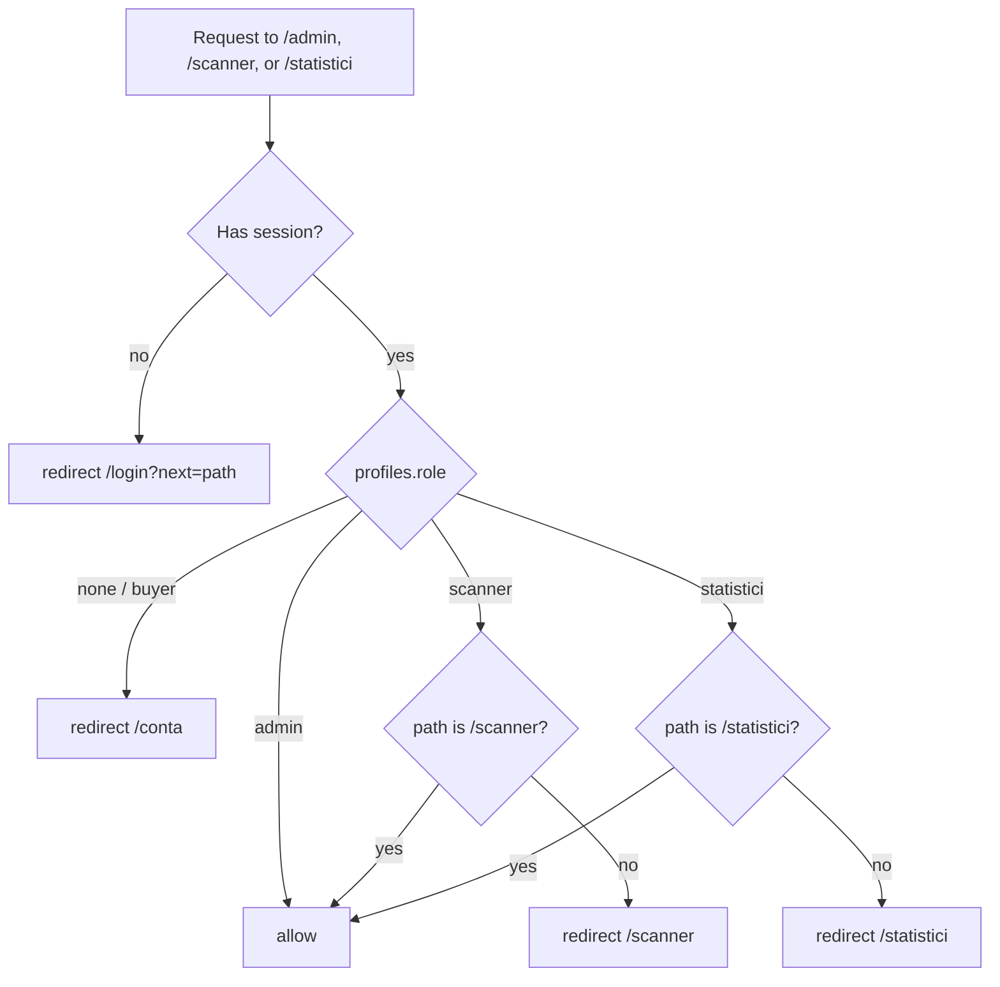
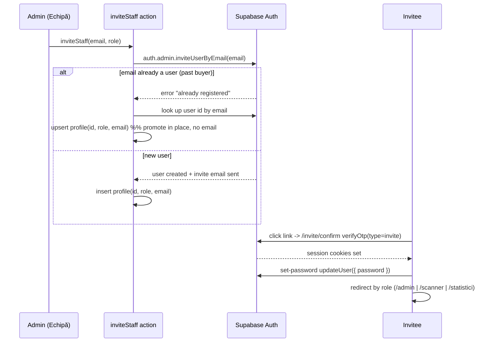

# feat: SavaPass admin event tooling, buyer dashboard, and role-based staff access

## Summary

Three feature clusters for the `web/` production app: (1) admins create and edit events from the UI — price, capacity, structured program, poster upload to Supabase Storage; (2) the buyer area `/conta` becomes a real account dashboard — editable profile, active/past ticket history, personal stats; (3) staff access splits into three roles (admin, scanner, statistici) that an admin assigns by email from a new "Echipă" section, with route gating rewritten to match.

---

## Problem Frame

Today events can only be edited in Supabase Studio, there is no way to create a new event from the app, and posters are static files committed to `web/public/events/`. Staff has only two implicit roles (`admin`, `organizer`) and the access model has real holes: `web/proxy.ts` lets *any* authenticated session reach `/scanner`, and `web/app/(staff)/scanner/actions.ts` auto-creates an `organizer` profile for anyone who scans — so any buyer who signs in becomes staff. The buyer area `/conta` exists but only lists tickets; the club wants it to feel like an account with profile and history. These three asks were given together because they share one substrate (the `profiles`/`staff_role` model and the admin surface) and are best planned as one body of work even though they ship as separable units.

---

## Requirements

### Event management (F1)

- R1. An admin can create a new event (as `draft`) from `/admin`, filling all event fields: title, subtitle, the four date strings (`date_label`, `date_long`, `starts_at`, `doors`), venue fields, price in RON, capacity, about text, accent color.
- R2. An admin can edit an existing event, including adding/removing/reordering structured `program` rows (time + label) and editing the `perks` list.
- R3. An admin can upload a poster image; it is stored in Supabase Storage and renders via `next/image` on the landing and event pages alongside the existing local posters.
- R4. Event status transitions are `draft → active → past` (and `past → active`); activating an event while another is active prompts an explicit swap; the one-active-event DB constraint never surfaces as a raw error.
- R5. An event's `slug` is immutable once it has any order, and capacity can never be set below the number of tickets already sold.
- R6. An admin sees a list of all events (every status) and can preview a `draft` before activating it.

### Staff roles (F3)

- R7. Staff roles are `admin`, `scanner`, `statistici`, replacing the `admin`/`organizer` model.
- R8. From an "Echipă" section in `/admin`, an admin can invite a staff member by email with a role, change a member's role, and remove a member.
- R9. Route access is role-gated: `/admin` requires `admin`, `/scanner` requires `scanner|admin`, `/statistici` requires `statistici|admin`; buyers and wrong-role sessions are redirected, never granted.
- R10. Every privileged server action verifies the caller's role server-side; scanner check-in requires `scanner|admin` and only succeeds for the currently `active` event.
- R11. The system always retains at least one `admin` (last-admin guard), and removing a staff member never deletes their underlying auth account or their buyer tickets.

### Buyer dashboard (F2)

- R12. An authenticated buyer sees a dashboard at `/conta` with an editable display name and a read-only email.
- R13. The buyer's tickets are split into active and past sections, each ticket linking to its wallet view at `/bilet/[token]`.
- R14. The dashboard shows personal stats: events attended and total tickets. It does not show a "member since" date.
- R15. The main site nav CTA labeled "Biletul meu" becomes "Cumpără bilet" and links to the active event.

---

## Key Technical Decisions

- KTD1 — **Role enum migration, split into two migrations.** Rename `staff_role` value `organizer → scanner` (transactional, relabels existing rows in place) and `ADD VALUE 'statistici'`. Postgres forbids using a freshly added enum value in the same transaction, and Supabase `apply_migration` wraps each call in one transaction — so migration A does the rename + add, migration B does anything that *references* `'statistici'` (policies, defaults, backfills). Regenerate `web/lib/supabase/types.ts` after, and check for escaped `\"` in the CompositeTypes block (recurring bug in this repo).

- KTD2 — **Role enforced in two layers, read per-request.** `web/proxy.ts` redirects by route+role; every privileged server action independently fetches `profiles.role` and rejects on mismatch. Role is read from the DB on each request (not cached in the JWT), so a role change takes effect on the user's next request with no re-login. UI-only gating was explicitly ruled out by the original design.

- KTD3 — **Denormalized `email` on `profiles`.** Add an `email` column to `profiles`, populated at invite time. The Echipă list and email operations read it directly instead of `auth.admin.listUsers`, which also returns every buyer (buyers and staff share one auth pool). Matches the existing email-based RLS pattern and is the cheapest lookup.

- KTD4 — **Invite via `inviteUserByEmail` + token_hash flow.** PKCE is unsupported for invites, so the existing `exchangeCodeForSession` path in `web/app/conta/confirm/route.ts` will not work. Use a customized "Invite user" email template with `token_hash` + `type=invite`, a dedicated `/invite/confirm` route handler calling `verifyOtp({ type: "invite" })`, then a set-password step (`auth.updateUser`). The profile row (id, role, email) is created at invite time since `inviteUserByEmail` returns the new auth user immediately. If the email is already a user (a past buyer), the call errors — catch it and promote in place (upsert the profile, no invite email sent).

- KTD5 — **Poster upload: service-role write to a public bucket, unique path per upload.** A public bucket `posters` (MIME-restricted to jpeg/png/webp, 5MB limit). The server action uploads via the service-role client to `{eventId}/{uuid}.{ext}`, writes `getPublicUrl(...)` into `events.photo_url`, then best-effort deletes the previous object. Unique paths avoid CDN stale-cache on replacement. `web/next.config.ts` gains `images.remotePatterns` for the Supabase Storage host and `experimental.serverActions.bodySizeLimit: "6mb"`. No storage RLS policies are needed (service-role writes bypass RLS; the bucket is public-read). Existing local posters in `web/public/events/` keep working — `next/image` serves both.

- KTD6 — **Event lifecycle guards.** Slug is auto-generated from the title at creation and locked once the event has any order (form disables the field). Capacity is hard-blocked below `event_stats.sold` server-side. Activating event B while A is active runs a confirm-and-swap (demote A to `past` + activate B in one transaction) instead of hitting the `one_active_event` unique index. Revenue is computed from `sum(orders.amount_bani where status='paid')`, not `sold * price` — price is now editable, and orders already snapshot the amount paid. Admin draft preview drops the code-level status filter (staff already pass `events_read` RLS via `is_staff()`).

- KTD7 — **Buyer profile in auth metadata.** Display name lives in `auth.users.user_metadata` (editable via `auth.updateUser`), email is read-only. Ticket history splits strictly on `events.status` (active vs everything else). Stats: events attended = `count(distinct event_id)` over tickets with status `in|used`; total = non-`void` tickets. The dashboard only ever shows tickets bought with the login email (email-RLS); a one-line note explains the mismatch case rather than building a merge feature.

- KTD8 — **`/statistici` is server-rendered and static.** Read-only stats page reusing `event_stats` and the existing stat-card components, `dynamic = "force-dynamic"` with a manual refresh, not Realtime. `statistici` gets SELECT on `tickets`/`orders`/`scans` via `is_staff()` but is excluded from the `scans` insert path so it can never check anyone in.

---

## High-Level Technical Design

### Event status lifecycle (F1)

```mermaid
stateDiagram-v2
  [*] --> draft: create
  draft --> active: activate (confirm-swap if another active)
  draft --> [*]: delete (only when 0 orders)
  active --> active: edit (slug locked after 1st order; capacity >= sold)
  active --> past: archive
  past --> active: re-activate (confirm-swap)
```



### Role-based route gating (F3, `web/proxy.ts`)



### Staff invite + acceptance (F3)



---

## Output Structure

New files added to the existing `web/app/` hierarchy (modified files not shown):

```
web/
├── app/
│   ├── (staff)/
│   │   ├── admin/
│   │   │   ├── events/
│   │   │   │   ├── page.tsx            events list (all statuses)
│   │   │   │   ├── [id]/page.tsx       create/edit editor route
│   │   │   │   ├── EventEditor.tsx     client form
│   │   │   │   └── actions.ts          upsertEvent, setEventStatus, uploadPoster
│   │   │   └── team/
│   │   │       ├── page.tsx            Echipă list + invite
│   │   │       ├── TeamClient.tsx      client controls
│   │   │       └── actions.ts          inviteStaff, changeRole, removeMember
│   │   └── statistici/page.tsx         read-only stats
│   └── invite/
│       ├── confirm/route.ts            verifyOtp(invite) -> set cookies
│       └── page.tsx                    set-password form
└── lib/
    └── roles.ts                        role constants + role-fetch helper
```

---

## Implementation Units

### U1. Role model migration and RLS

**Goal:** Move the database from the 2-role model to the 3-role model and update the RLS/helper layer so reads and writes are correctly scoped.

**Requirements:** R7, R10, R11

**Dependencies:** none

**Files:**
- `web/supabase/migrations/` (new — capture SQL here even though the repo has no prior migrations; apply via Supabase MCP `apply_migration`)
- `web/lib/supabase/types.ts` (regenerate after migration)
- `web/lib/roles.ts` (new — exported `StaffRole` union, role-set constants)

**Approach:**
- Migration A: `ALTER TYPE staff_role RENAME VALUE 'organizer' TO 'scanner';` then `ALTER TYPE staff_role ADD VALUE 'statistici';` (rename + add only — no usage of the new value here).
- Migration B (separate): add `email text` to `profiles`; backfill the existing admin's email; tighten the `scans` insert policy so its `WITH CHECK` requires role `admin|scanner` (exclude `statistici`); confirm `is_admin()` (`role = 'admin'`) and `is_staff()` (any profile / role in the three) still hold; clean up any legacy auto-provisioned `full_name = 'Staff'` rows.
- Keep `events_write = is_admin()`, `tickets_buyer_read` (authenticated, `holder_email` match), and the staff read policies as-is.
- Regenerate types via the Supabase MCP `generate_typescript_types`, then scan `web/lib/supabase/types.ts` for escaped `\"` and fix.

**Patterns to follow:** existing RLS predicates in the live DB (`is_admin()`, `is_staff()`); the project lesson to regenerate types before any new `.from()` call.

**Test scenarios:**
- After migration A, existing `organizer` rows report role `scanner`; no row is orphaned.
- `ADD VALUE` in its own migration succeeds; a follow-up insert/policy using `'statistici'` succeeds only in migration B.
- A `statistici` profile can SELECT from `tickets`/`orders`/`scans` but a `scans` insert with that role is rejected by the policy.
- `is_admin()` returns true only for `admin`; `is_staff()` returns true for all three roles.
- Regenerated `types.ts` contains the three-value `staff_role` union and no `\"` artifacts.

**Verification:** Migration applies cleanly in two steps; a SQL probe of `pg_enum` shows `admin|scanner|statistici`; the app type-checks against the regenerated types.

---

### U2. Auth gating rewrite (proxy + scanner action)

**Goal:** Close the access holes and route every session by its real role.

**Requirements:** R9, R10

**Dependencies:** U1

**Files:**
- `web/proxy.ts`
- `web/app/(staff)/scanner/actions.ts`
- `web/lib/roles.ts`

**Approach:**
- Rewrite the `proxy.ts` role branch per the gating flowchart: no session → `/login?next=`; session with no profile / buyer → `/conta`; `admin` → allow all; `scanner` → allow `/scanner` only else redirect `/scanner`; `statistici` → allow `/statistici` only else redirect `/statistici`. Add `/statistici/:path*` to the matcher. Keep `/conta` as cookie-refresh-only (page does its own redirect).
- In `scanTicket`, remove the auto-upsert of an `organizer` profile; require the caller to have a profile with role `scanner|admin` (reject otherwise); add a check that the ticket's event is `active`, returning a distinct "eveniment inactiv" verdict.
- Keep all check-in writes via the service-role client (defense-in-depth alongside the tightened insert policy from U1).

**Patterns to follow:** the existing `/admin` role-query branch in `proxy.ts`; the typed verdict object pattern in `scanner/actions.ts`.

**Test scenarios:**
- A buyer OTP session hitting `/scanner` is redirected to `/conta`.
- A `scanner` session hitting `/admin` is redirected to `/scanner`; a `statistici` session hitting `/scanner` is redirected to `/statistici`.
- An `admin` reaches all three routes.
- `scanTicket` called by a buyer session returns a rejection, not a check-in; no `profiles` row is created.
- Scanning a valid ticket whose event is `past` returns the "eveniment inactiv" verdict, not `ok`.
- A valid ticket for the active event still checks in once, second scan returns `already_in`.

**Verification:** Manual run against the dev server with three seeded role accounts; confirm redirects and the scanner verdicts on a phone per the existing scanner test procedure.

---

### U3. Echipă team management

**Goal:** Let an admin invite, re-role, and remove staff from the UI.

**Requirements:** R8, R11

**Dependencies:** U1, U2

**Files:**
- `web/app/(staff)/admin/team/page.tsx` (new)
- `web/app/(staff)/admin/team/TeamClient.tsx` (new)
- `web/app/(staff)/admin/team/actions.ts` (new — `inviteStaff`, `changeRole`, `removeMember`)
- `web/app/invite/confirm/route.ts` (new — `verifyOtp({ type: "invite" })`)
- `web/app/invite/page.tsx` (new — set-password form calling `auth.updateUser`)
- `web/app/(staff)/admin/page.tsx` or `AdminClient.tsx` (add an "Echipă" entry point)
- Supabase Auth config: customize the "Invite user" template to the `token_hash`/`type=invite` link; add `/invite/confirm` to the redirect allow-list

**Approach:**
- `inviteStaff(email, role)`: admin-gated server action. Call `auth.admin.inviteUserByEmail(email)`. On success, insert `profiles(id, role, email)`. On "already registered", look up the existing user id and upsert the profile (promote in place; tell the admin "exista deja cont, rol acordat direct").
- `changeRole` / `removeMember`: admin-gated. Reject if the target is the last remaining `admin` or if an admin demotes/removes themselves into a no-admin state. `removeMember` deletes only the `profiles` row — never `auth.admin.deleteUser` (preserves the person's buyer tickets).
- Team list: read `profiles` (id, email, full_name, role); show "În așteptare" when the auth user has `invited_at` set but no `last_sign_in_at` (enrich via `getUserById` per profile — N is tiny).
- `/invite/confirm` verifies the token_hash and redirects to `/invite`; `/invite` sets the password then redirects by role. `/invite/*` is intentionally outside the staff matcher.

**Patterns to follow:** the server-action + zod + Romanian-message pattern in `web/app/[slug]/checkout/actions.ts`; the OTP route handler shape in `web/app/conta/confirm/route.ts`.

**Test scenarios:**
- Inviting a brand-new email creates an auth user, sends the invite, and adds a pending profile row.
- Inviting an email that already has a buyer account promotes in place with no second auth user and no error shown to the admin.
- Changing the only admin's role to `scanner` is rejected with a clear message.
- Removing a member deletes the profile row but leaves the auth user and their tickets intact (the email still works at `/conta`).
- An invited user completing `/invite/confirm` then `/invite` lands on the route matching their role.
- An expired/used invite link lands on a friendly error, not a stack trace.

**Verification:** End-to-end invite of a throwaway email on the dev server (built-in mailer, 2/hr); confirm the pending→active transition in the list and the role-routed landing.

---

### U4. Storage bucket, Next config, and poster upload

**Goal:** Stand up the storage substrate and the upload action the editor will call.

**Requirements:** R3

**Dependencies:** U1 (shares the migration vehicle; otherwise independent of U2/U3)

**Files:**
- `web/next.config.ts`
- `web/app/(staff)/admin/events/actions.ts` (new — `uploadPoster` exported here, shared with U5)
- Supabase Storage: create public bucket `posters`

**Approach:**
- Create bucket `posters` (`public: true`, `allowedMimeTypes: ["image/jpeg","image/png","image/webp"]`, `fileSizeLimit: "5MB"`).
- `web/next.config.ts`: add `images.remotePatterns: [new URL("https://shzyvrojbtbczqqoilip.supabase.co/storage/v1/object/public/**")]` and `experimental.serverActions.bodySizeLimit: "6mb"`. Preserve the existing `reactCompiler: true`.
- `uploadPoster(eventId, file)`: admin-gated; validate MIME + size server-side (don't trust the bucket alone); upload via the service-role client to `{eventId}/{uuid}.{ext}`; return the public URL; caller persists it and best-effort deletes the prior object.

**Patterns to follow:** the service-role client in `web/lib/supabase/admin.ts` (throws if imported client-side); `next/image` usage in `web/app/page.tsx` and `web/app/[slug]/page.tsx`.

**Test scenarios:**
- Uploading a 2MB JPEG returns a public URL that renders through `next/image` on the event page.
- A non-image or >5MB file is rejected server-side with a Romanian message before hitting Storage.
- Existing local posters (`/events/echoes-unplugged.png`) still render unchanged.

**Test expectation:** the config edit itself (remotePatterns + bodySizeLimit) has no behavioral test beyond the render scenarios above.

**Verification:** Upload from a scratch admin form (or the U5 editor) and confirm the image renders on `/[slug]`; confirm the bucket rejects an oversized file.

---

### U5. Event editor and event actions

**Goal:** Full create/edit of an event from the admin UI, with the lifecycle guards.

**Requirements:** R1, R2, R4, R5

**Dependencies:** U2 (admin gating), U4 (poster upload)

**Files:**
- `web/app/(staff)/admin/events/[id]/page.tsx` (new — `[id]` = `new` for create)
- `web/app/(staff)/admin/events/EventEditor.tsx` (new — client form)
- `web/app/(staff)/admin/events/actions.ts` (`upsertEvent`, `setEventStatus`)
- `web/lib/events.ts` (extend with an admin-aware fetch that drops the status filter)

**Approach:**
- `EventEditor`: all event fields; price entered in whole RON, stored `* 100` (integer math only); program rows as add/remove/reorder list of `{ t, l }`, validated `t` as `HH:MM`, non-empty label, capped ~12 rows, empties stripped; perks as a string list; accent validated `^#[0-9A-Fa-f]{6}$` with `#009FE3` fallback; poster picker calling `uploadPoster`.
- `upsertEvent`: admin-gated, zod-validated. On create, auto-generate slug from title and enforce uniqueness (friendly message on 23505). On edit, disable/ignore slug changes once the event has any order; reject capacity below `event_stats.sold`.
- `setEventStatus(id, status)`: enforce allowed transitions; on activate-while-another-active, run the confirm-and-swap (demote current active to `past` + activate target in one transaction) rather than letting the unique index throw.
- Admin draft preview: render `/[slug]` for a `draft` when the viewer is admin, badged "DRAFT".

**Patterns to follow:** `FormField` in `web/app/[slug]/checkout/page.tsx`; the action state + `useActionState` loading pattern; `redirect()` kept **outside** try/catch.

**Test scenarios:**
- Creating an event from blank persists a `draft` with a unique auto-generated slug.
- Editing program rows (add, remove, reorder) round-trips the jsonb in order; an invalid time like `25:00` is rejected.
- Setting capacity below current sold count is rejected with a clear message.
- Editing the slug of an event that has orders is a no-op (field disabled / server ignores it).
- Activating a second event offers the swap; confirming demotes the first to `past` and never throws the unique-index error.
- A non-admin session cannot reach the editor or invoke `upsertEvent`.

**Verification:** Create → edit → activate a test event end-to-end on the dev server; confirm public pages reflect changes and the active-event swap works.

---

### U6. Admin events list and dashboard revenue fix

**Goal:** Give the admin an events index and correct the revenue math that breaks once price is editable.

**Requirements:** R6

**Dependencies:** U5

**Files:**
- `web/app/(staff)/admin/events/page.tsx` (new — list all statuses, link to editor + preview)
- `web/app/(staff)/admin/page.tsx` (revenue calc)

**Approach:**
- Events list: server component, all statuses, each row showing status chip, sold/capacity, and edit/preview links. Reuse the stat-card and chip conventions.
- Replace `revenue = sold * event.price_bani` in `web/app/(staff)/admin/page.tsx` with `sum(orders.amount_bani) where status = 'paid'` for the event. Coalesce nullable `event_stats` columns with `?? 0`.

**Patterns to follow:** `StatCard` in `admin/page.tsx`; `Chip` tones in `web/components/ui/Chip.tsx`.

**Test scenarios:**
- The list shows all three seeded events with correct status chips and sold counts.
- After changing an event's price, revenue reflects actual amounts paid, not new-price × sold.
- A draft event appears in the list and its preview link renders the badged draft page.

**Verification:** Load `/admin/events`; change a price and confirm `/admin` revenue is unchanged for already-sold tickets.

---

### U7. Statistici read-only stats page

**Goal:** A stats-only surface for the `statistici` role.

**Requirements:** R9 (the statistici surface)

**Dependencies:** U1, U2

**Files:**
- `web/app/(staff)/statistici/page.tsx` (new)

**Approach:**
- Server-rendered (`dynamic = "force-dynamic"`), reusing `event_stats` and the existing stat-card components: active event sold/capacity, check-ins, seats remaining, revenue (same corrected calc as U6), plus a static table of past events. Manual refresh, no Realtime.
- Gated to `statistici|admin` by the U2 proxy logic; the page also re-checks role server-side.

**Patterns to follow:** `StatCard` and the `force-dynamic` + `robots:{index:false}` conventions in `admin/page.tsx`.

**Test scenarios:**
- A `statistici` session sees the stats and cannot reach `/admin` or `/scanner`.
- The page renders current sold/check-in/revenue numbers and a past-events table.
- An `admin` can also open `/statistici`.

**Verification:** Log in as a `statistici` account and confirm the page renders and the role gates hold.

---

### U8. Buyer dashboard and nav rename

**Goal:** Turn `/conta` into an account dashboard and relabel the main nav CTA.

**Requirements:** R12, R13, R14, R15

**Dependencies:** none (email-RLS already in place; independent of F1/F3)

**Files:**
- `web/app/conta/page.tsx`
- `web/app/conta/ProfileCard.tsx` (new — editable name client component) + a small `updateProfile` action
- `web/app/page.tsx` (SiteNav CTA label, ~line 65)
- `web/lib/copy.ts` (`nav.myTicket` string)

**Approach:**
- Profile card: editable display name (`auth.updateUser({ data: { name } })`), read-only email. Empty name shows a "Numele tău" placeholder; a note clarifies the per-ticket holder name (what door staff see) is not retroactively renamed.
- Ticket history: split on `events.status` (active vs past), each ticket links to `/bilet/[qr_token]`; the existing status chip communicates valid/in/used/void.
- Stats: events attended = `count(distinct event_id)` over tickets `in|used`; total = non-`void` tickets. No "member since".
- A one-line note: "Vezi doar biletele cumpărate cu {email}." for the different-email case (no merge feature).
- Nav: change the CTA label "Biletul meu" → "Cumpără bilet" (update both the hardcoded label in `page.tsx` and `lib/copy.ts`), keeping the existing `activeEvent`-null conditional that hides it when there is no active event; it links to the active event page.

**Patterns to follow:** the existing `/conta` ticket list + `STATUS_CHIP` map; `SiteNav` in `web/app/page.tsx`.

**Test scenarios:**
- A buyer with tickets sees them split active/past, each linking to the correct wallet ticket.
- Editing the display name persists and survives reload; email is not editable.
- A buyer with zero tickets sees an empty-state, not an error.
- Stats count attended events from `in|used` tickets only and total from non-void.
- The landing nav shows "Cumpără bilet" linking to the active event, and hides it when no event is active.

**Verification:** Sign in at `/conta` with the seeded buyer email, confirm history/profile/stats; load `/` and confirm the renamed CTA.

---

## Scope Boundaries

### Deferred to follow-up work

- Stripe auto-refund on the webhook's capacity-race branch (`web/app/api/webhooks/stripe/route.ts`). The U5 form already blocks admin-caused capacity-below-sold; the simultaneous-checkout race is pre-existing and out of this body of work.
- Wiring Resend as custom SMTP for Supabase Auth so invite/OTP emails clear the built-in 2/hour limit. Required before real staff onboarding at volume; dev and small-team use work on the built-in mailer.
- Realtime on `/statistici` — ship static + refresh; add a subscription only if door-night usage demands it.
- `/api/admin/export` dedicated route, OG/SEO meta, a11y pass, Vercel deploy, Stripe live keys (separate launch checklist in `web/PRODUCTION_STATUS.md`).

### Outside this product's identity

- Multiple ticket types/tiers per event — the product is single-price per event by design.
- Account-required purchase — buying must stay account-free (`PLAN.md` §1 constraint).
- Membership/applicants recruitment pipeline (`/aplica`) — a separate v2 feature; "Echipă" is staff roles in `profiles`, not the applicants board.
- Merging tickets bought under different emails — email-RLS scoping is intentional.

---

## Risks & Dependencies

- **Enum migration ordering.** `ADD VALUE` cannot be used in the same transaction it is added in, and Supabase wraps migrations in transactions — the two-migration split (KTD1) is mandatory, not stylistic. Regenerate types and check for escaped quotes after.
- **F3 must deploy as a whole.** The proxy rewrite, the `scanTicket` role check, and the auto-provision removal are one change — a partial deploy leaves either a hole (buyers in `/scanner`) or a lockout. Sequence: U1 (schema) → U2 (gating) before any role-dependent UI.
- **Invite flow depends on Supabase Auth config.** The token_hash template customization and the `/invite/confirm` redirect allow-list entry are dashboard config, not code — the flow silently fails without them. PKCE is unsupported for invites, so the existing confirm route cannot be reused.
- **Storage host in image config.** `next/image` will refuse Supabase URLs until `remotePatterns` is added; the 1MB default server-action body limit will reject posters until raised.
- **Single live admin.** Only `proiectnss@gmail.com` is admin today — the last-admin guard (R11) protects against self-lockout during testing.

---

## Open Questions

- Production email volume: invites and buyer OTP both draw on Supabase's built-in 2/hour mailer. Custom SMTP (Resend) resolves it and is listed under deferred work — confirm whether staff onboarding happens before or after that wiring, since it caps invites to one per hour until then.
