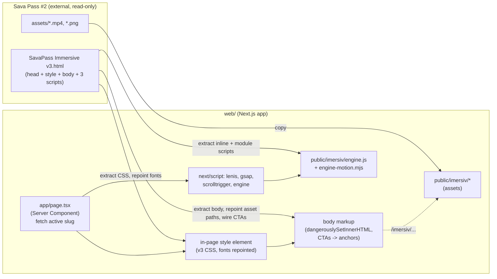

# feat: Wire the SavaPass backend to the v3 immersive landing

## Summary

Make the **v3 immersive landing** (the scrollytelling single-page experience currently living as a standalone HTML file in the `Sava Pass #2` folder) the public homepage `/` of the real Next.js app in `web/`, connected to the existing backend. The design must render **pixel-identical** to the standalone file. The backend already exists and does not change; the work is a faithful verbatim port plus wiring the functional CTAs into the real purchase/account routes, consolidated into the `sava-pass` project so nothing stays split across two folders.

Two confirmed decisions from the user shape the whole plan:
1. **Placement:** v3 replaces the homepage at `/`. The current Landing v2 (`web/app/page.tsx`) is archived. Functional pages (event detail, checkout, ticket, scanner, admin) keep their existing design — v3 contains no designs for those.
2. **Data wiring:** "do everything to look the same." Preserve the authored design exactly. Wire only the functional affordances (the two `Cumpără bilet` CTAs → real active-event purchase route) to the backend. No visible string is data-injected in a way that could change the look.

**Source (external, read-only input):** `<DESIGN_SRC>` = the `Sava Pass #2` folder. The authoritative design is `<DESIGN_SRC>/SavaPass Immersive v3.html` plus everything under `<DESIGN_SRC>/assets/`. v2 (`SavaPass Immersive v2.html`) and the orphaned `web/app/imersiv/content.ts` are the **wrong version** — do not use them as markup sources.

---

## Problem Frame

The team built a high-craft immersive landing (v3) as a no-build standalone HTML file: Lenis smooth-scroll + GSAP/ScrollTrigger + Framer Motion via CDN, ambient video loops, scroll-reveal sections (intro · hero · event · stats · join · footer), and its own design-token system (`--f-sans / --f-mono / --f-disp`, `--ink`, `--cyan`, `--e`). It is decoupled from the production app, which has a different (older "Landing v2") homepage and the full functional backend.

The goal is to unify them: the beautiful v3 page becomes the front door of the real app, its `Cumpără bilet` buttons lead into the working Stripe checkout flow, and the whole thing lives in one project. The hard constraint is **zero visual drift** — the ported page must look exactly like the standalone v3 file.

The central technical tension: v3 is a full document with **global** CSS (`body{...}`, `:root{...}`) and generic class names (`.btn`, `.h2`, `.grid`, `.dot`) that collide with the app's other pages (the functional pages use a `.btn .btn--primary` convention too). A naive port would either leak v3's dark-theme `body` styles onto every other route or get its own styles clobbered. The plan must guarantee the v3 styles apply fully on `/` and do **not** leak to `/conta`, `/{slug}`, `/scanner`, etc.

There is a proven local pattern for exactly this: the current `web/app/page.tsx` renders its entire stylesheet in an in-page `<style>` element, so the styles mount and unmount with the route. The same lifetime-scoping handles v3's globals.

---

## Requirements

| ID | Requirement |
|----|-------------|
| R1 | Visiting `/` renders the v3 immersive landing, visually identical to `<DESIGN_SRC>/SavaPass Immersive v3.html` served standalone (same layout, typography, colors, spacing, videos, scroll reveals). |
| R2 | The scroll engine runs: Lenis smooth scroll, GSAP/ScrollTrigger reveals and seams, Framer Motion entrances, count-up numbers, ambient video ping-pong loops, the QR generator, and the lightbox all function as in the standalone. |
| R3 | The two `Cumpără bilet · 45 RON` CTAs (event section + join section) navigate to the real active event's purchase route (`/{activeEvent.slug}`), which is wired to the existing checkout flow. |
| R4 | The v3 page's global CSS (`body`, `:root`, generic class names) does **not** leak onto any other route. Navigating from `/` to `/conta`, `/{slug}`, `/scanner`, `/admin` shows those pages with their existing, unchanged design. |
| R5 | All v3 assets (2 video loops, posters, year photos, team/community photos) are consolidated under `web/public/` so the page is self-contained in the `sava-pass` project; no path points back to the `Sava Pass #2` folder. |
| R6 | Fonts render via the app's existing `next/font` setup (Manrope / Instrument Serif / JetBrains Mono already loaded in `web/app/layout.tsx`); no duplicate Google Fonts network request is introduced. |
| R7 | `npm run build` succeeds (no TS/lint/Turbopack errors) and the page works in production mode, not just dev. |
| R8 | The current Landing v2 is archived (not deleted destructively) so it can be recovered if needed. |

---

## Key Technical Decisions

**KTD1 — Verbatim port, not a React rewrite.** Reproduce v3 by reusing its literal CSS, markup, and JS rather than re-authoring sections as React components. Rationale: the constraint is "exact same" and the JS engine (Lenis + GSAP + Framer choreography, ping-pong video, seams, count-up) is intricate and already tuned; a rewrite would introduce drift and re-debug work for no benefit. This also matches the established precedent (`web/app/imersiv/content.ts` was a verbatim v2 extraction). The only edits to the source are the four mechanical ones below.

**KTD2 — Route-lifetime style scoping via an in-page `<style>`.** Render the v3 CSS inside the homepage component's returned JSX (a `<style>` element), exactly as the current `web/app/page.tsx` does with `LandingStyles`. React adds the `<style>` when `/` mounts and removes it on navigation, so v3's global `body{...}` / `:root{...}` rules are live only while `/` is shown. This is the lowest-drift way to satisfy R1 + R4 simultaneously — no per-selector prefixing of ~1400 lines of CSS (which would itself risk drift). Verify isolation explicitly (U6) because generic class names (`.btn`) overlap with other routes.

**KTD3 — Markup injected via `dangerouslySetInnerHTML`; scripts loaded as external files via `next/script`.** The body markup is injected as a static HTML string (it has no React state). The three script blocks (CDN libs; the large inline classic engine script; the Framer `motion` ES module) are extracted to static files under `web/public/imersiv/` and loaded with `next/script` (CDN libs + classic engine) and a `<script type="module">` (motion). Rationale: keeps the engine byte-identical (no JSX-escaping a 300-line script), and `next/script` gives correct load ordering (`afterInteractive`, engine after GSAP/Lenis). Confirm the exact `next/script` strategy and module-script handling against the Next 16 docs in `node_modules/next/dist/docs/` (see AGENTS.md — this is not stock Next).

**KTD4 — Fonts wired to existing `next/font` variables; drop the Google Fonts `<link>`.** v3's `:root` defines `--f-sans/--f-mono/--f-disp` and loads fonts via a `<link>` to `fonts.googleapis.com`. In the port, repoint those three tokens to the app variables already set by `layout.tsx` (`--font-manrope`, `--font-instrument-serif`, `--font-jetbrains-mono`) and remove the Google Fonts `<link>`. Same typefaces, no double load (R6). This is exactly what the v2 `content.ts` port did.

**KTD5 — CTAs become anchors to the live active-event slug; no other content is dynamic.** The two `Cumpără bilet` buttons are `<button>` elements in the source. Convert them to anchors carrying the `.btn .btn-p mag` classes (identical styling) with `href={/${activeEvent.slug}}`, resolved server-side from `getActiveEvent()`. This is a behavior wire, not a visual change — the visible label stays the authored `Cumpără bilet · 45 RON`. The page is a Server Component that fetches only the active-event slug for this purpose. Everything else (stats, past events, copy, posters) stays as authored static markup, honoring "look the same." If there is no active event, the CTA falls back to `/` (or the events anchor) and is non-fatal.

**KTD6 — Assets consolidated under `web/public/imersiv/`, paths repointed to `/imersiv/...`.** Copy the entire `<DESIGN_SRC>/assets/` set into `web/public/imersiv/` and rewrite every `assets/...` reference (in markup and CSS) to `/imersiv/...`. Copying the full set (even assets that may already exist elsewhere in `web/public`) keeps the port self-contained and avoids hunting for partial overlaps (R5).

---

## High-Level Technical Design

### Build pipeline (source → rendered route)



### Isolation model (why other routes stay unchanged)

```mermaid
sequenceDiagram
  participant U as User
  participant R as React (one document)
  U->>R: load /
  R->>R: mount page.tsx -> inject <style> (v3 global CSS) + markup
  Note over R: body{background:var(--ink)} + :root tokens live NOW
  U->>R: click "Cumpără bilet" -> navigate /{slug}
  R->>R: unmount page.tsx -> remove its <style>
  Note over R: v3 globals gone; /{slug} renders with its own styles
```

The guarantee in R4 rests on: (a) the v3 CSS living **inside** the page component (not in `layout.tsx`), so it is torn down on navigation; and (b) the engine scripts being idempotent/guarded so a re-entry to `/` re-initializes cleanly.

---

## Output Structure

New/changed files (repo-relative to `sava-pass`):

```
web/
├── app/
│   ├── page.tsx                      # REWRITTEN: renders v3 (style + markup + scripts), fetches active slug
│   ├── _archive/
│   │   └── landing-v2.tsx            # MOVED: current page.tsx body, kept for recovery (not routed)
│   └── imersiv/
│       └── content.ts                # DELETE: orphaned v2 port (superseded by v3 on /)
└── public/
    └── imersiv/
        ├── engine.js                 # NEW: extracted v3 classic inline script (verbatim)
        ├── engine-motion.mjs         # NEW: extracted v3 module script (Framer motion)
        ├── savapass-ticket-engine-loop.mp4
        ├── savapass-hero-loop.mp4
        ├── echoes-unplugged.png
        ├── event-easter.png
        ├── event-cupid.png
        ├── year-2024.png  year-2025.png  year-2026.png
        ├── stat-concert.png  stat-scan.png  stat-community.png
        └── team-interact.png
```

The per-unit **Files** lists are authoritative; this tree is the scope-at-a-glance.

---

## Implementation Units

### U1. Consolidate v3 assets into the app

**Goal:** Bring every asset the v3 page references into `web/public/imersiv/` so the page is self-contained in `sava-pass` (R5).

**Requirements:** R5.

**Dependencies:** none.

**Files:**
- `web/public/imersiv/` (new dir) — copy all of `<DESIGN_SRC>/assets/` into it: `savapass-ticket-engine-loop.mp4`, `savapass-hero-loop.mp4`, `echoes-unplugged.png`, `event-easter.png`, `event-cupid.png`, `year-2024.png`, `year-2025.png`, `year-2026.png`, `stat-concert.png`, `stat-scan.png`, `stat-community.png`, `team-interact.png`.

**Approach:** Copy the whole `assets/` folder (one recursive copy per the Token-saving rules — `Copy-Item -Recurse -Force`). Cross-check the copied set against every `assets/...` and `url(assets/...)` reference in the v3 HTML so nothing is missed (the source `step-*.png` and `savapass-disintegrate.mp4` are unused per the design CLAUDE.md — they may be skipped). Do not yet touch any path references; that happens in U2/U4.

**Patterns to follow:** existing asset layout under `web/public/` (`events/`, `landing/`).

**Test scenarios:** Test expectation: none — pure asset relocation; coverage is the file-reference audit (every `assets/...` token in the source has a matching file in `web/public/imersiv/`) and the U6 visual parity pass.

**Verification:** A grep of the v3 source for `assets/` yields a set whose every member exists in `web/public/imersiv/`.

---

### U2. Port the v3 CSS as a route-scoped style block with fonts wired to `next/font`

**Goal:** Reproduce v3's stylesheet inside the homepage component, with font tokens repointed and asset URLs repointed, so `/` looks identical and styles tear down on navigation (R1, R4, R6).

**Requirements:** R1, R4, R6.

**Dependencies:** U1.

**Files:**
- `web/app/page.tsx` (will hold the `<style>`; full assembly in U4) — or a co-located `web/app/_immersive/styles.ts` exporting the CSS string if that reads cleaner.

**Approach:**
- Extract the contents of the v3 `<style>` block verbatim.
- Repoint fonts (KTD4): in the ported `:root`, set `--f-sans: var(--font-manrope), 'Manrope', ui-sans-serif, system-ui, sans-serif;`, `--f-disp: var(--font-instrument-serif), 'Instrument Serif', Georgia, serif;`, `--f-mono: var(--font-jetbrains-mono), 'JetBrains Mono', ui-monospace, monospace;`. Do not emit the Google Fonts `<link>`.
- Repoint asset URLs inside CSS: any `url(assets/...)` → `url(/imersiv/...)`.
- Render the CSS via a `<style>` element inside the page's returned JSX (mirrors the current `LandingStyles` component pattern). Do **not** place it in `layout.tsx`.
- Leave selectors otherwise untouched — no prefixing (KTD2).

**Patterns to follow:** `web/app/page.tsx` `LandingStyles()` (in-page `<style>{...}`); `web/app/imersiv/content.ts` header comment documenting the same four mechanical edits for v2.

**Test scenarios:**
- Visual parity (verified in U6): `/` matches the standalone v3 at desktop (1440) and mobile (390) widths.
- Isolation (verified in U6, R4): after navigating `/` → `/conta`, computed `body` background is the app default, not v3's `--ink`.
- Font: no network request to `fonts.googleapis.com` on `/` (DevTools network / Playwright request log).

**Verification:** The rendered `/` is visually indistinguishable from the served standalone file; `:root` font tokens resolve to the Manrope/Instrument/JetBrains next/font families.

---

### U3. Port the v3 JS engine as loadable scripts

**Goal:** Run v3's interactive engine in the Next route so all motion/behavior works (R2), without inlining a large script into JSX.

**Requirements:** R2.

**Dependencies:** U1 (assets present for videos).

**Files:**
- `web/public/imersiv/engine.js` (new) — the v3 inline **classic** `<script>` block, verbatim.
- `web/public/imersiv/engine-motion.mjs` (new) — the v3 `<script type="module">` block, verbatim (keeps the `import('https://cdn.jsdelivr.net/npm/motion@.../+esm')`).
- `web/app/page.tsx` (script tags; full assembly in U4).

**Approach:**
- Load the three CDN libs (`lenis@1.3.21`, `gsap@3.12.5`, `gsap/ScrollTrigger`) via `next/script` with `strategy="afterInteractive"`.
- Load `engine.js` via `next/script` **after** the CDN libs (it depends on `Lenis`, `gsap`, `ScrollTrigger` globals). Confirm the correct ordering primitive for Next 16 (`next/script` ordering / `onReady`) against `node_modules/next/dist/docs/`.
- Load `engine-motion.mjs` as a `<script type="module" src="/imersiv/engine-motion.mjs">` (Framer motion path). It is independent and degrades gracefully if the CDN import fails (per design lessons).
- Guard against React re-mount double-init: the engine should no-op if it has already initialized (e.g. a `window.__spImmersiveInit` flag), since navigating back to `/` re-runs the scripts.

**Patterns to follow:** the v3 design CLAUDE.md "JS contract" (count-up `.ct[data-c]`, QR ids `qr`/`stepqr`, reveal class `rv`, magnetic `.mag`, nav `data-s`, icons `data-i`) — honor these ids/classes exactly so the verbatim engine binds.

**Test scenarios:** (Playwright — the project already has `playwright-skill` on disk)
- Happy path / R2: on `/`, scrolling fires `.rv` reveals; `.gen-num .ct` count to `["80","180","264"]`; `.gen-bar i` widths reach their `var(--w)` targets; the two `<video>` loops autoplay and ping-pong (no hard cut).
- Edge: `prefers-reduced-motion: reduce` disables animations (videos fall back to native loop), page still readable.
- Error path: with the `motion` CDN import blocked, the page still renders and reveals via the `.rv` IntersectionObserver fallback (no white/blank sections).
- Integration: navigate `/` → `/{slug}` → back to `/`; engine re-initializes once, no duplicate observers, no console errors.
- Console: zero `pageerror`/uncaught exceptions on load and after a full scroll.

**Verification:** A headless Playwright run (desktop + mobile) with multiple Lenis scroll jumps shows reveals/count-up/bars firing and a clean console, matching the standalone behavior.

---

### U4. Mount v3 as the homepage `/` and archive Landing v2

**Goal:** Assemble U2 + U3 into the homepage route as a Server Component, replacing the current landing and preserving it for recovery (R1, R7, R8).

**Requirements:** R1, R3 (slug fetch), R7, R8.

**Dependencies:** U2, U3.

**Files:**
- `web/app/page.tsx` (rewritten) — Server Component: `await getActiveEvent()` for the CTA slug; render the `<style>` (U2), the body markup via `dangerouslySetInnerHTML`, and the `next/script` tags (U3). Keep/refresh `export const metadata` (title/description) — reuse the existing good Romanian values.
- `web/app/_archive/landing-v2.tsx` (new) — the current `page.tsx` content moved here verbatim (a folder prefixed `_` is not a route). Add a one-line header comment noting it is the archived Landing v2.
- `web/app/imersiv/content.ts` (delete) — orphaned v2 port, now superseded.

**Approach:**
- Extract the v3 `<body>` inner markup verbatim, apply the U1/U6 path repoints (`assets/` → `/imersiv/`) and the U5 CTA edits, and inject via `dangerouslySetInnerHTML` on a wrapping element.
- Body/layout check: `web/app/layout.tsx` sets `<body className="min-h-full flex flex-col" style={{fontFamily:...}}>`. Confirm the v3 page sits correctly inside that flex column (the current landing already does). The v3 `body{...}` rule from the in-page `<style>` applies background/overflow; layout's inline `font-family` is harmless (same family).
- Move the old landing to `_archive/` before overwriting `page.tsx` (so git history + recovery are clean).

**Patterns to follow:** current `web/app/page.tsx` structure (Server Component, `await getActiveEvent()`/`getPastEvents()`, in-page `<style>`); AGENTS.md — read the Next 16 docs for `dangerouslySetInnerHTML` SSR + `next/script` before writing.

**Test scenarios:**
- Happy path / R1: `GET /` returns 200 and renders the full v3 markup server-side (view-source contains the intro/hero/event/stats/join sections).
- Metadata: `<title>`/description present and correct.
- R8: `web/app/_archive/landing-v2.tsx` exists and is not reachable as a route (`/_archive/landing-v2` 404s).
- Isolation (R4): `/conta` and `/{slug}` still render with their own design after the swap.

**Verification:** `/` shows the immersive page; the old landing is recoverable from `_archive/`; other routes unaffected.

---

### U5. Wire the purchase CTAs to the live backend route

**Goal:** Make the two `Cumpără bilet` CTAs lead into the real purchase flow via the live active-event slug, with no visual change (R3, KTD5).

**Requirements:** R3.

**Dependencies:** U4.

**Files:**
- `web/app/page.tsx` (CTA markup transform within the injected body).

**Approach:**
- In the event section and the join section, convert each `<button class="btn btn-p mag">Cumpără bilet · 45 RON <span class="ar" data-i="arrow"></span></button>` to an anchor `<a class="btn btn-p mag" href="/{activeEvent.slug}">…</a>` keeping identical inner content and classes (so styling + the `.mag` magnetic effect + the `data-i="arrow"` icon all still apply).
- Resolve `activeEvent.slug` server-side. If `getActiveEvent()` returns null, fall back to the events anchor (`#event`) or `/` so the CTA never dead-links.
- Leave the IG/social links (`instagram.com/interact.sfsava`) and any other external links untouched (they are intentionally external; the design CLAUDE.md flags the handle as a placeholder TODO — note but do not change here).
- Do **not** add an account/"biletele mele" nav link (would alter the design); account is reachable through the event → checkout flow. (See Scope Boundaries.)

**Patterns to follow:** real purchase entry is `/{slug}` (`web/app/[slug]/page.tsx` → `BuyCta`); confirm the `.btn`/`.mag` engine hooks still bind to anchors (the magnetic-button code targets `.mag` regardless of tag).

**Test scenarios:**
- Happy path / R3: clicking each `Cumpără bilet` CTA navigates to `/{activeEvent.slug}` (the real event page), which loads the existing checkout entry.
- Dynamic slug: with the DB active event = `echoes-unplugged`, the CTA `href` is `/echoes-unplugged`; the href tracks `getActiveEvent()` rather than a hardcoded path.
- Edge / no active event: with no active event, the CTA resolves to the safe fallback and does not 404.
- Visual: the CTA is pixel-identical to the source button (same classes, label, arrow, magnetic hover).
- Integration: external IG links still open instagram.com in a new tab; not rewritten.

**Verification:** Both CTAs route into the live purchase flow; visually unchanged; slug is data-driven.

---

### U6. Verify parity, behavior, isolation, and build

**Goal:** Prove the port meets R1–R7 before shipping.

**Requirements:** R1, R2, R4, R7.

**Dependencies:** U1–U5.

**Files:**
- (verification only; any Playwright scripts live in the `playwright-skill` folder per the design CLAUDE.md, not committed to `web/`).

**Approach:**
- **Visual parity (R1):** serve the standalone v3 (`python -m http.server` in `Sava Pass #2`) and the ported `/` side by side; capture full-page screenshots at 1440 and 390 widths with `.rv` forced visible (inject `.rv{opacity:1!important;transform:none!important;filter:none!important}` for the static shot, per the design lessons) and compare. Count-up rendering `0` in a static shot is a known capture artifact, not a bug.
- **Behavior (R2):** real-scroll Playwright run (multiple `window.__lenis.scrollTo(y,{immediate:true})` jumps + dispatched `scroll` + `ScrollTrigger.update()`), asserting reveals, count-up values, bar widths, video playback, lightbox open/close, and a clean console.
- **Isolation (R4):** navigate `/` → `/conta` → `/{slug}` → `/scanner`; assert each renders its own design and v3's `--ink` body background is gone after leaving `/`.
- **Build (R7):** stop the dev server first (both write `.next/` — per CLAUDE.md), run `npm run build`, confirm success, then smoke `/` in `next start`.

**Patterns to follow:** design CLAUDE.md verification lessons (forced-visible screenshots, `window.__lenis` scroll harness, `node` from the `playwright-skill` folder); `web/` build lessons (kill dev server before build; `npm.cmd` if `npm.ps1` is blocked).

**Test scenarios:**
- R1: desktop + mobile screenshot diff between standalone and ported `/` shows no meaningful visual difference.
- R2: scripted scroll asserts `.ct` = `["80","180","264"]`, `.gen-bar i` widths hit targets, both videos `paused === false`, zero console errors.
- R4: post-navigation computed styles confirm no v3 leakage on `/conta` and `/{slug}`.
- R7: `npm run build` exits 0; `/` renders under `next start`.

**Verification:** All four checks pass; the port is visually and behaviorally faithful, isolated, and production-buildable.

---

## Scope Boundaries

**In scope:**
- Porting v3 to `/` verbatim (CSS, markup, JS engine), assets consolidated, fonts wired, CTAs wired to the live active-event route, current landing archived, build verified.

**Out of scope (not this product's job here):**
- Any change to the backend (Supabase schema, Stripe, Resend, QR, RLS) — it already works and stays as-is.
- Restyling the functional pages (event detail, checkout, success, ticket, scanner, admin, account) into the immersive style — v3 contains no designs for them; they keep their current (Batch A–D) design.
- Changing any authored copy, stats, or imagery in v3 (per "look the same").

**Deferred to follow-up work:**
- **Live data injection into the landing** (active-event title/date/price/poster, real `event_stats` numbers, real past-events cards). Explicitly declined now ("do everything to look the same"); revisit if the team wants the landing to auto-track future events instead of showing the authored Echoes Unplugged content.
- **Account entry point in the landing nav** ("Biletele mele" / "Contul meu" → `/conta`). The current Landing v2 had one; v3 as authored does not. Adding it changes the design, so it is deferred. Until then, buyers reach their tickets via the email link / `/conta` directly.
- **Real social handles/URLs.** The IG handle in v3 is a placeholder (`interact.sfsava`) per the design CLAUDE.md — confirm/replace with the club's real accounts before public launch.
- **Per-selector CSS namespacing.** If route-lifetime scoping (KTD2) ever proves insufficient (e.g. a future shared-layout change), prefix the v3 selectors under a wrapper class. Not needed for the current single-document/route-teardown model.

---

## Risks & Dependencies

| Risk | Likelihood | Impact | Mitigation |
|------|-----------|--------|------------|
| v3 global CSS leaks onto other routes (generic `.btn`, `body`, `:root`) | Medium | High (breaks other pages' look) | KTD2 route-lifetime `<style>`; explicit isolation check in U6 (R4). Fallback: wrapper-class prefixing (deferred item). |
| `next/script` load order wrong → engine runs before GSAP/Lenis globals exist | Medium | Med (no animations) | `afterInteractive` + engine loaded after libs; init guard; verify against Next 16 docs (AGENTS.md). |
| React re-mount on return-to-`/` double-initializes the engine (duplicate observers, video glitches) | Medium | Med | `window.__spImmersiveInit` idempotency guard (U3); U6 back-navigation test. |
| Visual drift from `next/font` vs the source's Google-Fonts `<link>` (rendering nuance) | Low | Med | Same typefaces; U6 screenshot diff catches any difference; can re-add a scoped `<link>` if needed. |
| `dangerouslySetInnerHTML` SSR/hydration quirks in Next 16 | Low | Med | Static markup (no React state) injected once; read the Next 16 SSR docs before writing (AGENTS.md). |
| CDN (unpkg/jsdelivr) unavailable at runtime | Low | Med | Engine + reveals degrade gracefully (`.rv` IO fallback, native video loop); optional follow-up: vendor the libs into `public/imersiv/`. |

**Dependencies / prerequisites:**
- `getActiveEvent()` in `web/lib/events.ts` (exists) for the CTA slug.
- Fonts already loaded in `web/app/layout.tsx` (exists).
- `playwright-skill` on disk for verification (exists per design CLAUDE.md).
- Read access to `<DESIGN_SRC>` (the `Sava Pass #2` folder) during implementation; after U1/U4 the app no longer references it.

---

## Execution Notes

- **Read the Next 16 docs first.** `web/AGENTS.md` warns this is not stock Next — check `node_modules/next/dist/docs/` for `next/script` ordering, module scripts, and `dangerouslySetInnerHTML`/SSR before writing route code.
- **Build hygiene (CLAUDE.md):** stop the dev server before `npm run build` (both write `.next/`); use `npm.cmd` if `npm.ps1` is execution-policy-blocked; start the dev server via the Bash tool with `run_in_background`.
- **Source of truth is v3 only.** Do not pull markup from `SavaPass Immersive v2.html` or `web/app/imersiv/content.ts` (both are v2, different class system).
