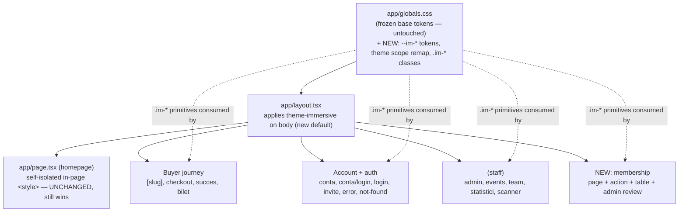
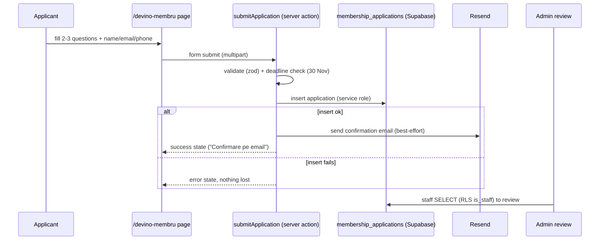

# feat: Rebrand web app to immersive v3 + membership application flow

## Summary

The homepage (`web/app/page.tsx`) wears the **immersive v3** design (dark, cinematic — ported verbatim from `Sava Pass #2/SavaPass Immersive v3.html`). Every other route in `web/` still wears the older **slate/cyan academic** REDESIGN-SPEC look. This plan brings the whole app up to the immersive v3 visual language (homepage left intact, since it is already v3) and builds the one genuinely net-new surface the v3 landing advertises but does not implement: the **"Devino membru"** club-recruitment application page and its submit flow.

The rebrand is a **re-theme**, not a rebuild: v3 reuses the app's exact fonts (Manrope / Instrument Serif / JetBrains Mono) and a near-identical cyan/blue palette. The real shift is from a light-slate default to a **dark-ink default** (`--ink #070A12`) with cyan accents, a brand gradient, and v3's motion/component treatments. The app already exposes **semantic token aliases** (`--bg-app`, `--bg-card`, `--fg-primary`, `--border-*`, gradients) that pages consume, so remapping those inside an immersive theme scope is the lever that cascades the rebrand.

The membership flow is **free** (application + interview, no payment per the v3 content) and reuses the existing server-action → Supabase-insert → Resend-email pattern.

---

## Problem Frame

- **Visual schism.** Users land on a polished dark-cinematic homepage, then click into an event and hit a tonally different light academic UI. The brand reads as two products.
- **Dead CTA.** The landing's "Aplică acum" / "Devino membru" call-to-action points at an in-page anchor with nothing behind it. The club cannot actually recruit through the site.
- **No application capture.** Interact recruits new members each generation; there is no digital intake, storage, or confirmation today.

**Goal:** one coherent immersive identity across every screen, plus a working membership application surface (capture + confirm + admin review).

**Non-goal:** changing routes, slugs, form field `name`s, server-action contracts, auth, data fetching, or the QR/Stripe/email backend logic. This is a visual + one-feature plan, not a backend refactor.

---

## Requirements

| ID | Requirement |
| --- | --- |
| R1 | Every non-homepage route renders in the immersive v3 visual language (dark ink surfaces, cyan accents, brand gradient, v3 type scale + motion), legible and on-brand. |
| R2 | The homepage (`web/app/page.tsx`) is unchanged and stays visually authoritative; its isolated in-page style keeps winning. |
| R3 | The existing frozen base tokens in `app/globals.css` are not edited or removed; the immersive theme is **additive** (new tokens + a theme scope). |
| R4 | Shared components (Button, Chip, Logo, Eyebrow, GearWatermark, LiveClock, Reveal, StaffHeader) render correctly on dark immersive surfaces. |
| R5 | A membership application page exists at a real route, styled in v3, presenting the offer + the 4-step "Cum decurge" timeline + a short application form. |
| R6 | Submitting the form stores the application, sends an email confirmation to the applicant, and surfaces a success state. Failures degrade gracefully (storage is the source of truth; a failed email never loses an application). |
| R7 | Staff can review submitted applications from the admin area. |
| R8 | The landing's "Aplică acum" / footer "Devino membru" CTAs deep-link to the new page. |
| R9 | No route, server action, slug, or form `name` contract changes. Build passes (`npm run build`) with zero type errors. |
| R10 | Motion respects `prefers-reduced-motion`; no heavy GSAP/Lenis engine is pulled into data-driven inner pages. |

**Success criteria:** a user can move homepage → event → checkout → success → ticket → account, and a recruit can homepage → "Aplică acum" → submit → receive email, with one consistent dark immersive identity throughout and a green production build.

---

## Key Technical Decisions

**KTD1 — Immersive theme as an additive scope, not an edit to frozen `:root`.**
Introduce new `--im-*` tokens and a theme scope (a class on `<body>` / the root layout, e.g. `data-theme="immersive"` or `.theme-immersive`) that **remaps the existing semantic aliases** (`--bg-app`→ink, `--bg-card`→ink-2, `--fg-primary`→light, `--border-subtle`→`--line-d`, etc.) to the v3 dark palette. Frozen base tokens stay untouched (R3). Because pages already consume the semantic aliases, the remap gives every page a legible dark baseline even before its bespoke pass lands, avoiding a broken intermediate state. Rationale: smallest blast radius, reversible, honors the immutability constraint while still flipping the whole app.

**KTD2 — Re-theme inner pages in place; do not verbatim-port HTML.**
The homepage approach (JSON-stringified HTML + `dangerouslySetInnerHTML` + GSAP engine) suits a static marketing page. Inner pages are data-driven React (`getEventBySlug`, server actions, auth). They get re-themed by swapping inline-style/Tailwind values to immersive tokens and composing shared immersive classes — structure and data flow untouched (R9).

**KTD3 — Shared immersive component classes in `globals.css`.**
Add a small set of v3-derived classes (`.im-card`, `.im-btn`, `.im-btn--ghost`, `.im-chip`, `.im-section`, `.im-reveal`, gradient/elevation helpers) distilled from the v3 stylesheet so each page composes the same primitives instead of re-inventing dark styling. This is the per-page rebrand's vocabulary.

**KTD4 — Membership = free application flow, pattern-reused.**
Per the v3 content ("Patru minute de aplicație… un scurt interviu"), there is no payment. New `membership_applications` table; anon `INSERT`, staff `SELECT` RLS. Submit via a server action mirroring `app/[slug]/checkout/actions.ts`; confirmation email via Resend mirroring the ticket email. Email failure is swallowed after a successful insert (same posture as the ticket flow).

**KTD5 — Usability guardrails on functional surfaces.**
"Entire app" was chosen, so admin/scanner/stats go dark too — but legibility wins over theatrics: admin tables keep high text contrast and clear row separation on dark; the scanner (already dark) is aligned to the v3 instrument aesthetic, not made busier. Flag any spot where dark genuinely hurts scanning for follow-up rather than shipping an unreadable table.

**KTD6 — Motion is confirmation, reused not re-imported.**
Use the existing lightweight `Reveal.tsx` + CSS keyframes for inner-page entrances; adopt v3's easing (`cubic-bezier(.22,1,.36,1)`). Do not import Lenis/GSAP into inner pages (R10). All motion gated on `prefers-reduced-motion`.

**KTD7 — Theme application is layout-scoped.**
Apply the immersive theme class in the **root layout** (`app/layout.tsx`) so it is the new app default; the homepage remains self-isolated and unaffected (R2). Route-group layouts (`(staff)`) may add surface-specific overrides (e.g. denser admin chrome) without forking the token system.

---

## High-Level Technical Design

### Theme + route architecture



The theme layer (globals.css) is the single source of immersive truth; the root layout makes it the default; every route group consumes the same `--im-*` tokens and `.im-*` classes. Homepage is wired under the layout but overrides everything via its own in-page style.

### Membership application flow



*Directional — the prose and per-unit fields are authoritative where they disagree.*

---

## Output Structure (new files only)

```
web/
├── app/
│   ├── devino-membru/
│   │   ├── page.tsx              # membership application page (v3 styled)
│   │   ├── MembershipForm.tsx    # client form component
│   │   └── actions.ts            # submitApplication server action
│   └── (staff)/admin/
│       └── aplicatii/
│           └── page.tsx          # staff review of applications
├── lib/
│   └── membership.ts             # query helpers (list/get applications)
└── supabase/migrations/
    └── 2026XXXXXXXXXX_membership_applications.sql
```

Existing files are modified in place for the rebrand; only the membership feature adds new files.

---

## Implementation Units

Units are grouped into four phases. Phase 1 (foundation) must land before any page unit; page units within Phases 2–3 are independent of each other; Phase 4 (membership) depends only on the foundation.

### Phase 1 — Immersive theme foundation

### U1. Immersive design-system token + class layer

**Goal:** Add the v3 visual vocabulary to `app/globals.css` additively.
**Requirements:** R1, R3, R10.
**Dependencies:** none.
**Files:** `web/app/globals.css`.
**Approach:** Add an `--im-*` token block distilled from `Sava Pass #2/SavaPass Immersive v3.html` `:root` (ink/ink-2/ink-3, paper/paper-2, cyan #00A7E8, cyan-light, brand `--grad`, instagram `--ig`/`--ig-soft`, line-d/line-l, mut-d/mut-l, used/success/rose, ease). Add a theme scope (`.theme-immersive` / `[data-theme="immersive"]`) that **remaps existing semantic aliases** (`--bg-app`, `--bg-card`, `--bg-elevated`, `--fg-primary/secondary/tertiary`, `--border-subtle/strong`, `--fg-on-brand`) onto the dark palette. Add `.im-card`, `.im-btn`, `.im-btn--ghost`, `.im-chip`, `.im-section`, `.im-reveal`, plus gradient/elevation/divider helpers. Do not touch any existing `@theme` or `:root` value (R3).
**Patterns to follow:** the existing `@theme`/`:root` structure in `globals.css`; class-naming mirrors current `.btn`/`.input`/`.anim-*` conventions; distill values from the v3 `<style>` head.
**Test scenarios:**
- Covers R3. After the change, every pre-existing token name still resolves to its original value (grep the frozen names; none edited/removed).
- A probe element under `.theme-immersive` reports `--bg-app` resolving to the dark ink value; outside the scope it still resolves to slate-50.
- Build compiles; Tailwind v4 `@theme` parses with the additions.
- *Test expectation:* visual/CSS unit-level — assert token resolution via a tiny rendered probe (or a CSS snapshot), not behavioral logic.

### U2. App-shell theme application + shared component dark-readiness

**Goal:** Make immersive the app default and ensure shared components render on dark.
**Requirements:** R1, R2, R4, R7-adjacent (StaffHeader).
**Dependencies:** U1.
**Files:** `web/app/layout.tsx`, `web/components/ui/Button.tsx`, `web/components/ui/Chip.tsx`, `web/components/ui/Logo.tsx`, `web/components/ui/Eyebrow.tsx`, `web/components/ui/GearWatermark.tsx`, `web/components/ui/LiveClock.tsx`, `web/components/ui/Reveal.tsx`, `web/components/staff/StaffHeader.tsx`.
**Approach:** Apply the theme scope on `<body>` (or root wrapper) in `app/layout.tsx` so all routes default to immersive. Verify the homepage still overrides (R2). Audit each shared component: replace hardcoded slate/white values with semantic aliases (which now resolve dark) or immersive tokens; ensure Button variants, Chip dot/pulse, Logo gear, watermark opacity, and LiveClock contrast read correctly on ink. Keep component APIs identical (R9).
**Patterns to follow:** existing component prop contracts; the homepage isolation note in the project CLAUDE.md (in-page style wins).
**Test scenarios:**
- Covers R2. Homepage `body` background still resolves to v3 ink and `.sp-immersive-root` renders; no visual regression in the homepage screenshot.
- Each shared component rendered on a dark surface has foreground/border contrast >= WCAG AA for text (spot-check primary/secondary text).
- Button primary still shows brand gradient/glow; ghost hover is a color shift not a filter (per existing spec).
- Covers R9. Component prop signatures unchanged (type-check passes; no call-site edits required).
- *Edge:* a route not yet bespoke-themed (pick one before its Phase 2/3 unit) is still legible (dark bg, light text) via the semantic remap.

---

### Phase 2 — Buyer journey rebrand

### U3. Event detail page + BuyCta

**Goal:** Re-theme `/[slug]` and its buy CTA to v3.
**Requirements:** R1, R9.
**Dependencies:** U1, U2.
**Files:** `web/app/[slug]/page.tsx`, `web/app/[slug]/BuyCta.tsx`.
**Approach:** Swap slate surfaces to `.im-card`/ink, apply v3 type scale (Instrument Serif accent stays a ceremonial italic), poster framing per v3, info grid (DATA/LOCUL/PORTI/PRET) as immersive data labels, seats chip dark. BuyCta uses `.im-btn` with the `Cumpără bilet · N RON` label + mono price. Data fetching, slugs, and the buy action untouched.
**Patterns to follow:** existing event-page structure; v3 `#event` section treatment; REDESIGN-SPEC data-label rule (eyebrows label data, not headings).
**Test scenarios:**
- Covers R1. Page renders dark immersive; active vs draft event still gated; metadata/robots unchanged.
- Sold-out / low-seats chip shows correct warning state on dark.
- Covers R9. CTA still links to `/[slug]/checkout`; no field/route change.
- *Integration:* a real seeded event (`echoes-unplugged`) renders end-to-end with correct price (45 RON) and seats.

### U4. Checkout page

**Goal:** Re-theme `/[slug]/checkout` to v3, keep the form contract.
**Requirements:** R1, R9.
**Dependencies:** U1, U2.
**Files:** `web/app/[slug]/checkout/page.tsx` (+ its client form if separate).
**Approach:** Dark form surface, `.input` fields restyled for dark focus rings, staggered field entrance, general-error `anim-shake`. **Field `name`s and the server action unchanged.** Keep payment legibility high (contrast on inputs/labels) — a dark checkout must not reduce conversion clarity.
**Patterns to follow:** existing checkout client structure; REDESIGN-SPEC Batch B checkout notes; v3 form styling.
**Test scenarios:**
- Covers R9. Hidden action inputs + visible field `name`s identical (curl-test the rendered form per the project's server-action test note).
- Validation errors render with shake/fade on dark; required-field gating intact.
- Inputs meet AA contrast on ink; focus ring visible.
- *Error:* a failed session-create still surfaces the existing "Plata nu a putut fi inițiată" message and marks the order failed.

### U5. Payment success page

**Goal:** Re-theme `/succes` to v3, keep the poll logic.
**Requirements:** R1, R9, R10.
**Dependencies:** U1, U2.
**Files:** `web/app/succes/page.tsx` (+ inner Suspense component).
**Approach:** Dark choreography — gear spinner during emit, serif italic "Ești înăuntru." headline (ceremonial serif moment), ring-pulse, staggered reveals on ready; error state gets GearWatermark on dark. `useSearchParams` stays inside `<Suspense>`. Order-status polling untouched.
**Patterns to follow:** existing success-page state machine; REDESIGN-SPEC Batch B success notes.
**Test scenarios:**
- Loading → ready transition still driven by `/api/order-status` poll (logic untouched).
- Ready state shows serif headline + ticket link; error state shows graceful dark fallback after poll exhaustion.
- Covers R10. Spinner/pulse honor reduced-motion.

### U6. Ticket page (the theatrical object)

**Goal:** Re-theme `/bilet/[token]` to v3 while preserving the Wallet-register feel.
**Requirements:** R1, R9.
**Dependencies:** U1, U2.
**Files:** `web/app/bilet/[token]/page.tsx` (+ LiveClock usage).
**Approach:** Dark ticket silhouette with gradient header, dashed divider/notches, QR on a high-contrast plate (QR must stay scannable — light QR module on a light plate even within a dark page), used-state slate ramp, void `ANULAT` shake, LiveClock under the QR. HMAC token route + service-role fetch untouched.
**Patterns to follow:** existing ticket structure; REDESIGN-SPEC Batch B ticket notes; v3 `.ticket`/`.qr-scan` mockup styling.
**Test scenarios:**
- Covers R1/R9. Valid ticket renders dark; QR contrast verified scannable (light modules on light quiet-zone plate).
- Used and void states render distinctly (used = slate ramp, void = shake + ANULAT).
- Buyer-token route still resolves via service-role + HMAC (no anon RLS dependency introduced).

---

### Phase 3 — Account, auth, system, and staff rebrand

### U7. Buyer account + buyer login

**Goal:** Re-theme `/conta` and `/conta/login` to v3.
**Requirements:** R1, R9.
**Dependencies:** U1, U2.
**Files:** `web/app/conta/page.tsx`, `web/app/conta/SignOutButton.tsx`, `web/app/conta/ProfileCard.tsx`, `web/app/conta/login/page.tsx`.
**Approach:** Dark greeting + stat boxes (mono numerals), boarding-pass TicketCard on dark, EmptyState with GearWatermark, SignOutButton danger-on-hover; login uses `.input` + MailCheck sent-state on dark. OTP login action + session refresh untouched.
**Test scenarios:**
- Covers R9. OTP login still works (email link → `/conta/confirm` route unchanged); past tickets still surface via email-RLS.
- Account renders dark with legible stat boxes and ticket cards; empty state shows on dark.
- Sign-out still clears session and redirects.

### U8. Auth + system pages (staff login, invite, error, not-found)

**Goal:** Re-theme staff entry + framework pages to v3.
**Requirements:** R1, R9.
**Dependencies:** U1, U2.
**Files:** `web/app/login/page.tsx`, `web/app/invite/page.tsx`, `web/app/error.tsx`, `web/app/not-found.tsx`.
**Approach:** Dark immersive cards, `.input` fields, navy/gradient primary, `anim-shake` on auth errors; 404 keeps the ceremonial serif numeral on dark with GearWatermark. Auth actions and invite-confirm route untouched.
**Test scenarios:**
- Covers R9. Staff login + invite-accept flows unchanged (routes/actions intact).
- error.tsx and not-found.tsx render dark with shared Button/Link classes; 404 serif numeral legible on ink.

### U9. Staff dashboard suite (admin, events editor, team, statistici)

**Goal:** Re-theme the staff tools to v3 with legibility guardrails.
**Requirements:** R1, R9, KTD5.
**Dependencies:** U1, U2.
**Files:** `web/app/(staff)/layout.tsx`, `web/app/(staff)/admin/page.tsx`, `web/app/(staff)/admin/AdminClient.tsx`, `web/app/(staff)/admin/events/page.tsx`, `web/app/(staff)/admin/events/[id]/page.tsx`, `web/app/(staff)/admin/team/page.tsx`, `web/app/(staff)/admin/team/TeamClient.tsx`, `web/app/(staff)/statistici/page.tsx`.
**Approach:** Dark desktop-tool surface; tables keep high contrast and clear row dividers on ink (KTD5); Live chip pulse, event editor sticky save bar, stat cards, status controls re-themed. All server actions, role checks (`is_staff`), and data fetching untouched. Flag (don't ship) any table that becomes hard to scan on dark.
**Test scenarios:**
- Covers R9. Admin actions (create/edit event, status swap, invite teammate) still function; role gating intact.
- Tables/stat views render with AA-contrast text and visible row separation on dark; `event_stats` nullables still `?? 0` guarded.
- Live chip pulse + sticky save bar behave as before.

### U10. Scanner alignment to v3 instrument aesthetic

**Goal:** Align the already-dark scanner to v3 without adding noise.
**Requirements:** R1, R9.
**Dependencies:** U1, U2.
**Files:** `web/app/(staff)/scanner/page.tsx`, `web/app/(staff)/scanner/ScannerClient.tsx`.
**Approach:** Map the existing flat-navy scanner onto `--im-*` ink tokens, verdict choreography (ok = pop + green ring-pulse, warning = pop, error = pop + shake) kept; align typography/spacing to v3. Atomic check-in action + camera decode untouched. Keep it a calm instrument (no gradients/glow that hurt night use).
**Test scenarios:**
- Covers R9. Atomic check-in still returns valid / already_in / invalid correctly; camera decode path unchanged.
- Verdict states render distinctly on dark; diacritics correct (Deja înăuntru, Scanează, Verific…).
- Reduced-motion respected on verdict animations.

---

### Phase 4 — Membership application feature

### U11. `membership_applications` table + RLS + types

**Goal:** Persist applications safely.
**Requirements:** R6, R7.
**Dependencies:** none (can land alongside Phase 1).
**Files:** `web/supabase/migrations/2026XXXXXXXXXX_membership_applications.sql`, `web/lib/supabase/types.ts` (regenerated).
**Approach:** Table `membership_applications` (id, created_at, full_name, email, phone, class/grade, short answers, status enum `new|reviewing|interview|accepted|declined` default `new`, source). RLS: anon `INSERT` allowed (with column whitelist), `SELECT` restricted to `is_staff()`; no anon SELECT. Regenerate types via Supabase MCP `generate_typescript_types` (per project rule: never hand-stub). Check `lib/supabase/types.ts` for escaped `\"` after regen.
**Patterns to follow:** existing migrations in `web/supabase/migrations/`; `is_staff()` policy used by `tickets`; the project's "generate real types before `.from()`" rule.
**Execution note:** apply the migration, then immediately regenerate types before any code consumes the table.
**Test scenarios:**
- Covers R6/R7. Anon role can INSERT a valid row; anon SELECT returns zero rows (RLS); staff SELECT returns the row.
- Status defaults to `new`; invalid status rejected by the enum/check.
- Required columns NOT NULL enforced at the DB.
- *Integration:* a round-trip insert via service role then staff-context read returns the same row.

### U12. Membership application page (v3)

**Goal:** Build `/devino-membru` presenting the offer + timeline + form.
**Requirements:** R5, R10.
**Dependencies:** U1, U2.
**Files:** `web/app/devino-membru/page.tsx`, `web/app/devino-membru/MembershipForm.tsx`.
**Approach:** Port the v3 `#join` section content verbatim where copy exists ("De partea cealaltă a serii.", the 4-step "Cum decurge" timeline with Astăzi/Instant/În 5 zile/~2 săpt. labels, deadline 30 noiembrie). Form: full name, email, phone, class/grade, 2-3 short-answer questions. Dark immersive styling via `.im-*`; serif accent for the headline; Reveal-based entrance (no GSAP). Client-side required-field validation before submit.
**Patterns to follow:** v3 `#join` markup/copy; existing client-form components (checkout form, conta login).
**Test scenarios:**
- Covers R5. Page renders the offer, the 4-step timeline, and the form on dark; deadline copy present.
- Required fields block submit client-side with inline messaging; email format validated.
- Covers R10. Entrance/reveal honors reduced-motion.

### U13. Submit action + confirmation email

**Goal:** Wire the form to storage + email with graceful failure.
**Requirements:** R6.
**Dependencies:** U11, U12.
**Files:** `web/app/devino-membru/actions.ts`, `web/lib/membership.ts` (insert helper if shared), Resend send (reuse existing email util/pattern).
**Approach:** Server action `submitApplication`: zod-validate (Next 16 uses `error`, not `errorMap`), enforce the 30 Nov deadline server-side, insert via service-role client, then best-effort Resend confirmation ("Confirmare pe email"). Insert success is the source of truth; a failed email is logged, not surfaced as failure (mirror the ticket email posture). Optionally notify a club inbox. Keep `redirect()` outside try/catch.
**Patterns to follow:** `app/[slug]/checkout/actions.ts` (server-action + service-role insert), the ticket-email send in the Stripe webhook, the project's Resend `from` (`noreply@savapass.ro`, domain still unverified — note delivery caveat).
**Test scenarios:**
- Covers R6 happy path. Valid submit inserts a row and returns success state.
- *Edge:* duplicate email — define policy (allow but flag, or soft-block); test the chosen behavior. Submission after 30 Nov is rejected with a clear message.
- *Error:* DB insert failure returns an error state and stores nothing partial; **email send failure still returns success** (application saved), failure logged.
- *Integration:* end-to-end submit creates a `membership_applications` row visible to staff.

### U14. Staff application review surface

**Goal:** Let staff read and triage applications.
**Requirements:** R7.
**Dependencies:** U11, U9 (staff theme).
**Files:** `web/app/(staff)/admin/aplicatii/page.tsx`, `web/lib/membership.ts` (list/get helpers), nav link in `web/components/staff/StaffHeader.tsx` or `(staff)/layout.tsx`.
**Approach:** Staff-only list (newest first) of applications with name/email/phone/answers/status, gated by `is_staff()` and the existing staff route protection. Read-only for v1 (status mutation is a follow-up). Dark immersive table consistent with U9.
**Patterns to follow:** existing admin list pages (`admin/team`); `lib/staff-routes.ts` + role gating.
**Test scenarios:**
- Covers R7. Staff sees submitted applications; non-staff is redirected/blocked by existing protection.
- List renders empty state when no applications; renders rows with all captured fields on dark.

### U15. Wire landing CTAs to the membership page

**Goal:** Make "Aplică acum" / "Devino membru" reach the new page.
**Requirements:** R8.
**Dependencies:** U12.
**Files:** `web/scripts/extract-immersive.mjs` (CTA href mapping) and/or `web/app/_immersive/content.ts`, `web/app/page.tsx` (href injection).
**Approach:** The homepage markup is generated by `extract-immersive.mjs` with a `__CTA_HREF__` placeholder for purchase CTAs. Add an analogous mapping so the membership CTA(s) (`Aplică acum`, footer `Devino membru`) resolve to `/devino-membru`. Prefer extending the extract script (re-runnable) over hand-editing `content.ts`. Homepage visual is otherwise unchanged (R2).
**Patterns to follow:** the existing `__CTA_HREF__` purchase-link mechanism in `extract-immersive.mjs`.
**Test scenarios:**
- Covers R8. Clicking "Aplică acum" / footer "Devino membru" navigates to `/devino-membru`.
- Covers R2. Re-running the extract script reproduces the homepage byte-faithfully except the new membership href; homepage visual unchanged.

---

## Scope Boundaries

**In scope:** dark immersive v3 re-theme of every non-homepage route + shared components; additive theme layer; membership application page, table, submit action, confirmation email, and read-only staff review; landing CTA wiring.

**Out of scope (non-goals):**
- Any change to routes, slugs, form field `name`s, server-action signatures, auth, data fetching, QR/Stripe/email backend logic.
- Editing or removing frozen `globals.css` base tokens.
- Re-porting or restyling the homepage beyond the membership CTA href.

### Deferred to Follow-Up Work
- Membership **payment** (the v3 offer is a free application + interview; no payment surface).
- Application **status workflow** (staff changing `new`→`interview`→`accepted`, interview-slot scheduling, applicant notifications beyond the first confirmation).
- Spam/rate-limiting hardening on the public submit endpoint (basic validation only in v1).
- Resend **domain verification** for `savapass.ro` (email delivery remains best-effort until done).
- A dedicated `prefers-reduced-motion` audit pass across all rebranded pages (each unit handles its own; a holistic sweep is deferred).

---

## Risks & Dependencies

| Risk | Impact | Mitigation |
| --- | --- | --- |
| Flipping the app default to dark leaves un-themed pages broken mid-rollout | Ugly intermediate states | KTD1 semantic-alias remap gives every page a legible dark baseline before its bespoke pass; land U1+U2 together. |
| Dark admin tables / scanner hurt usability | Staff can't read data at a glance | KTD5 legibility guardrail; flag-don't-ship unreadable tables; keep scanner calm. |
| QR becomes unscannable on a dark ticket | Door check-in fails | U6 keeps QR on a light quiet-zone plate; verify scannability explicitly. |
| Homepage isolation regresses when theme moves to root layout | Homepage visual breaks | R2 test in U2; homepage in-page style already wins per project CLAUDE.md note. |
| Stale Supabase types after the new table | `never[]` insert errors | U11 execution note: regenerate types immediately; check for escaped `\"`. |
| Supabase project auto-pauses (free tier) during testing | Membership submit hangs/null | Known issue (project CLAUDE.md): restore via MCP before E2E membership testing. |
| Email delivery silently fails (unverified domain) | Applicants get no confirmation | KTD4 stores first; surfaces in-app success regardless; domain verification deferred but noted. |

**Dependencies / prerequisites:** Supabase project `shzyvrojbtbczqqoilip` ACTIVE_HEALTHY; Resend key present in `web/.env.local`; `npm run build` run with the dev server stopped (project rule — both write `.next/`).

---

## Open Questions (resolve at implementation)

1. **Route name** for the membership page: `/devino-membru` (assumed) vs `/membru` vs `/aplica`. Pick one and keep the CTA mapping consistent.
2. **Application questions** — the exact 2-3 short-answer prompts are not specified by the v3 copy ("2-3 întrebări scurte"). Draft sensible ones (why Interact / a strength you'd bring / availability) and confirm with the club.
3. **Duplicate-email policy** on resubmission (allow + flag vs soft-block).
4. **Club notification inbox** for new applications (which address, if any) — default to none beyond the applicant confirmation until provided.

These are content/config choices that do not block the architecture; resolve them inline during Phase 4.
