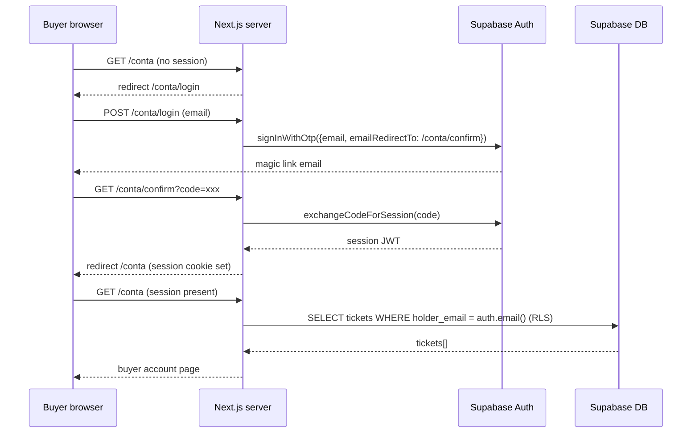

# feat: Buyer accounts, unified staff dashboard, and expanded Interact section

## Summary

Add buyer accounts (OTP magic link) so ticket holders can see all their tickets in one place at `/conta`, improve the staff experience with bidirectional admin/scanner navigation and a live check-in counter, and expand the `AboutInteract` landing section with richer club content.

---

## Problem Frame

Buyers have no way to find a purchased ticket without the original email link. The `/bilet/[token]` URL is only accessible if they saved it or kept the email — a fragile UX as SavaPass grows into multi-event territory. Buyers need a wallet home for all their tickets. On the staff side, the scanner page has no way back to the admin dashboard (one-way navigation), and the admin lacks a live scanner status indicator. The landing page's Interact section is sparse: two columns of numbers with no mission context, no project history, no membership path — a missed chance to build trust with new visitors.

---

## Requirements

**Buyer accounts**
- R1. Buyers can sign in at `/conta/login` using their email address via OTP magic link — no password required.
- R2. After sign-in, the buyer lands on `/conta` which lists all tickets tied to their email.
- R3. A ticket is visible in `/conta` if `holder_email` matches the authenticated buyer's email.
- R4. Tickets purchased before the buyer created an account are retroactively visible — no re-purchase needed.
- R5. Guest checkout is unchanged; an account is never required to buy.
- R6. Staff auth (`/login`, email+password) is unchanged.

**Staff dashboard**
- R7. The scanner page has a navigation link back to `/admin`.
- R8. The admin and scanner share consistent header navigation so staff can switch surfaces without dead ends.
- R9. The scanner header shows a live check-in count for the active event.

**Landing page — Interact section**
- R10. `AboutInteract` includes a mission statement, three project-pillar cards, social media links, and a membership call-to-action.
- R11. The stat block is preserved and the section overall provides stronger social proof than the current version.

---

## Key Technical Decisions

- **OTP magic link over password or Google OAuth.** `supabase.auth.signInWithOtp` is native, server-friendly, and requires zero credentials to manage. School-age buyers who purchase 1–2 tickets a year won't remember a password; Google OAuth requires extra OAuth app setup. OTP is the right fit.
- **Email-based RLS, not `user_id` join.** Retroactive ticket visibility is achieved via `holder_email = auth.jwt()->>'email'` in an RLS policy. No backfill needed — past tickets are visible on first sign-in automatically. A nullable `user_id` column is added for forward compatibility (future checkout auto-link), but `/conta` queries by email.
- **Separate buyer login route (`/conta/login`) from staff login (`/login`).** The existing `/login` says "Acces staff" and uses email+password. Merging the two flows would require detecting intent on one page. Two named routes is clearer.
- **`/conta` redirect handled in page component, not proxy.** The proxy must include `/conta/:path*` in its matcher so `@supabase/ssr` can refresh expired session cookies. But the redirect-if-unauthenticated logic lives in the page component (consistent with how the rest of the app handles SSR auth), not as a proxy rule. This avoids a proxy redirect loop when the callback route at `/conta/confirm` also matches the pattern.
- **Scanner live count reuses the `AdminClient.tsx` Realtime pattern.** A small `"use client"` sub-component subscribes to `scans` inserts on the active event and increments a local counter. Initial count is fetched server-side and passed as a prop.

---

## High-Level Technical Design

### Buyer auth flow



### Proxy and RLS boundary

```mermaid
flowchart TB
    R[Request] --> M{proxy.ts matcher}
    M -->|/admin /scanner| SR[Refresh session\nCheck role\nRedirect → /login if no session]
    M -->|/conta/:path*| CR[Refresh session only\nno proxy redirect]
    M -->|all else| NX[NextResponse.next]

    CR --> CP[/conta page\nredirects → /conta/login if no session]
    SR --> AD[/admin or /scanner page]
```

---

## Implementation Units

### U1. DB migration — buyer-linkable tickets

**Goal:** Add nullable `user_id` FK to `tickets` and `orders`; create buyer RLS policy on `tickets`.

**Requirements:** R3, R4

**Dependencies:** none

**Files:**
- `web/supabase/migrations/20260611_buyer_accounts.sql` (new)
- `web/lib/supabase/types.ts` (regenerate after migration via `generate_typescript_types` MCP)

**Approach:** Migration applies three changes:
1. `ALTER TABLE tickets ADD COLUMN user_id UUID REFERENCES auth.users(id) ON DELETE SET NULL;`
2. `ALTER TABLE orders ADD COLUMN user_id UUID REFERENCES auth.users(id) ON DELETE SET NULL;`
3. New RLS policy `tickets_buyer_read`: `CREATE POLICY ... ON tickets FOR SELECT TO authenticated USING (auth.jwt()->>'email' = holder_email);`

The existing `is_staff()` SELECT policy on tickets is additive — staff access is unchanged. After the migration runs, regenerate types so `tickets.Row.user_id: string | null` appears in `lib/supabase/types.ts`.

**Patterns to follow:** Existing `is_staff()` and `is_admin()` RLS function references visible in `lib/supabase/types.ts`.

**Test scenarios:**
- Happy path: authenticated buyer queries `tickets` with anon client → receives only rows where `holder_email` matches their JWT email.
- Edge: unauthenticated anon request → zero rows returned.
- Edge: staff user (`is_staff() = true`) → still sees all tickets via the existing staff policy (policies are OR-combined).
- Integration: after applying migration and regenerating types, `Ticket` type has `user_id: string | null`.

**Verification:** Migration applies without error; `tickets.user_id` column visible in Supabase Studio; regenerated `lib/supabase/types.ts` includes `user_id: string | null` on `Ticket` Row.

---

### U2. Buyer OTP login page and auth callback

**Goal:** `/conta/login` sends a magic link; `/conta/confirm` exchanges the code and establishes a session.

**Requirements:** R1

**Dependencies:** none (buildable independently of U1)

**Files:**
- `web/app/conta/login/page.tsx` (new — client component)
- `web/app/conta/confirm/route.ts` (new — GET route handler)

**Approach:**
- `login/page.tsx`: client component with email `<input>` and "Trimite link" button. On submit calls `createBrowserClient(...).auth.signInWithOtp({ email, options: { emailRedirectTo: process.env.NEXT_PUBLIC_SITE_URL + '/conta/confirm' } })`. After success, shows a confirmation state ("Verifică emailul — linkul e pe drum!"). Uses `createBrowserClient` from `lib/supabase/client.ts` — same pattern as `app/login/page.tsx`.
- `confirm/route.ts`: `GET` handler, reads `?code=` from search params, calls `createClient().auth.exchangeCodeForSession(code)`, then `redirect('/conta')`. On error, `redirect('/conta/login?error=1')`. Uses `createClient` from `lib/supabase/server.ts`.
- Staff `/login` page is untouched.

**Patterns to follow:** `app/login/page.tsx` for client-side form; `lib/supabase/server.ts` `createClient()` for the callback handler.

**Test scenarios:**
- Happy path: valid email entered → success confirmation state shown.
- Happy path: buyer clicks magic link → lands on `/conta/confirm?code=xxx` → session set → redirected to `/conta`.
- Error path: OTP fails (invalid email, rate limit) → inline error message shown.
- Error path: expired/invalid code in callback → redirected to `/conta/login?error=1`.
- Edge: `/conta/login` shows error banner when `?error=1` is present in the URL.

**Verification:** Full OTP round-trip completes; `/conta/confirm` sets session cookie; `supabase.auth.getSession()` returns valid session with buyer email.

---

### U3. Buyer account page (`/conta`)

**Goal:** Mobile-first wallet page showing all the authenticated buyer's tickets with links to individual ticket pages.

**Requirements:** R2, R3, R4

**Dependencies:** U1 (RLS must exist before queries work), U2 (session must be established)

**Files:**
- `web/app/conta/page.tsx` (new — async server component)
- `web/proxy.ts` (modify — extend matcher and refresh path to include `/conta/:path*`)

**Approach:**
- Server component: `createClient()` → `supabase.auth.getUser()`. If no user, `redirect('/conta/login')`.
- Query: `supabase.from('tickets').select('id, code, qr_token, status, issued_at, events(title, date_label, accent)').order('issued_at', { ascending: false })`. RLS enforces email match automatically.
- Render: sticky header with `Logo` + "Ieși din cont" sign-out link (client sub-component that calls `signOut()` + `router.push('/')`); list of ticket cards showing event poster accent color, event title, date, code, and status badge using the existing `Chip` component; link to `/bilet/[qr_token]`.
- Empty state: "Niciun bilet încă — explorează evenimentele noastre!" with a CTA back to `/`.
- `proxy.ts`: add `/conta/:path*` to `config.matcher` array; in the proxy body, add a session refresh path for `/conta` that doesn't redirect unauthenticated users (just calls `supabase.auth.getSession()` to refresh the cookie and returns `response`). This keeps session cookies fresh without building redirect logic into the proxy.

**Patterns to follow:** `app/(staff)/admin/page.tsx` for SSR auth + data fetch; `components/ui/Chip.tsx` for ticket status badges; `app/bilet/[token]/page.tsx` for the wallet-style visual reference.

**Test scenarios:**
- Happy path: buyer with 2 tickets → both cards rendered with correct event titles and status badges.
- Happy path: clicking ticket card → navigates to `/bilet/[token]`.
- Edge: buyer with zero tickets → empty state shown with CTA to landing.
- Edge: unauthenticated visitor → redirected to `/conta/login`.
- Edge: ticket with `status: 'in'` → "Intrat" badge; `status: 'valid'` → "Valabil" badge; `status: 'used'` → "Folosit" badge.
- Integration: ticket data from real DB (not mock) flows through RLS to the page correctly.

**Verification:** Authenticated buyer sees correct tickets; unauthenticated redirect works; sign-out clears session and returns to `/`.

---

### U4. Landing page nav — buyer account link

**Goal:** `SiteNav` shows "Contul meu" for authenticated buyers and "Biletele mele" for guests, both linking to the right destination.

**Requirements:** R2

**Dependencies:** U2, U3

**Files:**
- `web/app/page.tsx` (modify — `LandingPage` and `SiteNav`)

**Approach:**
- `LandingPage` is already async. Add a `createClient()` call to check auth alongside existing data fetches (parallel with `getActiveEvent()` / `getPastEvents()`). Pass `isAuthenticated: boolean` to `SiteNav`.
- `SiteNav`: if `isAuthenticated` → show "Contul meu" linking to `/conta`; if not → rename "Intră în cont" to "Biletele mele" linking to `/conta/login`.
- Staff `/login` is no longer linked from the public nav (staff know the URL). The route remains accessible by direct navigation.

**Patterns to follow:** Existing `LandingPage` parallel data fetch; `lib/supabase/server.ts` `createClient()`.

**Test scenarios:**
- Happy path: unauthenticated visitor → "Biletele mele" link visible, points to `/conta/login`.
- Happy path: authenticated buyer (session cookie present) → "Contul meu" visible, points to `/conta`.
- Edge: auth check errors → nav renders as unauthenticated (fallback, no crash).

**Verification:** Landing page renders correctly for both auth states; no visible performance change on page load.

---

### U5. Staff experience — bidirectional navigation and live check-in count

**Goal:** Add a back-to-admin link to the scanner page, make the admin→scanner link more prominent, and show a live check-in count in the scanner header.

**Requirements:** R7, R8, R9

**Dependencies:** none

**Files:**
- `web/app/(staff)/scanner/page.tsx` (modify)
- `web/app/(staff)/scanner/ScannerLiveCount.tsx` (new — client sub-component)
- `web/app/(staff)/admin/page.tsx` (modify — scanner button styling)

**Approach:**
- Scanner header currently has `<div style={{ width: 60 }} />` on the left (spacer). Replace with `Link href="/admin"` containing a `LayoutDashboard` Lucide icon + "Admin" label, styled like the existing admin header's scanner link.
- Add `ScannerLiveCount` client component to the scanner header right side: takes `initialCount: number` and `eventId: string` props (fetched server-side). Subscribes to `scans` inserts on that event via `supabase.channel(...).on('postgres_changes', { event: 'INSERT', schema: 'public', table: 'scans', filter: 'event_id=eq.' + eventId })`. Shows "X intrați" in muted text, incrementing on `ok` scan results.
- Scanner page (`ScannerPage` is currently a pure client component): convert to a server component wrapper that fetches the active event and current check-in count, then renders the scanner UI as a child. Alternatively, fetch count in a separate server action. The simpler approach: make a thin server page that passes `eventId` and `initialCheckedIn` to the existing client component.
- Admin: change the Scanner link from `border: "1px solid var(--slate-200)"` to `background: "var(--brand-cyan-50)"` with a cyan border — visually prominent as a day-of primary action.

**Patterns to follow:** `AdminClient.tsx` Realtime subscription pattern; existing admin header `Link` styling.

**Test scenarios:**
- Happy path: scanner page loads → "← Admin" link visible in header → clicking navigates to `/admin`.
- Happy path: scanner starts with count = 5 → a new `ok` scan is inserted → count updates to 6 without page refresh.
- Edge: Realtime subscription disconnects → count shows last known value (no crash, no spinner).
- Happy path: admin page → scanner button styled with cyan background, clearly visible.

**Verification:** Both navigation links work; Realtime count increments on scan insert confirmed via manual DB insert or a real scan.

---

### U6. Expanded `AboutInteract` landing section

**Goal:** Rewrite `AboutInteract()` in `app/page.tsx` to include mission text, three project-pillar cards, the existing stat block, social media links, and a membership CTA.

**Requirements:** R10, R11

**Dependencies:** none

**Files:**
- `web/app/page.tsx` (modify — `AboutInteract` function)

**Approach:** Expand the section to six content blocks:
1. **Section header** — existing `Eyebrow` "DESPRE INTERACT" + H2 heading (keep as-is).
2. **Mission paragraph** — 2–3 sentences: Interact Sf. Sava, Rotary affiliation, types of projects, and the role of ticket revenue.
3. **"Ce facem" 3-card row** — `Cultural` (concerte, baluri, vernisaje), `Social` (voluntariat, donații, proiecte comunitare), `Educativ` (workshop-uri, dezbateri, schimburi). Uses the same icon-card style from `HowItWorks` (accent gradient icon square + title + body).
4. **Impact stat block** — existing 4-stat dark card grid (3+ ani, 264 bilete, 13.5k RON, 100% Interact), kept.
5. **Social links row** — Instagram, Facebook links in a simple flex row (Lucide `Instagram` and `Facebook` icons, or simple SVG inline icons if Lucide doesn't have them). Links are `href="#"` placeholders until real URLs are provided.
6. **Membership CTA** — a `Link href="/aplica"` styled like the secondary button in `HeroSection`: "Vrei să faci parte din echipă? →". The `/aplica` page is a Phase 6 item; this is just the link.

The section keeps `id="despre"` (anchor from HeroSection).

**Patterns to follow:** `HowItWorks` icon cards; `HeroSection` CTA button; existing `Eyebrow` and `Chip` component usage.

**Test scenarios:**
- Test expectation: none — visual/copy change with no runtime logic. Manual verification: load `/` and confirm all six sub-elements render without error.

**Verification:** Landing page loads without build errors; `AboutInteract` renders all six blocks; `id="despre"` anchor still works from HeroSection's CTA.

---

## Scope Boundaries

### Deferred to Follow-Up Work

- `/aplica` membership application page (Phase 6 per PLAN.md) — CTA links there but the page is not built in this plan.
- Buyer "resend magic link" UI for when the email doesn't arrive (Supabase rate-limits OTP resends, so just documentation for now).
- Checkout auto-link: passing `user_id` to the order during Stripe checkout when the buyer is already authenticated.
- Multi-event admin support: `/admin` currently shows only the active event.
- Server-side export route for CSV (`/api/admin/export`) — inline client-side CSV download remains for now.

### Out of scope

- Ticket transfers between buyers.
- Buyer-initiated refunds (staff-only workflow per existing design).
- Google OAuth sign-in for buyers.
- Staff user management UI.

---

## System-Wide Impact

- `proxy.ts` matcher extended to include `/conta/:path*` — verify after change that existing `/admin` and `/scanner` gating is unaffected.
- New RLS policy on `tickets` is additive. After migration, verify in Supabase Studio that staff (`is_staff()`) still read all tickets.
- `lib/supabase/types.ts` must be regenerated after U1's migration before U3 can be written — stale types will cause TypeScript errors on any `.from('tickets')` usage touching `user_id`.

---

## Risks & Dependencies

- **OTP email delivery**: Supabase Auth uses its own email provider (not Resend) for magic links. This is independent of the ticket email issue (unverified `savapass.ro` domain in Resend). OTP emails go through Supabase's infrastructure and should work out of the box in development.
- **Session refresh on `/conta`**: if proxy matcher doesn't include `/conta`, expired JWTs won't refresh mid-session and buyers will silently see zero tickets after ~1 hour. The matcher extension in U3 is load-bearing.
- **Type regeneration blocks U3**: the `user_id` column from U1's migration must be applied and types regenerated before writing the ticket query in U3. U3's file list explicitly includes the regenerated types step.
