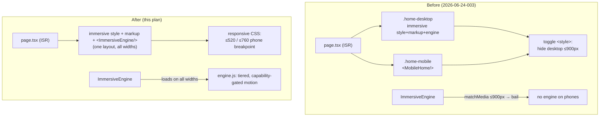

# feat: Responsive immersive homepage on mobile

## Summary

Make the **desktop v3 immersive homepage itself** render and animate on phones at high fidelity, and **delete the dedicated mobile homepage** (`web/app/_mobile/`) that replaced it. Phones get the same layout, components, videos, and animation language as desktop — not a separate, toned-down layout. Desktop stays byte-for-byte unchanged.

This reverses the direction of plan 2026-06-24-003. That plan built a purpose-built mobile homepage (`.mh`) because a 1280px-authored full-bleed scroll experience read as empty `100dvh` voids on a phone. The user has rejected that outcome ("not this refined crap") and wants literal desktop fidelity on mobile. The earlier failure was caused by *subtracting* desktop richness for phones (hiding the marquee, dots, telemetry, rails — leaving sparse sections). The fix here is the opposite: build a real phone breakpoint that *adapts* every section and decorative so it reads full and cinematic in portrait, and run the desktop animation engine on phones (tuned for ~60fps), instead of bending the layout by removal.

Two hard constraints shape the work: (1) `web/app/_immersive/content.ts` is **auto-generated** by `web/scripts/extract-immersive.mjs` from the out-of-repo v3 source — it is never hand-edited, so every CSS/markup change is an extractor edit + re-run; (2) the immersive CSS is **fully global/unscoped** and lives in a route-level `<style>`, which is now simpler because the immersive becomes the *only* homepage layout again (no `.mh` coexistence to isolate from). The mobile engine cost (~150KB GSAP/Lenis now loads on phones, which the perf pass had deliberately skipped) is a trade the user accepted for fidelity; the existing media re-encodes, self-hosted vendor, and rAF throttles keep it manageable.

Mobile inherits the desktop port's hardcoded showcase numbers (84/120 · 45 RON · 264) by design — desktop has no live-data wiring either, and live data is out of scope here. Only the CTA href (`__CTA_HREF__`) is dynamic, as it already is on desktop.

---

## Design Direction

The design system is **already locked** by the v3 immersive — this plan does not invent one, it adapts the established language to portrait at the same craft bar.

**Preserve the locked system (desktop = source of truth):** ink `#070A12` background, single cyan `#00A7E8` accent, paper text, the gear motif; Manrope (sans) + Instrument Serif (ceremonial) + JetBrains Mono (numerals); the v3 motion curves and reveal choreography. No new colors, fonts, radii, or accents are introduced for mobile.

**Mobile-specific craft rules (the bar for "wow without bugs"):**
- Every `100dvh`/`100svh` section reads **full and intentional** in portrait — no empty voids, no desktop clutter overlapping content.
- Decoratives are **adapted, not subtracted** — the marquee, dots, telemetry corners, and rails are re-placed for portrait where they add life; only a layer that genuinely cannot fit stays hidden (KTD4).
- Hero fits one screen: headline legible, phone mockup + ticket framed, both CTAs reachable, videos framed for portrait crop.
- Motion matches desktop's language and stays smooth: entrance reveals, hero mask, phone entrance, count-up, seam/thread draws, QR, and tuned parallax all run; heaviest scrubs are capability-gated on low-end devices (KTD3).
- Native feel: every tappable ≥44px, safe-area insets respected, zero horizontal overflow on text-bearing elements at 360/390/414 + landscape.

---

## Problem Frame

The homepage `/` (`web/app/page.tsx`, ISR `revalidate=300`) currently **co-renders two layouts** in one document: the immersive port wrapped in `.home-desktop` (shown >900px) and `<MobileHome/>` (`web/app/_mobile/`, shown ≤900px), toggled by a route-level `<style>` block. `web/app/_immersive/ImmersiveEngine.tsx` **bails before loading any engine script** when `matchMedia('(max-width:900px)').matches`, so phones run no GSAP/Lenis and see the dedicated `.mh` layout instead.

The immersive itself was authored for 1280px:
- Sections are `min-height:100svh` (`.intro` is `position:sticky` over the page) with content centered.
- The phone breakpoints in the immersive CSS are sparse — real responsive work lives at 760–920px (tablet); the `≤520px` block overrides almost nothing, so phones inherit desktop positioning, spacing, and type.
- Decorative viewport-fixed/absolute layers (`.strip` hero marquee, `.dots` section-nav, `.tele` corner telemetry, `.lrail` side rail) are currently `display:none` at ≤760px (the subtraction that emptied the page).
- The engine's continuous scroll-scrubbed parallax block is wrapped in `if(__noTouch){…}` (desktop-only) because it tanked mobile FPS; only entrance reveals + the hero/phone showpiece + count-up + CSS/IO reveals run on touch.

The desired state: **one immersive layout for all widths**, made genuinely responsive at phone sizes, with the engine running on phones (tuned), and the decoratives + videos refined for portrait — so mobile is the desktop experience, not a reduction of it.

**Available to build on (no new dependencies):**
- `web/scripts/extract-immersive.mjs` — the extractor; already applies targeted `cssOut`/`engineOut`/`markupOut` edits and has a precedent for mobile-specific blocks and perf tuning.
- `web/scripts/encode-media.mjs` — sharp-based media re-encoder (PNG→WebP); ffmpeg is installed for video (perf-pass precedent).
- The engine's existing mobile mitigations: rAF-throttled `chrome()`, off-screen video pause, native video `loop`, IO-driven hero/phone reveals.
- The v3 source of truth (out-of-repo): `Sava Pass #2/SavaPass Immersive v3.html` and `Sava Pass #2/assets/`.

---

## Requirements

- R1. Desktop `/` is unchanged — a 1280px baseline matches today byte-for-byte (same immersive markup/CSS/engine behavior, same SSR, same ISR `revalidate=300`). All mobile CSS rules live inside `@media(max-width:760px)`/`≤520px` so the desktop cascade is provably untouched.
- R2. On phones, `/` shows the **same immersive layout, components, and videos** as desktop (no separate mobile homepage), made responsive — every section reads full and intentional with no empty `100dvh` voids and no desktop clutter overlapping content.
- R3. The immersive **animations run on phones** — hero mask reveal, phone entrance, count-up, seam/thread draws, scroll reveals, QR, and tuned parallax — matching the desktop motion language.
- R4. Mobile motion is **smooth** (≈60fps target on mid-range; heaviest scrubs capability-gated on low-end devices); no jank, no FOUC, no stuck-hidden reveals.
- R5. Videos and heavy elements (the three background loops, the event poster, the phone mockup) are **refined for portrait** — framed/positioned, and re-encoded only if cover-crop is unacceptable — so they read well without blowing the payload budget.
- R6. **No bugs** at 360/390/414 + landscape: zero horizontal overflow on text-bearing elements, safe-area insets respected, every tappable ≥44px, zero console errors.
- R7. The dedicated mobile homepage (`web/app/_mobile/`) is **removed**; `page.tsx` renders one immersive layout for all viewports and `ImmersiveEngine` runs on all viewports.
- R8. All changes flow through `web/scripts/extract-immersive.mjs` (regenerating `content.ts`, `engine.js`, `engine-motion.mjs`); re-running the extractor is **idempotent** and reproduces the shipped result.
- R9. Verified (mobile render + desktop baseline + production build pass) and **live** on `sava-pass.vercel.app`.

---

## Key Technical Decisions

- KTD1 — **One responsive immersive layout for all viewports; retire `web/app/_mobile/`.** `page.tsx` renders the immersive `<style>` + markup + `<ImmersiveEngine/>` directly with no device wrapper, no visibility-toggle `<style>`, and no `body` reset. This reverses 2026-06-24-003 per the user's explicit call. *Rationale:* the user wants literal desktop fidelity; a single layout cannot drift from desktop and removes the `.mh` global-CSS-bleed problem entirely (the immersive is the only homepage layout again). *Cost:* a 1280px-authored layout must be made to work at 360px — that is the bulk of this plan. *Rejected:* keep dual layouts (drift + the rejected outcome); a `proxy.ts` UA rewrite to `/m` (UA sniffing + per-route cache warming complexity).
- KTD2 — **Every change goes through the extractor; `content.ts` is never hand-edited.** Mobile CSS is added by **appending a maintained mobile block** to `cssOut` (later rules win the cascade) plus a few targeted `.replace()`s for surgical fixes; engine changes are `engineOut` `.replace()`s; then `node scripts/extract-immersive.mjs` regenerates the outputs. *Rationale:* `content.ts`/`engine.js` are auto-generated (header says so) and re-extraction would clobber hand edits. Append-block keeps the out-of-repo v3 source a faithful port and the mobile layer owned in-repo. Idempotency is verified by re-running and diffing (R8).
- KTD3 — **Run the engine on mobile; gate by effect cost + device capability, not a blanket touch check.** Replace the engine's `if(__noTouch){…}` wrapper with a tiered model: cheap compositor effects (entrance reveals, hero mask, phone entrance, count-up, seam/thread draws, a *light* parallax) run on all devices; the heaviest continuous scrubs (the two background-video `yPercent` parallaxes, per-row stats parallax) run with **reduced amplitude** on touch and are **disabled on low-end devices** (`navigator.deviceMemory` defined and ≤4 → skip; undefined, e.g. iOS, → treat as capable). The QR showpiece uses a **cheaper transform/opacity variant** on touch instead of the perpetual `box-shadow` loop. Keep the existing rAF-throttled `chrome()`, off-screen-video pause, and native `loop`. *Rationale:* honors "all animations, tuned smooth"; protects the FPS win the perf pass earned by gating only what actually janks on weak hardware.
- KTD4 — **Adapt decoratives for portrait; do not subtract them.** The documented cause of the prior "very bad / empty" mobile was hiding `.dots`/`.strip`/`.tele`/`.lrail` at ≤760px. Re-place each into a portrait-appropriate form where it adds life (e.g. `.dots` smaller/inset clear of content, `.strip` repositioned clear of the eyebrow, `.tele` reduced to two corners, `.lrail` slimmed or inlined). Only a layer that genuinely cannot fit stays hidden, decided per-layer by eye in U4.
- KTD5 — **Phone breakpoints = the existing `≤520px` (primary) and `≤760px` (secondary) blocks; desktop ≥761px untouched.** The immersive cascade already collapses tablet at 760–920px, so phone work extends the near-empty `≤520`/`≤760` blocks. Keeping all new rules inside these media queries is what guarantees R1 (desktop byte-for-byte). The desktop `body{padding-left:clamp(26px,2.8vw,48px)}` gutter is reduced/zeroed only inside the phone breakpoint.
- KTD6 — **Verify by render + desktop baseline; ship via Vercel CLI; confirm served output.** Mobile: `playwright-core` + system Edge (`channel:'msedge'`) mobile contexts (looks full, no overflow, engine loads, reveals/count-up/parallax fire, FPS smoke, zero console errors). Desktop: a 1280px screenshot/markup baseline equals today. Guard against the **stale `.next` cache** trap by checking the served output, not just source. Deploy with the Vercel CLI (`--prod`, token at `active/.vercel-token`); the project has no git integration so CLI is the only path live.

---

## High-Level Technical Design

### Render flow — before vs after



### Where each animation runs (the KTD3 matrix)

| Effect | Source location | Desktop | Mobile (this plan) |
|---|---|---|---|
| Hero headline mask reveal (`.hline>span`) | engine.js IO reveal | yes | yes (unchanged) |
| Phone entrance (`#phone`) | engine.js IO reveal | yes | yes (unchanged) |
| Count-up numerals | engine.js | yes | yes (unchanged) |
| `.rv` / `.im-rv` scroll reveals | engine.js + engine-motion.mjs | yes | yes (unchanged) |
| Seam draws (`.seam`) | inside `__noTouch` | yes | **enable** (cheap transform timeline) |
| Hero ticket parallax (`#tkwrap`) | inside `__noTouch` | yes | **tuned** (reduced amplitude) |
| BG video parallax (`.hero-video`,`.foot-video`) | inside `__noTouch` | yes | **tuned + gated low-end** (heaviest) |
| Event poster zoom scrub (`.ev-poster img`) | inside `__noTouch` | yes | **tuned** |
| Footer `.foot .big` rise scrub | inside `__noTouch` | yes | **tuned** |
| Stats per-row parallax (`.gen-media`) | inside `__noTouch` | yes | **tuned + gated low-end** |
| QR scan loop | engine.js (`!hover:none` only) | yes (box-shadow) | **cheaper transform/opacity variant** |

### Mobile section map (portrait, top → bottom)

```
.intro / #hero   sticky 100svh — headline mask reveal, phone mockup + ticket, hero video framed for portrait, CTAs stacked, .strip + .tele adapted
.steps           how-it-works — stacks to 1 col (≤900 already); tighten rhythm + connectors
STATS (.eq)      equalizer band — scale to portrait width, keep scaleY bars
STATS (.gen)     three generations — 1 col (≤820 already); ghost numeral + media sized for phone
#event           light events section — featured event card (.ev-feat) + poster zoom, archive grid (.ev-past), live map (.ev-map)
#jointeam (.jt)  team photo band — 4/5 aspect (≤760 already); membership CTA
.foot            footer — big type rise, foot video framed, social grid 1 col (≤760 already)
fixed layers     .dots / .lrail / .rail adapted for portrait (KTD4)
```

---

## Output Structure

This plan modifies the extractor + two app files and **deletes** the `_mobile/` module. The generated outputs (`content.ts`, `engine.js`, `engine-motion.mjs`) and any re-encoded videos are regenerated, not hand-written.

```
web/app/
├─ page.tsx                         (modified: render immersive only; drop toggle/wrapper/reset)
├─ _immersive/
│  ├─ ImmersiveEngine.tsx           (modified: remove the ≤900px mobile bail)
│  └─ content.ts                    (regenerated by the extractor)
└─ _mobile/                         (DELETED — 11 files)
web/scripts/
├─ extract-immersive.mjs            (modified: mobile cssOut/engineOut/markupOut edits)
├─ encode-media.mjs                 (modified only if portrait video re-encodes are needed)
└─ verify-mobile-immersive.mjs      (new: mobile render + desktop baseline checks)
web/public/imersiv/
├─ engine.js                        (regenerated)
└─ *.mp4 / *.webm                   (re-encoded only if U7 needs portrait crops)
```

---

## Scope Boundaries

**In scope:** Serving the responsive immersive on phones; deleting the dedicated mobile homepage; running + tuning the engine on mobile; building a real phone breakpoint so every section reads full; adapting decoratives and videos for portrait; a no-bug + FPS hardening pass; verification and a production redeploy.

**Out of scope (non-goals):**
- Any change to the **desktop** immersive (markup, desktop CSS cascade, engine desktop behavior, ISR). All mobile rules are media-query-scoped.
- Wiring **live data** into the homepage numbers — desktop shows hardcoded showcase figures (84/120 · 45 RON · 264) and mobile inherits them; only the CTA href is dynamic, as today.
- Buyer / account / staff routes — they use the re-themed app (not the port) and were verified mobile-native in prior passes; not touched here.
- A native app / PWA / offline.
- Replacing the animation engine or adding `framer-motion`.
- Editing the out-of-repo v3 source HTML — the mobile layer is owned in the extractor (KTD2).

### Deferred to Follow-Up Work
- Conditionally **not shipping** the engine/markup to the weakest devices (a "lite" mode) — revisit only if real-device FPS proves bad after KTD3 tuning.
- True portrait-recut **video assets** beyond object-position framing, if re-encodes in U7 still crop poorly.
- Reviving any `_mobile/` component (e.g. the boarding-pass card) as a desktop-immersive enhancement — out of scope, parked in git history.

---

## Implementation Units

> Units are grouped in four phases: **Foundation** (U1–U2), **Responsive layout** (U3–U6), **Media** (U7), **Harden & ship** (U8). U3–U7 all edit `web/scripts/extract-immersive.mjs` and re-run it; they are dependency-ordered but each lands as an atomic commit (extractor edit + regenerated outputs).

### U1. Serve the immersive at all widths and retire the dedicated mobile homepage

**Goal:** Make the immersive the single homepage layout for every viewport and remove the `.mh` layout entirely.
**Requirements:** R1 (desktop unchanged), R7.
**Dependencies:** none (first).
**Files:**
- `web/app/page.tsx` — remove the `MobileHome` import + render branch, the `.home-mobile`/`.home-desktop` wrappers, the visibility-toggle `<style>`, and the `≤900px` `body` reset; render the immersive `<style>` + `.sp-immersive-root` markup + `<ImmersiveEngine/>` directly. Drop the now-unused `getEventStats`/`getPastEvents` fetch and the `stats`/`past` plumbing; keep `homeData`/`activeSlug` only for the CTA href.
- `web/app/_mobile/` — **delete** all 11 files (`MobileHome.tsx`, `MhHero/EventCard/Stats/Thread/Membership/Footer/StickyBuy.tsx`, `MhReveal.tsx`, `MhGear.tsx`, `mobile-home.css`).
**Approach:** Honor KTD1. After this unit, phones render the immersive (still desktop-tuned visually — U3–U7 make it good) and the engine still bails on mobile until U2. Confirm no dangling imports of `_mobile/*` anywhere (grep). The desktop render path is unchanged.
**Patterns to follow:** the existing `homeData()`/`activeSlug()` race in `page.tsx`; the immersive render block already present in `.home-desktop`.
**Test scenarios:**
- Covers R7. `grep -r "_mobile" web/app` returns no references after deletion; `page.tsx` no longer imports `MobileHome`.
- Covers R1. Desktop 1280px: immersive SSRs and renders exactly as before (markup + `<style>` present, engine block present).
- Mobile 390px: the immersive markup (`.sp-immersive-root`) renders (no `display:none`), `.mh` is gone.
- Production build passes; no unused-import/type errors from the removed `stats`/`past` plumbing.
**Verification:** One immersive layout serves all widths; `_mobile/` is gone; desktop render path unchanged; build passes.

### U2. Run the engine on mobile — tiered, capability-gated motion

**Goal:** Load and run the animation engine on phones, with the heaviest scrubs tuned/gated so motion is smooth.
**Requirements:** R3, R4.
**Dependencies:** U1.
**Files:**
- `web/app/_immersive/ImmersiveEngine.tsx` — remove the `if (window.matchMedia("(max-width: 900px)").matches) return;` early bail so the vendor + engine scripts load on all viewports.
- `web/scripts/extract-immersive.mjs` (`engineOut`) — replace the blanket `var __noTouch=!matchMedia('(hover:none)').matches; if(__noTouch){` gate with a tiered model: keep cheap effects (seam draws, light ticket parallax) running on all devices; wrap only the heaviest scrubs (`.hero-video`/`.foot-video` `yPercent`, `.gen-media` per-row parallax) in a `lowEnd` skip (`navigator.deviceMemory` defined && ≤4) and reduce their amplitude on touch; swap the QR `box-shadow` loop for a transform/opacity variant on `hover:none`. Then re-run the extractor to regenerate `web/public/imersiv/engine.js`.
**Approach:** Honor KTD3. Preserve the existing rAF-throttled `chrome()`, off-screen video pause, native `loop`, and the IO-driven hero/phone reveals (already all-device). Keep `ScrollTrigger.refresh()` on load/+600ms. Update the extractor's matching `.replace()` of the block-close comment so the brace balance stays correct (the current close is the `}  /* end desktop-only parallax/scrub block */` replace). Log the replace so a silent no-op (source drift) is caught (KTD2/R8).
**Patterns to follow:** the engine's existing `matchMedia('(hover:none)')` guards and the extractor's existing `engineOut` `.replace()` chain; the perf-pass capability comments already in the file.
**Test scenarios:**
- Covers R3. Mobile 390px (Edge mobile context): `/imersiv/vendor/gsap.min.js`, `lenis`, `ScrollTrigger`, and `engine.js` are all requested (engine no longer bails); hero mask reveal fires, phone entrance fires, count-up fires, `.rv`/`.im-rv` reveal on scroll.
- Covers R4. FPS smoke: scripted `mouse.wheel` scroll through the page while sampling `requestAnimationFrame` deltas → median frame interval ≤ ~20ms (≈50fps) on the test machine (real-device caveat noted in Risks).
- Capability gate: with `deviceMemory` stubbed to 4, the two video parallaxes and stats parallax do not initialize (no scrub ScrollTriggers created for them); with it undefined (iOS-like), tuned versions do.
- Desktop 1280px: engine still loads and behaves exactly as today (R1) — full parallax set runs, no reduced amplitude.
- Zero console errors on both viewports; re-running the extractor reproduces the same `engine.js` (idempotent).
**Verification:** The engine runs on phones with the full reveal/showpiece set plus tuned parallax, smooth on mid-range; desktop motion unchanged.

### U3. Mobile CSS foundation — the phone breakpoint scaffolding

**Goal:** Establish the responsive base every section builds on: kill the desktop left gutter on phones, set a phone type/spacing scale, and give sections sane vertical rhythm so portrait reads as a designed layout.
**Requirements:** R2, R6 (foundation for R2 across sections).
**Dependencies:** U1.
**Files:** `web/scripts/extract-immersive.mjs` (`cssOut` — append a maintained `@media(max-width:760px)` + `@media(max-width:520px)` foundation block, or targeted `.replace()`s) → regenerates `web/app/_immersive/content.ts`.
**Approach:** Honor KTD2/KTD5. In the phone breakpoint: reduce/zero `body{padding-left:clamp(26px,2.8vw,48px)}` (the desktop gutter wastes width at 360px); set a phone-appropriate base type scale and section padding so `min-height:100svh` sections are filled by content + adapted decoratives rather than whitespace; ensure `overflow-x:hidden` holds and section horizontal padding uses safe-area-aware values where edges matter. Do not touch desktop rules (all inside the media query). After regenerating, confirm the served route HTML contains the new rules (stale-cache guard).
**Patterns to follow:** the existing `@media(max-width:520px){.ev-cta .btn,.ev-ghost{flex:1 1 100%}.cta{flex-direction:column}}` and `@media(max-width:760px){…}` blocks in `cssOut`; the perf-pass append/`.replace` style.
**Test scenarios:**
- Mobile 360/390px: `document.documentElement.scrollWidth ≤ innerWidth + 2` (no horizontal overflow) on the assembled page after this unit.
- The left gutter is gone on phones (computed `body` `padding-left` ≈ 0–8px at 360px, vs the desktop clamp at 1280px).
- Section vertical padding/type read as intentional (screenshot review at 390px) — sections are not blank.
- Covers R1. Desktop 1280px computed `body` `padding-left` unchanged; 1280px baseline screenshot equals pre-change.
- Re-running the extractor reproduces `content.ts` (idempotent); served `/` HTML contains the new media-query rules.
**Verification:** Phones have a real type/spacing base, no gutter waste, no overflow; desktop untouched.

### U4. Adapt the decorative layers for portrait

**Goal:** Bring back the desktop "wow" decoratives on phones in a portrait-appropriate form (the layers whose removal emptied the prior mobile).
**Requirements:** R2, R6.
**Dependencies:** U3.
**Files:** `web/scripts/extract-immersive.mjs` (`cssOut` — replace the current `@media(max-width:760px){.lrail{display:none;}.dots{display:none;}.strip{display:none;}.tele{display:none;}}` hide rule with per-layer adaptive rules) → `content.ts`.
**Approach:** Honor KTD4. For each layer decide adapt-vs-hide by eye at 360/390px: `.strip` (hero marquee) repositioned clear of the `.eyebrow` line (e.g. moved/sized so it does not overlap), `.dots` (section-nav) shrunk and inset clear of poster/CTA content (or kept as a slim progress affordance), `.tele` (corner telemetry) reduced to ≤2 corners or smaller type, `.lrail`/`.rail` slimmed or repositioned. A layer that genuinely cannot fit without overlapping content stays hidden (documented in the rule comment). `mix-blend-mode:difference` layers (`.dots`) must not land over busy imagery in a way that reads as a bug (the 2026-06-24-001 dots-overlap failure mode).
**Patterns to follow:** 2026-06-24-001 (the dots overlap fix) for what overlapped and why; the existing decorative `position:fixed`/`absolute` rules in `cssOut`.
**Test scenarios:**
- Mobile 360/390/414: each adapted decorative is visible and does **not** overlap text-bearing content (poster, seats bar, CTAs, eyebrow) — measured `getBoundingClientRect` non-overlap for the specific pairs that failed before (dots×poster, strip×eyebrow).
- No decorative pushes `scrollWidth` past `innerWidth` (decoratives are clipped/contained, not causing overflow).
- Hidden-by-decision layers (if any) are documented in the extractor comment with the reason.
- Covers R1. Desktop 1280px decoratives unchanged (rules are inside the ≤760 query).
- Screenshot review at 390px: the page reads rich/cinematic, not empty (the explicit anti-goal).
**Verification:** Decoratives add life on phones without overlapping content or causing overflow; desktop unchanged.

### U5. Hero (the door) — portrait refinement

**Goal:** Make the sticky `100svh` hero read full and cinematic in portrait — the signature first screen.
**Requirements:** R2, R3, R6.
**Dependencies:** U3, U4 (decoratives in the hero), U2 (hero reveals run).
**Files:** `web/scripts/extract-immersive.mjs` (`cssOut` — phone rules for `.intro`, `.hline`/`.hline>span`, `.tk-wrap`/`#tkwrap`, `.phone`, `.intro-video`, hero `.cta`) → `content.ts`.
**Approach:** Honor KTD2/KTD5. In the phone breakpoint: fit the headline (`.hline`) to ≤2–3 lines with no clipping of the masked spans (`overflow:hidden` + `translateY(112%)` reveal must still clear descenders — keep line-height generous); size/place the phone mockup (`.phone` is `clamp(232px,23vw,288px)` — verify ~232px reads well at 360px and does not overflow); frame `.intro-video` for portrait crop (object-position so the meaningful part shows; the full-bleed `inset:-7%` cover stays); stack CTAs full-width (the `.cta{flex-direction:column}` ≤520 rule exists — extend its styling for ≥44px, full-width, thumb-reachable); ensure the gear accent does not overflow. The hero must occupy ~one screen with intent, not centered emptiness.
**Patterns to follow:** the existing `.phone` clamp + `.tk-wrap` positioning; the hero headline IO reveal in `engine.js` (do not break the masked-span structure); the `.cta` column rule already in `cssOut`.
**Test scenarios:**
- Covers R3. Mobile 390px: the headline mask reveal plays (spans start hidden, settle in staggered) and no glyph is clipped at the mask edge.
- Hero fills ~one screen at 360/390/414 (content + phone + CTAs visible without a sea of whitespace; screenshot review).
- Both CTAs full-width, ≥44px, reachable; primary href = live active event (or `#evenimente` fallback).
- `.intro-video` shows a meaningful crop (not an off-center/empty frame) in portrait; no horizontal overflow from the video or gear.
- Covers R1. Desktop 1280px hero pixel-equal to today.
**Verification:** The hero is a deliberate, animated, full first screen in portrait; desktop hero unchanged.

### U6. Body and lower sections — portrait refinement

**Goal:** Make every remaining section (steps, stats, events, team, footer) read full and balanced in portrait.
**Requirements:** R2, R3, R6.
**Dependencies:** U3, U4.
**Files:** `web/scripts/extract-immersive.mjs` (`cssOut` — phone rules for `.steps`/`.step`, `.eq`, `.gen`/`.gen-row`/`.gen-media`/`.gen-ghost`, `#event` + `.ev-feat`/`.ev-grid`/`.ev-past`/`.ev-prog`/`.ev-map`/`.ev-poster`, `#jointeam`/`.jt`, `.foot`/`.social`) → `content.ts`.
**Approach:** Honor KTD2/KTD5. Build on the existing partial stacks (`.steps` 1-col ≤900, `.gen-row` 1-col ≤820, `.feat-grid` 2-col ≤560, `.jt` 4/5 ≤760, `.social` 1-col ≤760) and tighten each for phone: vertical rhythm, type scale, the equalizer `.eq` band sized to portrait width (keep the `scaleY` bars from the perf pass), `.gen-ghost` numeral sized so it frames not overflows, the featured event card + poster + progress bar legible, the archive grid balanced, the live map and team band framed. Each section should fill its space with content, not center a fragment. Animations (reveals, count-up, bar fills, poster zoom) come from U2 — this unit ensures the layout they animate is correct.
**Patterns to follow:** the existing `≤820`/`≤760`/`≤560` section rules in `cssOut`; the `.im-rv`/`.im-bar`/`.gen-thread` reveal hooks in `engine-motion.mjs` (do not rename the classes the motion module targets).
**Test scenarios:**
- Mobile 360/390/414: each section reads full (screenshot review) — no section is a small centered fragment in a tall empty box.
- Covers R3. Scroll reveals, count-up, progress-bar fills, stats row reveals, and poster zoom all fire in these sections.
- Zero horizontal overflow on text-bearing elements across all sections; `.gen-ghost` and the equalizer do not cause overflow.
- The light `#event` section renders correctly inside the dark page on phones (no contrast/clipping bug).
- Covers R1. Desktop 1280px for each section pixel-equal to today.
**Verification:** All sections are full and balanced in portrait, with their animations firing; desktop unchanged.

### U7. Video and media refinement for portrait

**Goal:** Make the three background video loops, the event poster, and the phone-mockup screen read well in portrait without blowing the payload.
**Requirements:** R5.
**Dependencies:** U5 (hero video), U6 (foot video).
**Files:** `web/scripts/extract-immersive.mjs` (`cssOut` `object-position`/sizing for `.intro-video`/`.hero-video`/`.foot-video`; `markupOut` if poster sizing/`loading` changes), `web/scripts/encode-media.mjs` + `web/public/imersiv/*.mp4|*.webm` (only if a portrait re-encode is needed) → `content.ts` + assets.
**Approach:** First decide per video whether `object-position` framing on the existing landscape loop is enough at 360–414px portrait, or whether the cover-crop loses the subject badly enough to warrant a portrait re-encode (ffmpeg, same CRF/`+faststart` budget as the perf pass — keep each loop well under ~0.7MB). Set `object-position` so the meaningful region shows in portrait for all three (`.intro-video`, `.hero-video`, `.foot-video`). Confirm the event poster (`.ev-poster img`) is sized + lazy below the fold (the extractor already lazy-loads `event-easter`/`event-cupid`) and reads at phone width; confirm the phone-mockup screen art is legible at ~232px. Keep all video attributes (`muted playsinline autoplay loop`) intact for mobile autoplay.
**Patterns to follow:** the perf-pass ffmpeg recipe (`-an -c:v libx264 -crf 31 -movflags +faststart`) and `encode-media.mjs`; the extractor's existing WebP rewrite + lazy-load edits in `markupOut`.
**Test scenarios:**
- Covers R5. Mobile 390px: all three background videos autoplay (`muted playsinline autoplay`) and show a meaningful crop (subject visible, not an empty edge) — screenshot review per video.
- Total media transferred on mobile `/` stays within the perf budget (re-encodes, if any, keep each loop < ~0.7MB; measure with the perf-measure approach).
- Event poster loads (lazy below the fold) and is legible at 360px; no layout shift from late poster load.
- Covers R1. Desktop 1280px videos/poster unchanged (object-position rules inside the phone query; any new encode is additive or replaces with an equal-or-better desktop asset — verify desktop frame unchanged).
- Re-running the extractor reproduces the result (idempotent).
**Verification:** Videos and media read well in portrait and stay within budget; desktop media unchanged.

### U8. Harden, verify (mobile + desktop baseline), and ship

**Goal:** Prove the mobile immersive looks "wow" and bug-free across phone sizes, the desktop is provably unchanged, then deploy to production.
**Requirements:** R1, R4, R6, R8, R9.
**Dependencies:** U2–U7.
**Files:** `web/scripts/verify-mobile-immersive.mjs` (new — `playwright-core` + Edge); fixes land back in `web/scripts/extract-immersive.mjs` (re-run) as needed.
**Approach:** Write the verify script to load `/` at 360/390/414 + landscape (mobile contexts, `isMobile:true,hasTouch:true`) and assert: no horizontal overflow on text-bearing elements (filter out the known decorative/full-bleed offenders), every interactive control ≥44px, safe-area respected, engine scripts loaded, reveals/count-up/parallax fired (measure computed opacity/transform over rAF while wheel-scrolling), an FPS smoke (median frame interval), and zero console errors. Capture screenshots at each width for a **design self-review against the Design Direction bar** (sections full not empty, decoratives adapted, hero one-screen, motion actually moves). Add a 1280px desktop assertion that the immersive markup/CSS and engine match today (R1 baseline). Iterate fixes through the extractor until clean and the build passes; guard against the stale `.next` cache by checking served output (or `rm -rf web/.next` + rebuild). Then redeploy with the Vercel CLI (`cd web && npx -y vercel deploy --prod --yes --token "$T" --scope alex-2027s-projects`, token from `active/.vercel-token`, deleted after) and confirm production serves the responsive immersive on a mobile viewport.
**Patterns to follow:** the Edge `channel:'msedge'` + mobile-context screenshot pattern and the text-bearing-only overflow filter (both documented in `projects/sava-pass/CLAUDE.md`); the perf-measure script; the Vercel CLI `--prod` sequence (`web/.vercel/project.json` already links the project).
**Test scenarios:**
- Covers R6. 360/390/414 + landscape: `scrollWidth ≤ innerWidth + 2` for text-bearing elements; all controls ≥44px; safe-area insets applied; zero console errors.
- Covers R3/R4. Reveals/count-up/tuned parallax fire on scroll; FPS smoke median ≤ ~20ms; no FOUC and no stuck-hidden reveals across a full scroll.
- Covers R1. Desktop 1280px baseline equals today (immersive markup/CSS present, engine loads, full parallax runs).
- Covers R8. A fresh `node scripts/extract-immersive.mjs` run reproduces `content.ts`/`engine.js` with no diff (idempotent); served `/` HTML contains the mobile rules.
- Covers R9. After deploy, production `sava-pass.vercel.app` serves the responsive immersive on a mobile context (not the old `.mh`), looks full, no overflow.
**Verification:** Mobile immersive is full, animated, smooth, and bug-free at all phone sizes; desktop provably unchanged; build passes; live on `sava-pass.vercel.app`; hard-refresh confirms on device.

---

## Risks & Dependencies

- **A 1280px layout at 360px surfaces many spacing/overflow bugs** — this is the bulk of the work and the "bugs like previously done." Mitigation: incremental per-section verification (U3→U6), the text-bearing-only overflow audit (decoratives/full-bleed videos always report as offenders by design — filter them), screenshot review per width.
- **Engine on mobile re-introduces the FPS risk the perf pass fixed.** Running GSAP/Lenis + scrubs on touch is exactly what tanked FPS before. Mitigation: KTD3 tiering + low-end capability gate + the existing rAF-throttle/off-screen-video-pause; FPS smoke in U8. *Caveat: the FPS smoke runs on the dev machine via Edge, not a real low-end phone — it is a signal, not a guarantee; a real-device hard-refresh check in U8 is the backstop.*
- **Mobile JS/asset weight increases vs the retired `.mh`** (which shipped no engine). This consciously gives back part of the perf pass's mobile win for fidelity (user's accepted trade). Mitigation: media re-encodes (U7) within budget, self-hosted vendor + preload (already in place), engine loads deferred after markup.
- **Extractor `.replace()` silent no-op on source drift** — a targeted replace that no longer matches the v3 source does nothing and ships nothing. Mitigation: log replace counts (the extractor already logs CTA/apply counts; add the same for the engine/decorative replaces) and verify the regenerated `content.ts`/`engine.js` contain the new rules (R8).
- **Stale `.next` Turbopack cache** has repeatedly masked CSS/asset changes in dev. Mitigation: verify served output (curl the route HTML for the inline immersive CSS rule, or the served chunk), or `rm -rf web/.next` + rebuild before concluding.
- **Desktop regression** is the highest-stakes failure (R1). Mitigation: every mobile rule lives inside `@media(max-width:760px)`/`≤520px`; engine changes branch on capability/`hover:none`; a 1280px baseline assertion in U8.
- **`mix-blend-mode` decoratives over imagery** (the 2026-06-24-001 dots-overlap failure) can read as a bug if re-introduced carelessly. Mitigation: U4 measures non-overlap for the exact pairs that failed.
- **Playwright not installed** in `web/node_modules`. Mitigation: U8 uses `playwright-core` + system Edge (`channel:'msedge'`), the documented path.
- **Deploy needs the token** (`active/.vercel-token`, deleted after); the project has **no git integration**, so only a CLI `--prod` deploy updates the production alias (the MCP would ship stale git).

---

## System-Wide Impact

- **Affected users:** every phone visitor to `/` (the majority of traffic) now gets the full immersive experience instead of the retired `.mh` — richer and matching desktop, but heavier (the ~150KB GSAP/Lenis engine + background videos now load on phones, which the perf pass had skipped). Desktop visitors are unaffected.
- **Desktop untouched:** all changes are mobile-media-query-scoped CSS, capability-branched engine code, and the `page.tsx` render simplification; a 1280px baseline assertion guards it.
- **Surface area shrinks then grows:** the `web/app/_mobile/` module (11 files) is deleted; the responsive layer lives in the extractor and its regenerated outputs; one new verify script is added. No new runtime dependencies.
- **Perf posture:** this is a deliberate fidelity-over-mobile-JS-savings trade — mobile LCP/TBT will rise vs the `.mh` baseline. The media re-encodes, self-hosted vendor, deferred engine load, and capability gating keep it within the project's budget; U7/U8 measure it.

---

## Open Questions (deferred to implementation)

- Exact low-end capability-gate threshold (`deviceMemory ≤ 4`? add `hardwareConcurrency`?) — tune by testing in U2.
- Per video, whether `object-position` framing suffices or a portrait re-encode is needed — decided by eye in U7.
- Per decorative layer, which (if any) genuinely cannot fit portrait and stays hidden — decided by eye in U4.
- Whether to later ship a "lite" mode that skips the engine/videos for the weakest devices — deferred (revisit only if real-device FPS is bad after KTD3).

---

## Sources & Research

- `web/app/page.tsx` — current co-render (`.home-desktop` immersive + `.home-mobile` `<MobileHome/>`), the `≤900px` toggle `<style>` + `body` reset, `homeData()`/`activeSlug()` 2s race, ISR `revalidate=300`.
- `web/app/_immersive/ImmersiveEngine.tsx` — the `matchMedia('(max-width:900px)')` bail to remove; the sequential vendor→engine→motion loader and teardown.
- `web/app/_mobile/MobileHome.tsx` (+ 10 sibling files) — the dedicated mobile homepage to delete.
- `web/scripts/extract-immersive.mjs` — the extractor: `cssOut`/`engineOut`/`markupOut` edit chains, the existing `≤760px` decorative-hide rule, the `≤520px` CTA-stack rule, the `__noTouch` parallax gate, the WebP/lazy-load markup rewrites, the Lenis `syncTouch:false` + GSAP-ticker integration, the perf comments.
- `web/public/imersiv/engine.js` — the `if(__noTouch){…}` parallax/scrub block (lines ~184–207: `#tkwrap`, seam draws, `.hero-video`/`.foot-video` `yPercent`, `.ev-poster img` zoom, `.foot .big`, `.gen-media` per-row), the rAF-throttled `chrome()`, off-screen video pause, QR `box-shadow` loop.
- Immersive CSS facts (from `content.ts`): `body{padding-left:clamp(26px,2.8vw,48px)}` + `body{display:flex;flex-direction:column}`, `.intro{min-height:100svh;position:sticky}`, `.hline>span{transform:translateY(112%)}`, `.phone{width:clamp(232px,23vw,288px)}`, `.intro-video`/`.hero-video` full-bleed cover; responsive blocks at 920/900/820/760/560/520 (phone blocks near-empty).
- `web/scripts/encode-media.mjs` + perf ffmpeg recipe (`-an -c:v libx264 -crf 31 -movflags +faststart`).
- Prior plans: `web/docs/plans/2026-06-24-003-feat-mobile-native-homepage-plan.md` (the dedicated mobile homepage this supersedes), `2026-06-24-002` (the conservative subtraction that emptied mobile — the anti-pattern), `2026-06-24-001` (the dots-overlap fix — the `mix-blend-mode` failure mode), `2026-06-23-003` (the perf pass whose mobile-JS savings this consciously trades back).
- `projects/sava-pass/CLAUDE.md`: extractor-is-source-of-truth / `content.ts` auto-generated, global/unscoped immersive CSS, force-on motion, served-HTML + stale-`.next` verification, Edge `channel:'msedge'` mobile screenshots, text-bearing-only overflow audit, Vercel CLI-deploy-needs-token / no-git-integration.
- v3 source of truth (out-of-repo, not edited): `Sava Pass #2/SavaPass Immersive v3.html`, `Sava Pass #2/assets/`.
