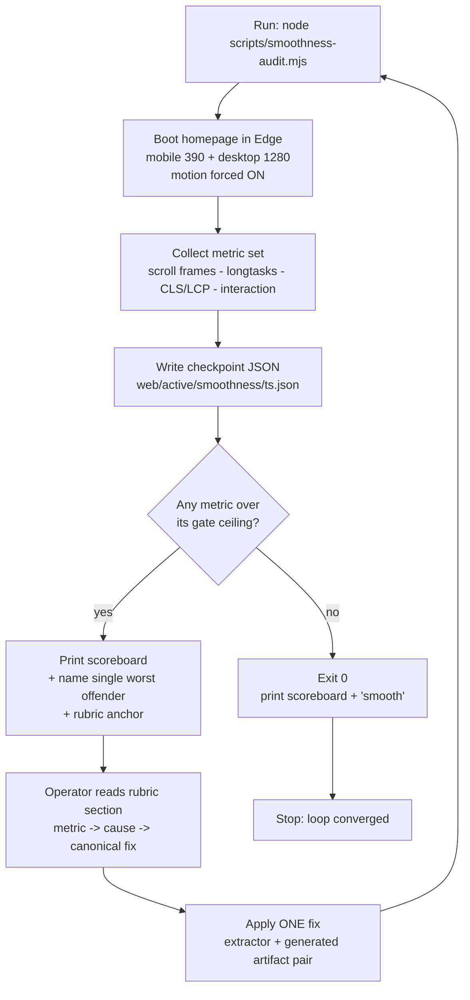

# perf: Token-Light Smoothness Optimization Loop (Immersive Homepage + Reveal)

## Summary

Build a single repeatable audit script that measures perceived smoothness (scroll
jank, interaction delay, load stutter) on the immersive homepage across mobile and
desktop, prints a tiny numeric scoreboard, and names the **one worst offender** with
a pointer to a fix. Pair it with a durable rubric that maps each metric to its known
cause and canonical fix (distilled from the project's existing jank lessons), so each
loop iteration is one cheap script run plus one targeted edit — no multi-agent spawns,
no screenshots, no exploratory file reads. Close with one proven optimization
iteration to validate the apparatus and land a real win.

The goal the user stated is explicit: a loop that **isn't token-heavy** and optimizes
**smoothness, delay, and stutter** on mobile and desktop. The cost model is the design
constraint, not an afterthought.

---

## Problem Frame

The immersive homepage (`web/app/page.tsx` → `_immersive/content.ts` + `public/imersiv/engine.js`)
is a 1280px-authored GSAP/Lenis scroll experience now served responsively at all widths.
It has already been through a heavy perf pass (29 MB → 2.6 MB transfer, LCP 1016 → 460 ms)
and a long series of one-off jank fixes (animate `transform`/`opacity` not `height`/`filter`,
reveal-once not re-fire, native video loop, device-tiered heavy scrubs). Those wins were
found by **expensive forensic detours** — Playwright probes, served-CSS-chunk diffing,
multi-hour "is this real jank or a headless artifact" investigations — each costing
significant tokens.

What is missing is a **cheap, repeatable instrument**: a way to ask "is it smooth, and if
not, what's the single biggest offender right now?" and get a numeric answer in one run.
Today the only smoothness signal is the coarse FPS smoke inside
`web/scripts/verify-mobile-immersive.mjs` (median frame ms during a wheel-scroll) — it tells
you *that* a frame budget is blown, never *where* or *why*, and it doesn't measure
interaction delay or load stutter at all.

This plan converts the project's hard-won, prose-scattered smoothness knowledge into a
measurement + rubric loop that any future session (or the user) can run for a fixed, small
token cost.

---

## Requirements

- **R1** — One command produces a numeric smoothness scoreboard for the immersive homepage at
  both a mobile context (390×844, touch) and a desktop context (1280), in a single run.
- **R2** — The scoreboard separates the three failure modes the user named: scroll **stutter**
  (frame jank), interaction **delay** (tap/click-to-response), and load **stutter** (layout
  shift / LCP). One blended FPS number is insufficient.
- **R3** — The script names the **single worst offender** (the metric furthest over its target)
  and points to the rubric section that fixes that class of problem. This is the property that
  makes the loop token-light.
- **R4** — Each run is checkpointed to a gitignored JSON file so runs are diffable and the loop
  is resumable without re-measuring (mirrors the project's checkpoint-by-file pattern).
- **R5** — Hard gates exit non-zero on a real regression, with ceilings tuned generously above a
  captured baseline (same posture as `web/scripts/perf-measure.mjs`).
- **R6** — A durable runbook + fix rubric documents how to run the loop, the metric→cause→fix
  table, and the iteration protocol, so the fix knowledge is front-loaded once, not re-derived
  per iteration.
- **R7** — The loop runs with motion forced **on** (`reducedMotion: 'no-preference'`), because
  this app force-disables reduce-motion in production and the real animation cost is only visible
  with motion live.
- **R8** — The apparatus is proven end-to-end by one optimization iteration that measures a
  baseline, fixes the top offender, and re-measures to confirm improvement.

Traceability: R1–R5, R7 land in U1–U3; R6 in U4; R8 in U5.

---

## Key Technical Decisions

- **KTD1 — Measure with `playwright-core` + system Edge, not a downloaded browser.** Reuse the
  proven boot from `web/scripts/verify-mobile-immersive.mjs` (`chromium.launch({channel:'msedge'})`).
  No 130 MB browser fetch, already works headless on this machine. Rationale: the cheapest harness
  that exists here; matches the documented "screenshot a dev build with `channel:'msedge'`" lesson.
- **KTD2 — Smoothness is a small fixed metric set, not a single number.** Scroll: median frame ms,
  p90 frame ms, long-frame count (frames > 32 ms and > 50 ms). Main thread: long-task count + total
  blocking time during load and during scroll. Load: CLS, LCP. Interaction: handler-to-next-paint
  latency on key controls. Rationale: "delay" and "stutter" are different failure modes (R2); a
  blended FPS hides which one is broken.
- **KTD3 — The script computes and prints the worst offender.** Each metric is normalized against its
  target; the script prints the single metric furthest over budget plus the rubric anchor that fixes
  it. Rationale: this removes per-iteration analysis — the dominant hidden token cost in past jank work.
- **KTD4 — Drive scroll via `window.__lenis.scrollTo` increments.** Plain `window.scrollTo` does not
  move Lenis (documented lesson); frame sampling against a non-scrolling page would be meaningless.
- **KTD5 — Checkpoint each run to gitignored `web/active/smoothness/<timestamp>.json`.** `active/` is
  already gitignored. Rationale: free run-to-run diffing and resume, no re-measure (R4).
- **KTD6 — Manual loop (user choice), not an autonomous `/loop` or CI gate.** One command per
  iteration; the operator (or agent) reads the offender, applies one fix, re-runs. Rationale: user
  selected the cheapest-per-iteration shape with full control.
- **KTD7 — Generous gate ceilings tuned above a captured baseline.** The gate fires only on a real
  regression, not normal headless variance. Rationale: mirrors `perf-measure.mjs` (LCP ≤ 1500,
  bytes ≤ 6 MB ceilings sit well above the ~460 ms / ~2.6 MB baseline).
- **KTD8 — Immersive CSS/markup/engine fixes land in BOTH `web/scripts/extract-immersive.mjs` AND the
  generated `web/app/_immersive/content.ts` / `web/public/imersiv/engine.js`.** The extractor cannot be
  re-run on this machine (the v3 source HTML `Sava Pass #2/SavaPass Immersive v3.html` is absent), so the
  generated artifacts must be hand-patched too (documented lesson). The loop's fix step always touches the
  pair.
- **KTD9 — Interaction-latency is advisory first, hard-gated later.** Headless event-timing is flakier
  than frame sampling; start it as a reported-but-not-gated metric, promote to a gate only once its
  variance across runs is shown to be tight (decided during U2/U3).

---

## High-Level Technical Design

The loop is a closed cycle. The script measures and locates; the rubric prescribes; the operator
applies exactly one fix; the script confirms. The cheapness comes from the script doing the
locating so no human/agent analysis is spent per turn.

Metric → gate → fix-class mapping (the decision matrix the script and rubric share):

| Metric | Measures | Likely cause when over budget | Fix class |
| --- | --- | --- | --- |
| `scroll.p90` / `longFrames50` | Scroll **stutter** | A property that triggers layout/paint animated on many elements, or a heavy per-frame scroll handler | Convert to `transform`/`opacity`; throttle/rAF-coalesce scroll handlers; device-tier the effect |
| `longtask.tbtScroll` | Main-thread blocking during scroll | GSAP scrub set too large; per-frame JS (reverse-scrub, chrome update) | Trim/tier scrubs; coalesce; native loop |
| `interaction.latency` | Tap/click **delay** | Long task between input and paint; layout thrash in handler | Defer non-urgent work; read-then-write DOM; passive listeners |
| `load.cls` | Load **stutter** | Unsized media, late-injected layout, font swap shift | Reserve space; size media; stabilize injection order |
| `load.lcp` | Time to main content | Render-blocking chain, oversized hero asset | Already mostly handled; regression guard only |

---

## Implementation Units

### U1. Frame, long-task, and load-stutter measurement harness

**Goal:** A new script that boots the homepage in mobile + desktop contexts and emits the
scroll-jank, long-task, and load metrics as a readable table plus machine JSON.

**Requirements:** R1, R2 (scroll + load halves), R7.

**Dependencies:** none.

**Files:**
- `web/scripts/smoothness-audit.mjs` (new)
- writes checkpoints under `web/active/smoothness/` (gitignored; ensure the dir is created on run)

**Approach:**
- Reuse the Edge boot, mobile/desktop context shapes, and console-error capture from
  `web/scripts/verify-mobile-immersive.mjs` (do not invent a new harness).
- Mobile context: `{ viewport:{width:390,height:844}, deviceScaleFactor:2, isMobile:true, hasTouch:true, reducedMotion:'no-preference' }`. Desktop: `{ viewport:{width:1280,height:832} }`, motion on.
- Scroll metric: `addInitScript` an rAF frame-delta sampler; drive scroll with
  `window.__lenis.scrollTo((i+1)*600, {})` increments (KTD4) with short waits between, sampling
  through the whole page; compute median, p90, and counts of frames over 32 ms and 50 ms.
- Long-task metric: `PerformanceObserver({ type:'longtask', buffered:true })`, summed during the
  load phase and again during the scroll phase (total blocking time = sum of `(duration - 50)` over
  the threshold).
- Load metric: `PerformanceObserver` for `layout-shift` (CLS, excluding `hadRecentInput`) and
  `largest-contentful-paint` (reuse the LCP pattern already in `perf-measure.mjs`).
- Output: a compact stdout table per context + a single JSON object written to
  `web/active/smoothness/<ISO-ish-timestamp>.json`. No gates in this unit (U3 adds them).

**Patterns to follow:**
- `web/scripts/verify-mobile-immersive.mjs` (Edge boot, contexts, FPS smoke, `__lenis` scroll driving).
- `web/scripts/perf-measure.mjs` (LCP observer via `addInitScript`, MB/number formatting, checkpoint mindset).

**Test scenarios:**
- Happy path: run against the current production build of `/`; assert the JSON contains all metric
  keys for both `mobile` and `desktop`, every value is a finite number (no `NaN`/`null`), and a
  checkpoint file appears under `web/active/smoothness/`.
- Signal-has-teeth (integration): temporarily inject a deliberately janky rule (e.g. a keyframe that
  animates `height` on the `.eq span` bars on an infinite loop) into the served page via
  `page.addStyleTag`, re-run the scroll measurement, and assert `longFrames50` / `scroll.p90` rise
  materially versus the clean run. Proves the metric actually detects jank rather than always reading
  green. Covers R2.
- Edge: page where `window.__lenis` is absent (e.g. a non-homepage URL passed as arg) — assert the
  script falls back to `window.scrollTo` and still completes without throwing.

**Verification:** One command yields a populated scoreboard for both contexts and a checkpoint file;
the injected-jank run reads visibly worse than the clean run.

---

### U2. Interaction-latency probe (the "delay" metric)

**Goal:** Add tap/click-to-response latency measurement for the key controls, capturing the
interaction-delay failure mode the user named.

**Requirements:** R2 (interaction half).

**Dependencies:** U1.

**Files:**
- `web/scripts/smoothness-audit.mjs` (extend)

**Approach:**
- Identify a small fixed set of real controls: the primary purchase CTA, a top-nav anchor, and the
  mobile sticky/buy CTA if present in the homepage markup. Resolve them by stable selector/text, not
  position.
- For each, measure handler-to-next-paint latency: timestamp immediately before dispatching the
  interaction, then resolve on the next `requestAnimationFrame` after the event handler runs; record
  the delta. Average several interactions per control to damp variance (KTD9).
- Also capture a scroll-start latency: time from issuing the first scroll delta to the first frame
  whose `scrollY`/Lenis position actually changes.
- Report as `interaction.latency` (mean, p90) in the same scoreboard + JSON; **advisory only** in this
  unit (no gate yet) per KTD9.

**Patterns to follow:**
- The `__lenis.scrollTo` driving and `page.evaluate` timing patterns already in U1 / `verify-mobile-immersive.mjs`.

**Test scenarios:**
- Happy path: run on `/`; assert `interaction.latency` is present with finite mean and p90 for both
  contexts, and that at least the primary CTA was found and exercised (non-zero sample count).
- Robustness: if a target control is not found at the current viewport, assert the script logs a skip
  and continues (does not crash the whole run) — interaction metrics are best-effort.
- Edge: confirm a control behind a click that triggers navigation is handled (intercept/prevent or
  measure pre-navigation) so the probe doesn't leave the page mid-measurement.

**Verification:** Scoreboard shows interaction latency for both contexts; missing controls degrade
gracefully to a skip, not a failure.

---

### U3. Gates, worst-offender hint, and baseline capture

**Goal:** Turn the measurements into a loop: per-metric targets/ceilings, an exit-1 gate on
regression, and a printed "single worst offender + rubric anchor" line.

**Requirements:** R3, R4, R5.

**Dependencies:** U1, U2.

**Files:**
- `web/scripts/smoothness-audit.mjs` (extend)
- baseline numbers recorded in the script header comment and in `web/docs/smoothness-loop.md` (U4)

**Approach:**
- Run U1+U2 against the current production build a few times to capture a stable baseline; record the
  observed values.
- Define `TARGET` (the "smooth" number) and `CEIL` (the regression gate, generously above baseline,
  KTD7) for each metric. Gate metrics: `scroll.p90`, `longFrames50`, `longtask.tbtScroll`, `load.cls`,
  `load.lcp`. Interaction latency stays advisory (KTD9).
- Worst-offender: for each gated metric compute `over = value / TARGET`; print the metric with the
  highest `over` plus its rubric anchor string (e.g. `→ see smoothness-loop.md#scroll-stutter`).
- Exit code: 1 if any gated metric exceeds its `CEIL` on either context; else 0. Print a one-line
  verdict (`SMOOTH` or `JANK: <offender>`).

**Patterns to follow:**
- `web/scripts/perf-measure.mjs` gate block (`LCP_MAX`, `BYTES_MAX`, `process.exit(failed?1:0)`).

**Test scenarios:**
- Happy path: clean prod build → verdict `SMOOTH`, exit 0, worst-offender line still printed (lowest
  `over`, informational).
- Gate teeth: feed the injected-jank scenario from U1 → assert exit 1 and the offender line names the
  scroll/long-frame metric. Covers R3, R5.
- Checkpoint: assert two consecutive runs produce two JSON files and that a small diff helper (or
  documented `jq`/node one-liner) can show metric deltas between them. Covers R4.

**Verification:** Clean build passes (exit 0); injected-jank build fails (exit 1) and correctly names
the offender; two runs leave two diffable checkpoints.

---

### U4. Loop runbook + fix rubric (`web/docs/smoothness-loop.md`)

**Goal:** The durable doc that front-loads the fix knowledge so iterations don't re-derive it: how to
run, the metric→cause→fix table, the iteration protocol, and the where-to-apply map.

**Requirements:** R6.

**Dependencies:** U3 (so the rubric anchors match the offender strings the script prints).

**Files:**
- `web/docs/smoothness-loop.md` (new)

**Approach:**
- **How to run:** the single command, prerequisites (prod build up, `npm run build` not racing the
  dev server — documented lesson), and where checkpoints land.
- **Metric → cause → fix table:** the HLTD decision matrix, expanded with the project's concrete
  lessons as the canonical fixes — animate `transform`/`opacity` never `height`/`width`/`top`/`filter`/`box-shadow`
  on many/looping elements; reveal-once not re-fire-on-exit; native video `loop` not per-frame
  reverse-scrub; device-tier heavy scrubs (`__lowEnd`/`__vamp`); coalesce per-frame scroll handlers via
  rAF; `will-change:transform` for compositor-only. Each row carries the anchor the script prints.
- **Iteration protocol:** run → read offender → open the rubric row → apply exactly ONE fix → re-run →
  keep if the offender improved and nothing else regressed, else revert. Emphasize one-fix-per-iteration
  so cause/effect stays attributable (and cheap).
- **Where to apply (KTD8):** immersive CSS/markup → patch `extract-immersive.mjs` AND hand-patch
  `web/app/_immersive/content.ts`; engine behavior → `extract-immersive.mjs` `engineOut` AND
  `web/public/imersiv/engine.js`; app-wide reveal → `web/components/ui/ScrollReveal.tsx`. Note the
  extractor cannot be re-run here (v3 source absent), so the generated artifact is always hand-patched.
- **Headless caveat:** the loop is a relative regression detector + offender locator; validate a large
  visual win on a real device before declaring it shipped (documented false-positive risk).

**Patterns to follow:** the existing plan docs under `web/docs/plans/` for tone/structure; the
lesson list in `projects/sava-pass/CLAUDE.md` as the source for the fix table.

**Test scenarios:** Test expectation: none — documentation only. Validation is that every offender
anchor the U3 script can print has a matching heading in this doc (checked in U5's first run).

**Verification:** A reader can run the loop and resolve a named offender using only this doc, without
reading source or CLAUDE.md.

---

### U5. First optimization iteration — prove the loop and land a win

**Goal:** Execute one full loop turn end to end: capture baseline, fix the top offender via the
rubric, re-measure, confirm improvement, and record it. Validates the whole apparatus and delivers a
real smoothness gain.

**Requirements:** R8 (and exercises R1–R7).

**Dependencies:** U1, U2, U3, U4.

**Files (provisional — the script picks the actual target):**
- likely one of: `web/scripts/extract-immersive.mjs` + `web/app/_immersive/content.ts` (immersive CSS),
  `web/public/imersiv/engine.js` (a per-frame scroll handler such as the `__chromeT` chrome update or a
  remaining scrub), or `web/components/ui/ScrollReveal.tsx` (WAAPI reveal) — whichever the worst-offender
  line names.
- `web/docs/smoothness-loop.md` (append the baseline numbers + the first before/after entry).

**Approach:**
- Run the audit on the production build; record the baseline scoreboard for both contexts.
- Take the single worst offender, open its rubric row, apply exactly one fix.
- Re-run; confirm the offender metric improved and no gated metric regressed on either context.
- If improved: keep + record before/after. If not: revert and record the negative result (still
  valuable — it tunes the rubric).

**Execution note:** Characterization-first — capture the baseline scoreboard before touching any
animation code, so the win is attributable to the one change.

**Patterns to follow:** the project's existing jank fixes (equalizer `height`→`scaleY`, native video
loop, reveal-once) as worked examples of the fix classes.

**Test scenarios:**
- Before/after: assert the post-fix run shows the targeted metric measurably lower and the overall
  verdict no worse on both mobile and desktop. Covers R8.
- No-regression: assert no other gated metric crossed its ceiling after the change (the fix didn't move
  jank elsewhere).
- Rubric-coverage: assert the offender anchor printed by the script resolves to a real heading in
  `web/docs/smoothness-loop.md` (validates U4 against U3).

**Verification:** One recorded before/after entry in the runbook showing a real improvement with no
new regression, demonstrating the loop works for the price of one script run plus one edit.

---

## Scope Boundaries

**In scope:**
- The immersive homepage (`/`) — desktop GSAP/Lenis engine and mobile rendering — plus the app-wide
  `web/components/ui/ScrollReveal.tsx`.
- The audit script, the gate, the worst-offender hint, the checkpoint JSON, and the runbook/rubric.
- One proven optimization iteration.

**Deferred to Follow-Up Work:**
- Extending the loop to buyer pages (event/checkout/ticket) and staff pages (admin/scanner/tables) —
  those are already light React; add only if a real complaint surfaces.
- Promoting interaction latency from advisory to a hard gate once its run-to-run variance is shown tight.
- A small `diff` helper that prints metric deltas between the two most recent checkpoints.

**Out of scope (different shape, not this plan):**
- Wiring the loop as an autonomous `/loop` or a CI/pre-commit gate (user chose the manual measure→fix
  shape).
- Real-device automation (the loop stays a headless relative detector; real-device checks remain a manual
  confirm step).
- Redesigning or re-choreographing animations beyond the targeted offender fixes the loop surfaces.

---

## Risks & Mitigations

- **Headless frame timing under-reports real-device jank** (documented false-positive risk). Mitigation:
  gate on long-frame **count** and long-task **TBT** (more robust than median FPS), treat the loop as a
  relative regression detector + offender locator, and validate large visual wins on a real device before
  shipping (R7 caveat baked into U4).
- **Interaction-latency headless measurement is flaky.** Mitigation: average several interactions, keep it
  advisory until variance is shown tight (KTD9), and degrade gracefully when a control isn't found (U2).
- **A gate with no teeth is useless** (the optimize-loop failure mode: a metric that always reads green).
  Mitigation: U1/U3 inject deliberate jank and assert the metric spikes and the gate trips before trusting it.
- **Fixing the immersive in the wrong place** — patching only the generated artifact, or only the extractor.
  Mitigation: KTD8 + the U4 where-to-apply map make "patch both" the default; the extractor can't even be
  re-run here.
- **Stale Turbopack `.next` cache masking a CSS fix** (bit this project twice). Mitigation: U4 runbook notes
  measuring against a clean production build (or rebuild after CSS edits), not a hot-reloaded dev server.

---

## Dependencies / Prerequisites

- `playwright-core` is already in `web/node_modules` and system Edge is present (both used by
  `verify-mobile-immersive.mjs`). No new install.
- A production build of the homepage to measure against (`npm run build` + start, with the dev server not
  racing `.next`).
- `web/active/` is already gitignored for checkpoints.
