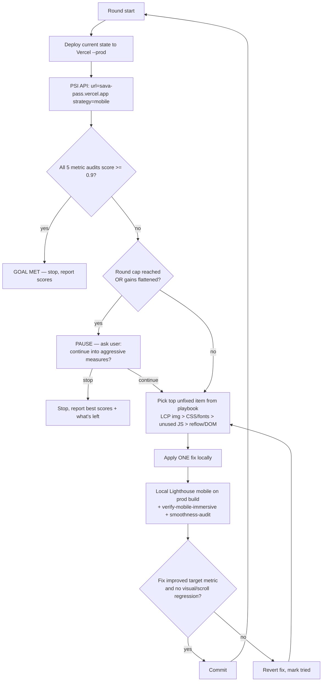

# perf: PageSpeed Mobile All-Green Loop (sava-pass homepage)

## Summary

Build a bounded, self-running optimization loop whose **goal** is: PageSpeed Insights
(`pagespeed.web.dev`), **mobile strategy**, shows all five core Web-Vitals metrics green for
`https://sava-pass.vercel.app/`. The loop iterates fast locally with Lighthouse (no deploy per
fix), gates the real goal on the PageSpeed Insights API against the deployed site, applies the
fixes the current report already names, and re-measures. It stops when all five are green, and
otherwise runs a bounded number of rounds and **pauses to ask the user** before escalating to
aggressive measures — never infinite.

The loop runs on **Sonnet, medium-high reasoning, no sub-agent fan-out** (decided below). The
five fixes the report points at are enumerated as a prioritized playbook the loop applies in
impact order.

---

## Problem Frame

A real PageSpeed mobile run of the deployed homepage (captured 2026-06-25) reads:

| Metric | Current (mobile) | Green threshold | Status |
| --- | --- | --- | --- |
| Total Blocking Time | 20 ms | ≤ 200 ms | **green** |
| Cumulative Layout Shift | 0 | ≤ 0.1 | **green** |
| First Contentful Paint | 2.1 s | ≤ 1.8 s | red |
| Largest Contentful Paint | 3.2 s | ≤ 2.5 s | red |
| Speed Index | 4.6 s | ≤ 3.4 s | red |

TBT and CLS are already green, so the loop targets **FCP, LCP, and Speed Index**. The report's
diagnostics name concrete causes:

- **LCP element is `church.webp` loaded with `loading="lazy"`** (`div.sp-immersive-root > section#intro > div.mhi-church > img`). LCP breakdown shows a **1380 ms load delay** — the LCP image isn't requested early because it's lazy. This is the single biggest, clearest win.
- **Render-blocking CSS** — the app-shell CSS chunk (~7.8 KiB) blocks first render (~300 ms est. saving).
- **Critical-path fonts** — three woff2 files (Manrope, Instrument Serif, JetBrains Mono) sit on the critical path at ~800-860 ms.
- **Unused JavaScript** — ~51 KiB across two chunks (70.5 KiB / 37.4 KiB) flagged as largely unused on load.
- **Forced reflow** — `engine.js` `chrome()` writes styles then reads `getBoundingClientRect()` on every scroll (lines 283-289); also lenis/gsap/ScrollTrigger. Diagnostic (not directly scored) but affects Speed Index.
- **DOM size** — 1042 elements, the QR showpiece `div#qr > svg` has 333 cells. Diagnostic, not scored.

The user wants this turned into a loop that drives those reds to green and knows when to stop.

---

## Requirements

- **R1** — A `/loop`-driven cycle whose goal condition is "all five PageSpeed **mobile** core metrics green for the deployed homepage," evaluated against the real PageSpeed Insights API.
- **R2** — Fast local iteration: each candidate fix is picked and verified with a local Lighthouse mobile run against a production build, so the loop does not deploy once per fix.
- **R3** — The real goal is gated on the PageSpeed Insights API against `https://sava-pass.vercel.app/` after a deploy, because PageSpeed only measures the deployed site.
- **R4** — The loop is **bounded**: it stops immediately when all five are green; otherwise it runs a capped number of rounds and **pauses to ask the user** whether to continue with more aggressive measures. It never loops infinitely.
- **R5** — The loop applies the report's fixes in impact order (LCP image → render-blocking CSS/fonts → unused JS → forced reflow/DOM), measuring after each.
- **R6** — Each fix preserves the visual experience (the church image still displays, the progress rail/dots still work, scroll stays smooth) — verified by the existing `verify-mobile-immersive.mjs` and `smoothness-audit.mjs` guards.
- **R7** — Execution posture is fixed: the loop runs on Sonnet, medium-high reasoning, with no sub-agent dispatch; Opus is escalated to only if a fix proves genuinely non-obvious.

---

## Key Technical Decisions

- **KTD1 — Two measurement tiers: local Lighthouse for iteration, PageSpeed Insights API for the goal gate.** Local Lighthouse (mobile form-factor, against a local prod build) is the fast inner loop; the PSI API (`.../pagespeedonline/v5/runPagespeed?url=...&strategy=mobile`) against the deployed URL is the authoritative goal gate. Rationale: PSI only measures deployed code, and deploying per fix is slow; Lighthouse is the same engine, so local results predict PSI closely (user-confirmed).
- **KTD2 — "Green" = the metric's Lighthouse audit `score ≥ 0.9.`** PSI returns per-metric audits (`first-contentful-paint`, `largest-contentful-paint`, `speed-index`, `total-blocking-time`, `cumulative-layout-shift`) each scored 0-1; the colored pill is green at ≥ 0.9. Goal = all five ≥ 0.9 on `strategy=mobile`. Rationale: matches exactly what "all stats green" means on the site the user pointed at.
- **KTD3 — Bounded loop with a human checkpoint, not auto-stop and not infinite (user choice).** Stop immediately on all-green. Otherwise run up to a round cap (start at 6); when the cap is hit or gains flatten (< ~5% metric improvement across a round), pause and ask the user whether to continue into aggressive measures (deferring the whole engine on mobile, dropping background videos). Rationale: Speed Index 4.6 → 3.4 on a heavy GSAP/Lenis/video homepage may not cross the line cheaply; the user wants to decide before paying that cost.
- **KTD4 — The loop runs on Sonnet, medium-high reasoning, no sub-agent fan-out.** The cycle is sequential (deploy → measure → pick fix → apply → verify) and the fixes are well-specified by this plan, so Opus's intelligence isn't warranted and sub-agents add context-setup cost without parallelism benefit (the steps are dependency-chained). Rationale: honors the Max opus-scarcity posture and the token-light constraint; escalate to Opus only on a genuinely novel fix.
- **KTD5 — Immersive-port fixes land in the pair: extractor + generated artifact.** The church image and the `chrome()` reflow live in the verbatim homepage port, so fixes patch both `scripts/extract-immersive.mjs` (source of truth) and the generated `app/_immersive/content.ts` / `public/imersiv/engine.js` (the extractor can't be re-run here — v3 source absent). Patch `content.ts` with a count-asserted node script, never by loading the blob.
- **KTD6 — Deploys use the kept Vercel token via the CLI, not the MCP.** Each PSI gate redeploys with `cd web && npx -y vercel deploy --prod --yes --token "$T" --scope alex-2027s-projects` (token in gitignored `active/.vercel-token`, kept). The Vercel MCP deploys the connected git repo, not local files, so it would ship stale code.
- **KTD7 — LCP-image preload must be mobile-scoped.** The church image is the *mobile* LCP; eagerly preloading it unconditionally could regress desktop LCP (different element). Use a `media`-conditioned preload or a mobile-only hint so the desktop critical path is untouched.

---

## High-Level Technical Design

The loop is a bounded state machine with a human checkpoint. The inner fast path (local
Lighthouse) is where fixes are chosen and verified; the deploy + PSI gate confirms the real goal.

Playbook priority (scored impact first; diagnostics last):

| # | Fix | Primarily moves | Scored? |
| --- | --- | --- | --- |
| 1 | Church LCP image: eager + `fetchpriority=high` + mobile preload | LCP, FCP | yes (LCP metric) |
| 2 | Render-blocking CSS + critical-path font trim/preload | FCP, LCP | yes |
| 3 | Unused JS: defer engine + vendor past LCP | FCP, LCP, SI | yes |
| 4 | Forced reflow (`chrome()` read/write batching) + DOM weight | Speed Index | diagnostic |

---

## Implementation Units

### U1. Local Lighthouse mobile harness

**Goal:** A repeatable command that runs Lighthouse (mobile form-factor) against a local
production build and prints the five metric scores + the top opportunities, so each fix is
picked and verified without a deploy.

**Requirements:** R2, R5.

**Dependencies:** none.

**Files:**
- `web/scripts/lh-mobile.mjs` (new) — wraps the Lighthouse CLI run + parses JSON
- writes a checkpoint under `web/active/lighthouse/` (gitignored)

**Approach:**
- Drive `npx lighthouse http://localhost:3000/` with mobile defaults (`--form-factor=mobile`,
  default mobile screen emulation + throttling), `--only-categories=performance`,
  `--output=json --quiet`, headless Chrome/Edge via `CHROME_PATH`/`--chrome-flags=--headless`.
- Parse `lighthouseResult.audits` for the five metrics (`score`, `numericValue`, `displayValue`)
  plus the scored opportunities (`render-blocking-resources`, `unused-javascript`,
  `largest-contentful-paint-element`, `uses-rel-preload`).
- Print a compact scoreboard (per-metric score + green/red) and write
  `web/active/lighthouse/<timestamp>.json`. Exit 0 when all five ≥ 0.9, else 1.

**Patterns to follow:** `web/scripts/perf-measure.mjs` and `web/scripts/smoothness-audit.mjs`
(checkpoint-to-`active/`, compact stdout, gate via exit code).

**Test scenarios:**
- Happy path: run against the current local prod build; assert the JSON contains all five metric
  audits with finite `score`, and a checkpoint file is written.
- Gate: assert exit code is 1 when any metric `score < 0.9` and 0 when all ≥ 0.9 (verify against
  the known-red current build → expect exit 1).
- Robustness: if Chrome/Edge can't be found, assert the script fails with a clear "set CHROME_PATH"
  message rather than a stack trace.

**Verification:** One command yields the five mobile metric scores for the local build and a
checkpoint; it agrees directionally with the PSI report (FCP/LCP/SI red, TBT/CLS green).

---

### U2. PageSpeed Insights API goal-gate

**Goal:** A command that hits the PSI API for the deployed homepage (mobile) and reports whether
the goal is met — all five metric audits green.

**Requirements:** R1, R3.

**Dependencies:** none (parallel to U1).

**Files:**
- `web/scripts/psi-gate.mjs` (new)
- checkpoint under `web/active/psi/` (gitignored)

**Approach:**
- Fetch `https://www.googleapis.com/pagespeedonline/v5/runPagespeed?url=https://sava-pass.vercel.app/&strategy=mobile&category=performance`
  (optional `&key=` if a `PSI_API_KEY` env var is set, to dodge anonymous rate limits).
- Parse the same five metric audits + the overall performance score; print each metric's score +
  green/red, and a single `GOAL: MET / NOT MET` line. Exit 0 when all five ≥ 0.9.
- Write `web/active/psi/<timestamp>.json` for run-to-run diffing.

**Approach notes (deferred to implementation):** anonymous PSI calls are rate-limited; if 429s
appear, document adding a free `PSI_API_KEY`. The deployed URL is fixed but accept an arg override.

**Test scenarios:**
- Happy path: run against the live URL; assert all five metric scores parse as finite numbers and
  the `GOAL` line reflects them (currently NOT MET — FCP/LCP/SI red).
- Error path: on a non-200 / rate-limited response, assert a clear message + non-crash exit, not a
  silent empty scoreboard.
- Gate: assert exit 0 only when all five ≥ 0.9.

**Verification:** The script reproduces the user's report verdict (not met, FCP/LCP/SI red) and
flips to exit 0 once the deployed site is all-green.

---

### U3. The loop: goal, bound, deploy step, and execution posture

**Goal:** Wire the `/loop` so it runs the cycle in the HLTD diagram: deploy → PSI gate → (green?
stop) → pick + apply the next playbook fix → verify locally → commit → repeat, bounded with a
user checkpoint, on the decided model/effort.

**Requirements:** R1, R4, R5, R7.

**Dependencies:** U1, U2.

**Files:**
- `web/docs/pagespeed-loop.md` (new) — the loop runbook: the per-round prompt, the goal
  definition, the stop rule, the deploy command, the model/effort/agents posture, and the playbook
  order. This is the durable spec the `/loop` prompt points at.

**Approach:**
- **Goal:** `psi-gate.mjs` exit 0 (all five mobile metrics ≥ 0.9).
- **Per round:** deploy (KTD6) → `psi-gate.mjs`. If met, stop and report. Else pick the
  top untried playbook item (U4→U7 order), apply it, verify with `lh-mobile.mjs` +
  `verify-mobile-immersive.mjs` + `smoothness-audit.mjs`, commit if improved, revert if not.
- **Bound (KTD3):** round cap starts at 6; on cap-hit or flattened gains, pause and ask the user
  whether to continue into aggressive measures. Never infinite.
- **Posture (KTD4):** document that the loop is run in a Sonnet session at medium-high reasoning
  with no sub-agent dispatch; record when to escalate to Opus.
- Provide the literal `/loop` invocation and the self-pacing note (the loop waits on deploys via
  the platform's wakeup, not a busy-poll).

**Patterns to follow:** `web/docs/smoothness-loop.md` (runbook shape, run log).

**Test scenarios:** Test expectation: none — documentation/orchestration spec. Validated in U7's
first real round (the loop actually runs the deploy → PSI → fix → re-measure cycle once).

**Verification:** A reader can run `/loop` and watch one full round execute against the goal,
stopping correctly on all-green and pausing-to-ask at the round cap.

---

### U4. Fix — eager LCP image (church.webp)

**Goal:** Stop the mobile LCP image being lazy-loaded; make it discoverable and high-priority.
The biggest single win (kills the 1380 ms load delay).

**Requirements:** R5, R6.

**Dependencies:** U1 (to measure the before/after).

**Files:**
- `web/scripts/extract-immersive.mjs` (source of truth)
- `web/app/_immersive/content.ts` (generated — count-asserted patch, KTD5)
- `web/app/layout.tsx` or `web/app/page.tsx` (mobile-scoped preload hint, KTD7)
- possibly `web/scripts/encode-media.mjs` / `web/public/imersiv/church.webp` (size for mobile)

**Approach:**
- Change the church `` from `loading="lazy"` to eager (drop the attribute or `loading="eager"`),
  add `fetchpriority="high"`, keep `decoding="async"`.
- Add a **mobile-scoped** `<link rel="preload" as="image" href="/imersiv/church.webp" fetchpriority="high" media="(max-width: 760px)">` so desktop LCP (a different element) is untouched (KTD7).
- Confirm `church.webp` is sized to the mobile render box (re-encode via `encode-media.mjs` if it's
  oversized — an oversized LCP image inflates load duration).

**Patterns to follow:** the documented `content.ts` count-asserted patch; `encode-media.mjs` for sizing.

**Test scenarios:**
- Before/after: local Lighthouse mobile shows the LCP `score` rise and the `largest-contentful-paint-element`
  load delay drop; `uses-rel-preload` / lazy-LCP audits clear.
- No desktop regression: a desktop Lighthouse run shows LCP not worse (preload is mobile-scoped).
- Visual: `verify-mobile-immersive.mjs` still passes (church image renders, zero console errors).

**Verification:** LCP metric improves on mobile with no desktop regression and the image still displays.

---

### U5. Fix — render-blocking CSS + critical-path fonts

**Goal:** Cut the render-blocking CSS delay and trim the three critical-path fonts to what the
first paint actually needs.

**Requirements:** R5, R6.

**Dependencies:** U1.

**Files:**
- `web/app/layout.tsx` (next/font config)
- `web/app/globals.css` and/or `web/next.config.ts` (CSS delivery, if adjustable)

**Approach:**
- Fonts: keep Manrope (body) preloaded; set `preload: false` on `Instrument_Serif` (ceremonial) and
  `JetBrains_Mono` (numerals) so only one font sits on the critical path. `display: swap` already set.
- Render-blocking CSS: the immersive route CSS is already inlined as a route `<style>`; assess
  whether the small app-shell chunk can be deferred/reduced without a FOUC. If the saving stays ~300 ms
  and risk is low, apply; otherwise record as not-worth-it in the run log (honest non-fix).

**Patterns to follow:** existing `next/font` setup in `web/app/layout.tsx`.

**Test scenarios:**
- Before/after: FCP and LCP scores improve after dropping the two font preloads; assert no visible
  font-swap flash on the ceremonial serif (it's below the fold / used sparingly).
- No-regression: CLS stays 0 (font swap shouldn't shift layout — `adjustFontFallback`).

**Verification:** FCP improves with no new layout shift and the serif/mono still render where used.

---

### U6. Fix — defer unused JS past LCP

**Goal:** Reduce the ~51 KiB of JS flagged unused on load by ensuring the engine + vendor
(gsap/lenis/ScrollTrigger) load after first paint, not on the critical path.

**Requirements:** R5, R6.

**Dependencies:** U1, U4 (LCP fixed first so deferral is measured against a good LCP).

**Files:**
- `web/app/page.tsx` / the `ImmersiveEngine` client loader
- `web/scripts/extract-immersive.mjs` `engineOut` + `web/public/imersiv/engine.js` (if load timing changes)

**Approach:**
- Confirm `ImmersiveEngine` is lazy (client-only, post-hydration) and that the vendor scripts load on
  idle / after LCP rather than blocking. If they're eager, defer to `requestIdleCallback` (with a
  timeout fallback) or after the `load` event.
- Verify the engine still arms its reveals/parallax once loaded (the existing reveal-once + IO gates).

**Approach notes (deferred to implementation):** the exact chunk-to-source mapping
(`0kk1s2nahs3h.js` / `2oh5rha75m2ak.js`) is discovered at run time from the build output; the fix is
"defer the engine/vendor," not a specific webpack split decided now.

**Test scenarios:**
- Before/after: `unused-javascript` opportunity savings drop; FCP/LCP/SI scores improve.
- Integration: `smoothness-audit.mjs` still SMOOTH and `verify-mobile-immersive.mjs` still loads the
  engine (reveals fire, videos play) — deferral must not kill the engine.

**Verification:** Unused-JS bytes fall, the engine still runs, scroll stays smooth.

---

### U7. Fix — forced reflow batching + DOM weight; first real loop round

**Goal:** Remove the `chrome()` write-then-read layout thrash and address DOM weight, then run the
loop end-to-end for one real round to prove the whole apparatus.

**Requirements:** R5, R6, R4 (proves the bound + checkpoint).

**Dependencies:** U1, U2, U3, U4, U5, U6.

**Files:**
- `web/scripts/extract-immersive.mjs` `engineOut` + `web/public/imersiv/engine.js` (`chrome()`)
- optionally `web/app/_immersive/content.ts` (QR cell count, if reduced)

**Approach:**
- `chrome()` (engine.js ~282-291): reorder to **read all** first (`scrollHeight`, every section
  `getBoundingClientRect`) then **write all** (`rail.style.width`, `lrailFill.style.height`,
  `classList.toggle`) — eliminates the forced reflow PSI flagged. Patch extractor + generated engine.
- DOM weight (333-cell QR) is a non-scored diagnostic — only touch it if Speed Index is still short
  after U4-U6, and prefer a cheaper QR render on mobile over removing the showpiece. Record the
  decision in the run log.
- Run one full loop round (deploy → PSI gate → apply next fix → verify → commit) to validate U3's
  bound, checkpoint-ask, and deploy step against the live site.

**Execution note:** Characterization-first — capture the PSI baseline before this round so each
metric move is attributable.

**Test scenarios:**
- Reflow: after batching, `verify-mobile-immersive.mjs` shows the progress rail/dots still update on
  scroll (no broken behavior) and `smoothness-audit.mjs` TBT/longtask is no worse.
- Loop round: assert the round deploys, the PSI gate returns parsed scores, and the loop either stops
  (if green) or pauses-to-ask at the cap — never silently loops.
- No-regression: no metric that was green (TBT/CLS) goes red after the round.

**Verification:** One real loop round runs against the live site, scores are recorded in the run log,
and the rail still works with the reflow removed.

---

## Scope Boundaries

**In scope:**
- The mobile PageSpeed score of the deployed homepage `/`, driven to all-green where achievable.
- The local Lighthouse harness, the PSI goal-gate, the bounded loop runbook, and the four-item fix
  playbook.

**Deferred to Follow-Up Work:**
- A `PSI_API_KEY` if anonymous PSI calls hit rate limits.
- Reducing the 333-cell QR DOM on mobile if Speed Index stays short after the scored fixes.
- Wiring the loop as a scheduled/cron job (it's user-invoked `/loop` for now).

**Out of scope (different shape):**
- Desktop PageSpeed scores (goal is mobile-only).
- Redesigning or removing the immersive experience (videos, GSAP scene) — only entertained behind the
  user checkpoint (KTD3) if green is otherwise unreachable.
- Backend, checkout, scanner, or any non-homepage route.

---

## Risks & Mitigations

- **"All green" may be unreachable cheaply.** Speed Index 4.6 → 3.4 on a GSAP/Lenis/video homepage is
  hard. Mitigation: the bound + user checkpoint (KTD3) — the loop gets every cheap win, then asks
  before paying for aggressive measures, so it never thrashes forever.
- **Local Lighthouse ≠ PSI exactly.** Lab numbers vary by machine/network. Mitigation: local Lighthouse
  only *picks/verifies* fixes; the **PSI API is the authoritative gate** (R3). Treat local as directional.
- **Deploy cost + the kept token.** Each PSI gate redeploys prod. Mitigation: local-iterate-then-gate
  (KTD1) keeps deploys to once per round, not per fix; token stays in gitignored `active/.vercel-token`.
- **Eager LCP image regressing desktop.** Mitigation: mobile-scoped preload (KTD7) + a desktop
  Lighthouse no-regression check in U4.
- **Deferring the engine breaks the experience.** Mitigation: U6 gates on `verify-mobile-immersive.mjs`
  + `smoothness-audit.mjs` — the engine must still run and stay smooth.
- **PSI anonymous rate limits.** Mitigation: accept a `PSI_API_KEY` env var; back off on 429.

---

## Dependencies / Prerequisites

- Lighthouse via `npx lighthouse` (no install) + a headless Chrome/Edge reachable via `CHROME_PATH`.
- The deployed homepage at `https://sava-pass.vercel.app/` and the kept Vercel token for redeploys.
- The existing guards `web/scripts/verify-mobile-immersive.mjs` and `web/scripts/smoothness-audit.mjs`.
- `web/active/` is gitignored for the Lighthouse/PSI checkpoints.
