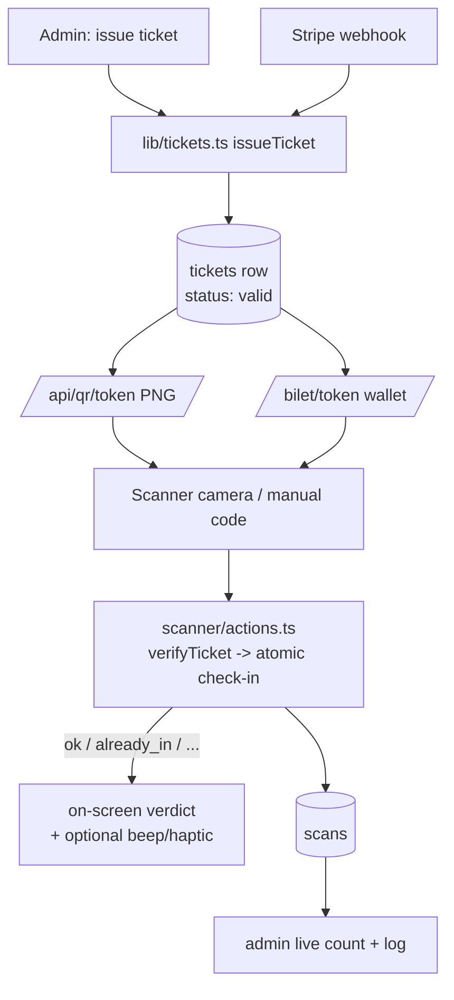

# feat: QR ticketing & door check-in readiness

## Summary

The QR ticketing system is **already implemented end-to-end**: HMAC-signed tokens (`SP1.<id>.<sig>`), a real QR PNG endpoint, and a staff-gated scanner with atomic check-in, manual-code fallback, and all seven verdict states. Phase 3 is therefore about **proving it works on real hardware** and closing the few gaps that make a real-world door shift smooth — not rebuilding it.

The one true blocker to verifying it today: you can't scan a ticket that doesn't exist, and tickets are only issued by a paid Stripe order (Phase 1, not live yet). So this plan adds a small **admin "issue ticket" tool** to mint a valid ticket on demand (also genuinely useful as comp/staff tickets), an **optional scan-feedback** hardening (audible beep + haptic, distinct for accept vs reject), and a concrete **device-verification protocol** to run before the first event.

---

## Problem Frame

What exists and works (verified by code read, not yet on a phone):
- `lib/qr-token.ts` — `signTicket`/`verifyTicket` (HMAC-SHA256, `QR_SIGNING_SECRET`).
- `app/api/qr/[token]/route.ts` — renders a real QR PNG after verifying the token.
- `app/(staff)/scanner/ScannerClient.tsx` — camera enumeration + back-camera preference, hi-res + autofocus/zoom tuning, zxing QR-only decode with TRY_HARDER, scan-cooldown + duplicate-token guard, manual-code entry (SP1 token or 6-char code), 7 verdicts with color/label/animation, camera-error + retry, responsive stack ≤860px.
- `app/(staff)/scanner/actions.ts` — staff-gated, atomic check-in (`update ... .eq("status","valid")` → 0 rows = `already_in`), logs every scan to `scans`.
- `app/(staff)/admin` — live check-in count + scan log via Supabase Realtime.

The gaps Phase 3 closes:
1. **No scannable ticket without live Stripe.** Verification is blocked because the only way to mint a ticket is a paid order. Need an admin path to issue one directly.
2. **Unverified on real devices.** Camera capture, permissions, and decoding can only be confirmed on physical iOS + Android hardware over HTTPS — never in a desktop CI.
3. **Door-shift ergonomics.** In a loud entrance, a silent on-screen verdict is easy to miss; an accept/reject sound + haptic reduces mistakes. (Optional.)

---

## Requirements

- **R1** — A staff admin can mint a valid, scannable ticket on demand **without** a Stripe payment (unblocks verification now; doubles as comp/staff ticket issuance).
- **R2** — The full door flow is verified on real Android **and** iOS: camera permission, live decode, and the `ok → already_in` re-scan guard.
- **R3** — All seven verdicts render correctly with the right copy and color: `ok`, `already_in`, `already_used`, `void_ticket`, `invalid`, `inactive_event`, `unauthorized`.
- **R4** — The admin live check-in count + scan log update in near-real-time as scans happen.
- **R5** — (Optional) Distinct audible + haptic feedback on accept vs reject, respecting a mute toggle.

Traceability: origin `web/docs/ROADMAP.md` Phase 3 steps 1-5.

---

## Key Technical Decisions

- **KTD1 — Mint test/comp tickets via a guarded admin action, not SQL.** A server action gated by `requireStaffRole(["admin"])` reuses the exact issuance logic from the Stripe webhook (`generateCode`, `signTicket`, insert `tickets` row `status:"valid"`). Rationale: the QR token is an HMAC of the ticket id — it can't be hand-computed in SQL without the secret, so a code path is both correct and far easier. This action doubles as a real feature (comp/staff/door tickets) and is the only way to rehearse the door before payments go live. _(Alternative: a throwaway script — rejected; an in-app admin tool is reusable and safe.)_
- **KTD2 — Reuse, don't duplicate, issuance.** Extract the ticket-issuance core (currently inline in `app/api/webhooks/stripe/route.ts`) into a shared `lib/tickets.ts` `issueTicket()` so the webhook and the admin action share one implementation. Avoids drift between paid tickets and comp tickets.
- **KTD3 — Scan feedback is additive + muteable.** A short WebAudio beep (two tones: accept vs reject) + `navigator.vibrate` on the verdict, behind a persisted mute toggle, default ON. No new deps. Pure enhancement; never blocks a scan. _(Optional unit — ship only if wanted.)_
- **KTD4 — Verification is the deliverable, captured as a protocol.** The bulk of Phase 3 value is a repeatable device-test checklist (below), run on real hardware — not new code.
- **KTD5 — Don't touch the scanner's decode pipeline.** It already handles camera selection, focus/zoom, debounce, and duplicate suppression. Avoid regressions; only add feedback (KTD3) on top.

---

## High-Level Technical Design

Directional only — prose + per-unit fields are authoritative.

---

## Implementation Units

### U1. Extract shared ticket issuance (`lib/tickets.ts`)

- **Goal:** One `issueTicket()` used by both the webhook and the new admin action, so comp tickets and paid tickets are identical.
- **Requirements:** R1, KTD2.
- **Dependencies:** none.
- **Files:**
  - Create `web/lib/tickets.ts`
  - Modify `web/app/api/webhooks/stripe/route.ts` (call `issueTicket`)
- **Approach:** Move the issuance core (generate `id`, `code` via `generateCode`, `qrToken` via `signTicket(id)`, insert into `tickets` with `holder_name/email`, `event_id`, `order_id`, `status:"valid"`) into `issueTicket({ eventId, orderId, holderName, holderEmail })` returning `{ id, code, qrToken }`. Webhook calls it; email send stays in the webhook. `import "server-only"`.
- **Deferred to implementation:** confirm `tickets.order_id` nullability — if NOT NULL, the admin action (U2) must create a comp `orders` row first (e.g. `amount_bani: 0`, `status: "paid"`, a `comp`/source marker); resolve by checking the live schema before wiring U2.
- **Patterns to follow:** existing webhook issuance block; `lib/site-url.ts` / `lib/email.ts` for the `server-only` helper shape.
- **Test scenarios:**
  - Happy path: `issueTicket(...)` inserts a `valid` ticket and returns a token that `verifyTicket()` accepts back to the same id.
  - Integration: webhook still issues exactly one ticket per paid order after refactor (no behavior change).
- **Execution note:** No test runner in the repo — verify via build + a webhook replay (`stripe events resend`) confirming a ticket is still issued.
- **Verification:** `npm run build` clean; a replayed `checkout.session.completed` still produces a ticket + email.

### U2. Admin "issue ticket" action + entry point

- **Goal:** A staff admin can mint a valid ticket (comp/test) for an event and get its `/bilet/<token>` link + 6-char code.
- **Requirements:** R1.
- **Dependencies:** U1.
- **Files:**
  - Create `web/app/(staff)/admin/issue-ticket/actions.ts` (or colocate in an existing admin actions file)
  - Modify an admin surface (e.g. `web/app/(staff)/admin/page.tsx` or the event view) to add a small "Emite bilet" control
- **Approach:** Server action gated by `requireStaffRole(["admin"])`; inputs: event (default active), holder name + email (default to the admin's own / a `test@` address). Create comp order if required (see U1 deferred note), call `issueTicket`, return `{ ticketUrl, code }`. Minimal UI: a form + the resulting link/code shown so staff can open `/bilet/<token>` on a phone to scan. Keep it inside the dark admin shell (`--im-*`).
- **Patterns to follow:** `app/(staff)/admin/team/actions.ts` (staff-gated action shape), `requireStaffRole`.
- **Test scenarios:**
  - Covers R1. Admin issues → a `valid` ticket exists, `ticketUrl` opens the wallet page, the QR scans to `ok`.
  - Auth: a non-admin (scanner role or anon) calling the action is refused.
  - Edge: issuing for an `active` event works; for a past/draft event the resulting scan returns `inactive_event` (expected, not an error).
- **Execution note:** No runner — verify by issuing one and scanning it (this is the R1/R2 enabler).
- **Verification:** Build clean; issued ticket scans `ok` then `already_in` on re-scan.

### U3. (Optional) Scan feedback — beep + haptic

- **Goal:** Distinct accept vs reject feedback at a loud door, muteable.
- **Requirements:** R5.
- **Dependencies:** none (independent of U1/U2).
- **Files:** Modify `web/app/(staff)/scanner/ScannerClient.tsx`
- **Approach:** On `showVerdict`, play a short WebAudio tone (higher/major for `ok`, lower/buzz for warnings + errors) and `navigator.vibrate(...)` (short for ok, double for reject) when supported. Add a persisted mute toggle (localStorage) in the aside, default ON. Gate on capability; never throw if unsupported (iOS may need a prior user gesture — acceptable, the staff taps to start).
- **Patterns to follow:** existing aside controls + `buttonStyle`; the existing verdict flow in `showVerdict`.
- **Test scenarios:**
  - `ok` → accept tone + single vibrate; `invalid`/`void`/`already_*` → reject tone + double vibrate.
  - Mute toggle off → silent + no vibrate; preference persists across reloads.
  - Unsupported `vibrate`/AudioContext → no error, scan still completes.
- **Execution note:** Optional — include only if you want it now; manual verify on a phone.
- **Verification:** Build clean; audible/haptic difference between accept and reject on a real device.

---

## Verification Protocol (the core of Phase 3 — run on real hardware)

Prereq: deploy is live (HTTPS) and you can mint a ticket (U2) or have a real one (post-Phase-1). Log in a staff/admin account first.

1. **Android (Chrome):** open `/scanner` → allow camera → scan a ticket QR → expect **"Intrat"** (`ok`). Re-scan the same ticket → expect **"Deja înăuntru"** (`already_in`).
2. **iOS (Safari):** same flow. iOS is the riskiest — confirm `getUserMedia` prompts, the back camera is chosen, and decode works (autoplay/`playsInline`/`muted` are already set).
3. **Manual code:** type the 6-char code → **"Intrat"**/**"Deja înăuntru"** as appropriate; type a garbage code → **"Bilet invalid"**.
4. **Edge verdicts:** scan a refunded ticket → **"Bilet anulat"** (`void`); a token with a tampered signature → **"invalid"**; a ticket for a non-active event → **"Eveniment inactiv"**; a non-staff visitor hitting `/scanner` → redirected to `/conta`.
5. **Admin liveness (R4):** with `/admin` open on another screen, confirm the check-in count + scan log update within ~1-2s of a scan (Supabase Realtime).
6. **Lighting/distance:** test the "Claritate QR" optimize button and a few angles/distances; confirm the back-camera + zoom tuning helps.

Record pass/fail per row; file any failure as a follow-up (most likely iOS camera or a device without `deviceId` labels before permission is granted).

---

## Scope Boundaries

**In scope:** shared issuance helper, admin issue-ticket tool, optional scan feedback, and the device-verification protocol.

### Deferred to Follow-Up Work
- Offline scanning / queued check-ins (no connectivity at the door).
- A dedicated scan-history / per-event check-in report page (admin already shows the live log + count).
- Multi-device scan conflict UX beyond the existing atomic guard (the DB guard already prevents double-entry; this is about messaging if two doors scan simultaneously).
- Un-mirroring the camera preview — see Open Questions.
- Bulk comp-ticket issuance (CSV) — U2 is single-issue.

---

## Risks & Dependencies

- **iOS Safari camera quirks:** strictest `getUserMedia` rules; needs HTTPS (Vercel ok) and sometimes a user gesture. Mitigation: the staff opens the page and it auto-starts on tap; verify explicitly on a real iPhone (protocol step 2).
- **No device labels pre-permission:** some browsers hide camera labels until permission is granted, so `chooseInitialCamera` may pick the wrong lens on first load. Mitigation: the camera `<select>` + "Reîncarcă camerele" already let staff switch; confirm in the protocol.
- **Dependency on Phase 1 for the FULL chain:** buy → email → scan needs live payments. **U2 removes this dependency for the scan/door rehearsal** — the door flow is fully verifiable now via a minted ticket.
- **Comp tickets affect counts:** minted tickets count toward `sold`/check-in stats. Mitigation: mark/track them (the comp-order marker from U1's deferred note) or only mint sparingly in production.
- **Low regression risk:** U1 is a pure extract (behavior-preserving); U3 is additive and capability-gated.

---

## Open Questions

- **Mirror the preview?** The video uses `transform: scaleX(-1)` (mirrored). zxing decodes the raw frame so scanning is unaffected, but a mirrored preview can make staff align a printed QR awkwardly. Keep (selfie-style, familiar) or un-mirror for a rear-camera door? Low stakes — decide during the device test.
- **Default holder identity for comp tickets?** Admin's own email, a fixed `comp@`/`test@`, or a required input each time? Affects U2's form.
- **Verdict dwell time:** the verdict auto-dismisses after 3s. Fine for a steady line; want a tap-to-dismiss-now for a fast door? Optional follow-up.
