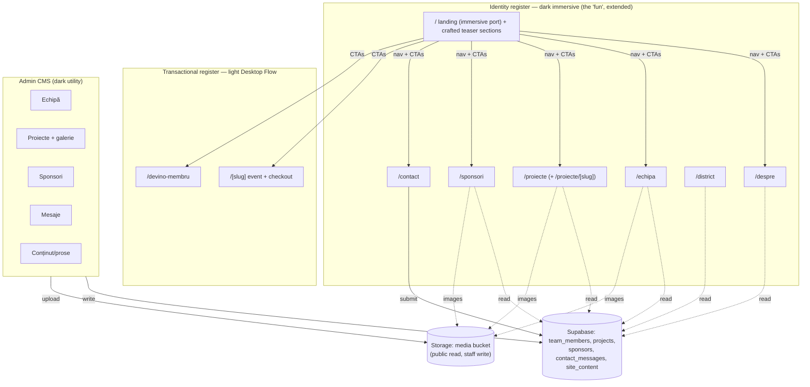

# feat: Public Interact club site on top of the immersive landing (Phase 9)

## Summary

Evolve SavaPass from a ticketing app into the **full public website for Interact Sf. Sava**,
*without* losing the immersive "fun" landing and *without* looking like an AI-generated
template. We keep the existing cinematic homepage as the entry, enrich it with a few crafted
teaser sections, and add dedicated, navigable **identity pages** — About, Team, Projects,
Sponsors, Contact (+ Rotary/District) — each with an **immersive animated hero and a calm,
highly readable body**. All club content (team, projects, sponsors, contact messages, key
prose) becomes **data-driven and admin-editable** with image uploads, so the club runs it
with no developer. This deliberately formalizes a **two-register design system**: immersive
dark for *identity/marketing*, the existing light "Desktop Flow" for *transactional* flows
(buy/apply), with intentional transitions between them.

This is the largest visual undertaking since the rebrand; it is phased (A foundation → B core
identity → C engagement → D reach) and gated on a written design spec + a design review to hold
the anti-slop bar.

---

## Problem Frame

SavaPass has a powerful **engine** (Stripe ticketing, QR door check-in, membership pipeline,
admin CMS, auth, GDPR) but almost no **public identity**: the homepage is event-centric and
there is no About, Team, Projects/causes, Sponsors, or Contact. The benchmark
(interactatheneum.ro, see `web/docs/club-site-gap-analysis.md`) is the inverse — a static
brochure with rich identity content but zero functionality, offloading every action to
Instagram. The opportunity is to be **both**: the crafted club site *and* the working
ticketing/membership platform.

Two hard constraints from the user shape everything:
1. **Keep the fun.** The immersive GSAP landing stays and the new pages must feel like a
   continuation of it — one cinematic, coherent site.
2. **No AI slop.** The new pages must read as intentionally designed (editorial, specific,
   crafted), not as a generic "hero + 3 cards + CTA" template.

Existing visual reality to reconcile: the homepage `/` is a dark immersive verbatim port; the
buy/recruiting flows are now **light** (`.sp-light` "Desktop Flow"); staff/admin is dark
immersive utility. The club pages must slot into this without feeling like a third random style.

---

## Requirements

- **R1** — The immersive landing is preserved and *enriched* (richer landing + deep pages), forming one coherent site (Hybrid structure, per user decision).
- **R2** — New club pages do **not** look like AI slop: editorial layout, real typographic craft, motion with restraint, real content — and pass a design review against the anti-slop bans.
- **R3** — A visitor can fully understand the club: **About** (mission/values/Rotary family), **Team** (board + members), **Projects/causes** (portfolio + galleries), **Sponsors**, **Contact** (+ District/Rotary) — as real, navigable, SEO-indexed pages.
- **R4** — Team, projects, sponsors, contact messages, and key prose are **data-driven** and editable from the admin with **image uploads**, no developer required.
- **R5** — Performance + a11y are preserved: no new per-page GSAP regressions (CSS/IO motion), sized `next/image`, per-page SEO/OG metadata, keyboard + reduced-motion sane.
- **R6** — A clear, intentional **two-register** system (immersive-dark identity vs light transactional) with non-jarring transitions (nav + CTAs bridge them).

Traceability: `web/docs/club-site-gap-analysis.md` (the gap list) + the three user decisions
(Hybrid, immersive-heroes+calm-bodies, data-driven).

---

## Design language & anti-slop principles (the heart of this plan)

These are binding constraints for every club-page unit. The implementer reads the three design
skills (`~/.claude/skills/impeccable`, `emil-design-eng`, `design-taste-frontend`) and the
existing `web/docs/REDESIGN-SPEC.md` before building, and U1 distills them into a club-specific
spec.

- **One language, extended — not a new theme.** Club pages live in the **dark immersive
  register** (the existing `--im-*` tokens, the cyan/ink palette, the gear/seam/telemetry/mono-
  label motifs from the v3 design). They should feel like rooms in the same building as the
  landing, reusing its type system: Instrument Serif for ceremonial display moments, Manrope for
  UI/body, JetBrains Mono for data/labels/numerals.
- **Immersive hero, calm body.** Each page opens with ONE crafted "hero moment" (a masked/clip
  headline reveal, a parallax-free cinematic image or motif, a count-up stat) and then drops into
  a quiet, generously-spaced, highly readable content body. Restraint below the fold is what
  separates "designed" from "over-animated slop."
- **Editorial, not templated.** Avoid the slop signature: centered hero → identical 3-card grid →
  big CTA, repeated per page. Use asymmetry, varied section rhythm, real hierarchy, a recurring
  but non-repetitive layout grammar. No emoji-bullet feature lists, no lorem, no stock-photo
  vibe.
- **Specificity kills slop.** Real names, real project descriptions, real impact numbers, real
  photos (via Storage). Concrete content reads as human; generic copy reads as AI.
- **Motion with taste + performance.** Reuse the established CSS + IntersectionObserver
  primitives (`components/ui/ScrollReveal.tsx` variants, the `.anim-*` classes) — **not** new
  per-page GSAP scenes (protects the desktop TBT budget; the homepage engine stays the only GSAP
  layer). Animate opacity/transform only (never filter/blur/height on many elements — see prior
  perf lessons). One hero animation per page; reveals are short + in-sync with scroll.
- **Cohesive transitions between registers.** Identity (dark) → transactional (light) handoffs
  (e.g. "Cumpără bilet", "Devino membru") are deliberate moments, bridged by the nav and CTA
  styling, so the light flow reads as "checkout", not "a different website".
- **Gate it.** U1 produces `web/docs/REDESIGN-SPEC-club.md` (ideally via the `design-director`
  agent), and a `design-reviewer` pass runs before each public phase ships (R2).

---

## High-Level Technical Design

Two-register site + data-driven club layer on the existing engine:



Page rhythm (every identity page): `Hero (1 crafted moment) → calm content sections (scroll-reveal) → cross-register CTA → footer`.

---

## Output Structure (new/changed surfaces)

```
web/
  app/
    page.tsx                      (MODIFY: append crafted teaser sections below immersive root)
    (club)/                       (NEW route group — public identity pages, dark immersive)
      despre/page.tsx
      echipa/page.tsx
      proiecte/page.tsx
      proiecte/[slug]/page.tsx
      sponsori/page.tsx
      contact/page.tsx
      contact/actions.ts
      district/page.tsx
    (staff)/admin/
      echipa/{page.tsx,actions.ts}
      proiecte/{page.tsx,actions.ts,[id]/page.tsx}
      sponsori/{page.tsx,actions.ts}
      mesaje/page.tsx
      continut/{page.tsx,actions.ts}
  components/
    club/
      ClubPage.tsx                (immersive-hero + calm-body shell)
      ClubHero.tsx
      Gallery.tsx                 (reused: projects/team/district)
      TeamGrid.tsx ; ProjectCard.tsx ; SponsorWall.tsx ; LandingTeasers.tsx
  lib/
    club.ts                       (data access: team/projects/sponsors/content)
    storage.ts                    (Supabase Storage helpers + public URL)
  supabase/migrations/
    <ts>_club_content.sql         (tables + RLS + storage bucket policies)
  docs/
    REDESIGN-SPEC-club.md         (U1 design spec)
```

The per-unit `Files` lists are authoritative; the tree is the expected shape.

---

## Key Technical Decisions

- **KTD1 — Formalize a two-register design system (R6).** Identity/marketing = dark immersive
  (`theme-immersive` + `--im-*`); transactional = light `.sp-light`; staff = dark utility. Club
  pages join the immersive register. Document the rule so future pages pick the right register on
  purpose.
- **KTD2 — A reusable `ClubPage` shell + section primitives (R2).** One shell (immersive hero +
  calm body + footer) used by every identity page guarantees coherence and stops each page from
  drifting into a different template. Heroes vary per page within a shared grammar.
- **KTD3 — Motion via existing CSS/IO primitives, never per-page GSAP (R5).** Reuse
  `ScrollReveal` + `.anim-*`; the homepage engine stays the only GSAP scene. Protects TBT and
  avoids the filter/height-animation jank documented in prior perf passes.
- **KTD4 — Projects are a NEW `projects` table, separate from ticketed `events`.** Events are a
  ticketing concept (price/capacity/Stripe); projects are content (story/gallery/beneficiary).
  Conflating them muddies both models. A project MAY link to a ticketed event when relevant.
- **KTD5 — Data-driven via Supabase + admin CRUD + a `media` Storage bucket (R4).** Lists
  (team/projects/sponsors) are tables; editable prose (about/district/mission) is a small
  `site_content` key→rich-value table so non-list copy is also admin-editable. Public read,
  staff/admin write, via RLS + the existing `is_staff()/is_admin()` helpers.
- **KTD6 — Enrich the landing by APPENDING React sections, not editing the verbatim port (R1).**
  `page.tsx` renders the immersive markup via `dangerouslySetInnerHTML`; the teaser sections are
  added as crafted React *below* `.sp-immersive-root` (same dark language, CSS/IO motion). The
  fragile extractor/`content.ts` port is never touched.
- **KTD7 — Public pages are ISR/cacheable; content reads via a cached data layer (R5).** Identity
  pages revalidate on a tag bumped by admin writes (`updateTag`, per the Next 16 caching notes in
  AGENTS.md), so they're fast and SEO-friendly while staying current after edits.
- **KTD8 — Design is gated, not vibe-checked (R2).** A written club design spec (U1) precedes
  implementation; a `design-reviewer` pass precedes each public ship.

---

## Implementation Units

> Grouped into phases. Land A before B; B is the P1 value; C/D are incremental.

### Phase A — Foundation

### U1. Club design spec + reusable immersive shell
- **Goal:** Establish the anti-slop club design language and a reusable `ClubPage`/`ClubHero` shell + section primitives so every page coheres.
- **Requirements:** R1, R2, R6. (KTD1, KTD2, KTD3)
- **Dependencies:** none.
- **Files:** create `web/docs/REDESIGN-SPEC-club.md`; create `web/components/club/ClubPage.tsx`, `web/components/club/ClubHero.tsx`; (reuse) `web/components/ui/ScrollReveal.tsx`.
- **Approach:** Author the spec (via the `design-director` agent reading impeccable + emil-design-eng + design-taste-frontend + the existing immersive design + `REDESIGN-SPEC.md`): page rhythm, type scale, the hero grammar, motion budget, the two-register rule, anti-slop bans. Then build the shell: dark immersive bg, a `ClubHero` (masked/clip headline reveal via CSS, optional cinematic image/motif, mono eyebrow), a calm body container, footer; all motion via CSS/IO.
- **Patterns to follow:** the immersive CSS motifs (`--im-*`, gear/seam/mono labels); `ScrollReveal` variants; the `.sp-light` island pattern (here we stay dark, but mirror the "scoped, self-contained page styles" approach).
- **Test scenarios:** Test expectation: none — design artifact + presentational shell. Verify: a throwaway page using the shell builds, renders dark/cohesive, reveals fire on scroll, and `prefers-reduced-motion` doesn't break layout.
- **Execution note:** Spec-first — do not build pages before the spec exists; run a `design-reviewer` pass on the shell.
- **Verification:** Spec committed; shell renders a sample hero+body that a design review rates cohesive with the landing.

### U2. Data model + storage + types
- **Goal:** Supabase tables, the media bucket, RLS, and regenerated types for the whole club layer.
- **Requirements:** R4.
- **Dependencies:** none (can parallel U1).
- **Files:** create `web/supabase/migrations/<ts>_club_content.sql`; modify `web/lib/supabase/types.ts` (regen); create `web/lib/storage.ts`.
- **Approach:** Tables — `team_members` (name, role, photo_path, bio, sort, active, mandate), `projects` (slug, title, date_label, location, summary, body, beneficiary, cover_path, gallery jsonb, category, published, sort, event_id nullable), `sponsors` (name, logo_path, url, tier, sort, active), `contact_messages` (name, email, message, created_at, handled), `site_content` (key pk, value jsonb, updated_at). RLS: public SELECT on published team/projects/sponsors + site_content; `contact_messages` anon INSERT + staff SELECT (mirror `membership_applications`); admin write on all via `is_admin()`. Storage: public `media` bucket, read public, write staff. `lib/storage.ts` = upload + public-URL helpers. Regenerate types via the Supabase MCP (`generate_typescript_types`) and fix the known `\"`/CompositeTypes quirk.
- **Patterns to follow:** `membership_applications` migration + RLS; `web/supabase/schema.sql`; the `is_staff()/is_admin()` helpers; the types-regen lessons in CLAUDE.md.
- **Test scenarios:**
  - RLS: anon can SELECT published projects/team/sponsors + site_content but NOT unpublished; anon cannot SELECT `contact_messages`; anon CAN INSERT a contact message; non-admin cannot write team/projects.
  - Storage: anon can read a public media URL; non-staff cannot upload.
  - `published=false` project is hidden from public reads, visible to staff.
- **Execution note:** Apply the migration to a Supabase **branch** first if available; otherwise via MCP `apply_migration` with care. Add the same DDL to `web/supabase/schema.sql`.
- **Verification:** Types compile; RLS scenarios hold via quick `execute_sql` probes as anon vs service role.

### U3. Public identity nav + route group + metadata
- **Goal:** Visitors can reach every identity page; routes + SEO scaffolding exist.
- **Requirements:** R3, R5, R6.
- **Dependencies:** U1.
- **Files:** modify `web/app/HomeNav.tsx` (add identity links without clutter); create `web/app/(club)/layout.tsx` (shared metadata + dark register); (reuse) per-page `generateMetadata`.
- **Approach:** Extend HomeNav to a real site nav — Despre · Proiecte · Echipă · Evenimente(→ tickets) · Devino membru · Contact, plus the CTA — keeping the zero-JS `<details>` mobile pattern; design it so 6-7 items don't clutter (grouping/secondary items acceptable). `(club)` route-group layout sets dark register + OG defaults. Per-page `generateMetadata` for title/description/OG image.
- **Patterns to follow:** the current `HomeNav` (server, CSS-only disclosure); Next 16 metadata API (read `node_modules/next/dist/docs/` per AGENTS.md).
- **Test scenarios:** Test expectation: none — nav + scaffolding. Verify links resolve at build; mobile disclosure still works; metadata renders per route.
- **Verification:** Build lists the new routes; nav reaches them on desktop + mobile.

### Phase B — Core identity (P1)

### U4. About page (`/despre`)
- **Goal:** Tell the club story: mission/values ("Service above self" equivalent), the Interact/Rotaract/Rotary family, history.
- **Requirements:** R2, R3, R4.
- **Dependencies:** U1, U2, U3.
- **Files:** create `web/app/(club)/despre/page.tsx`; (reuse) `ClubPage`, `lib/club.ts` (read `site_content`).
- **Approach:** Immersive hero (mission line, serif moment) + calm body sections: who we are, values, the Rotary family (3 tiers), impact. Prose pulled from `site_content` keys (admin-editable); images from Storage. Editorial layout, not a card grid.
- **Patterns to follow:** `ClubPage` shell; the immersive "Familia" framing from the benchmark, reimagined in our language.
- **Test scenarios:** Test expectation: none — content page (data-read only). Verify it renders with seeded `site_content`, is ISR-cached, and metadata is set.
- **Verification:** Renders cohesive; editing `site_content` in admin (U9) updates it after revalidation.

### U5. Team page (`/echipa`) + admin CRUD
- **Goal:** Public board + members (photo + role), admin-managed.
- **Requirements:** R3, R4, R2.
- **Dependencies:** U1, U2, U3.
- **Files:** create `web/app/(club)/echipa/page.tsx`, `web/components/club/TeamGrid.tsx`, `web/app/(staff)/admin/echipa/page.tsx`, `web/app/(staff)/admin/echipa/actions.ts`.
- **Approach:** Public: hero + a crafted (non-generic) team grid grouped by board vs members, ordered by `sort`, photos via Storage `next/image`. Admin: list + create/edit/delete (name, role, photo upload, sort, active), `requireStaffRole(["admin"])`, image upload via `lib/storage.ts`.
- **Patterns to follow:** `admin/team` (staff roles) for the admin shape; `admin/emite-bilet` action/form pattern; `next/image` sizing.
- **Test scenarios:**
  - Admin CRUD: create a member → appears on `/echipa` (after revalidate); edit role → reflected; soft-delete (`active=false`) → hidden publicly.
  - Auth: non-admin cannot reach the admin page or invoke the actions.
  - Upload: a photo upload returns a public URL stored in `photo_path`; oversized/invalid file rejected.
- **Execution note:** Image upload is the new mechanic — verify the Storage round-trip end to end.
- **Verification:** A member added in admin shows on the public page with the right photo + order.

### U6. Projects portfolio (`/proiecte` + `/proiecte/[slug]`) + admin CRUD + gallery
- **Goal:** Showcase volunteer projects/causes with detail + photo galleries; admin-managed.
- **Requirements:** R3, R4, R2.
- **Dependencies:** U1, U2, U3.
- **Files:** create `web/app/(club)/proiecte/page.tsx`, `web/app/(club)/proiecte/[slug]/page.tsx`, `web/components/club/ProjectCard.tsx`, `web/components/club/Gallery.tsx`, `web/app/(staff)/admin/proiecte/page.tsx`, `web/app/(staff)/admin/proiecte/actions.ts`, `web/app/(staff)/admin/proiecte/[id]/page.tsx`.
- **Approach:** Index: hero + editorial project cards (cover, title, beneficiary, date). Detail: hero + story body + a reusable `Gallery` (multi-image, accessible, lazy, lightbox optional). Admin: CRUD with slug, published toggle, cover + multi-image gallery upload, optional `event_id` link to a ticketed event. ISR + tag revalidate.
- **Patterns to follow:** `admin/events/[id]` editor for the edit-page pattern; `Gallery` reused by team/district; slug routing like `/[slug]`.
- **Test scenarios:**
  - Public: published projects list; `/proiecte/[slug]` renders detail + gallery; unknown slug → notFound; unpublished slug → notFound for anon.
  - Admin: create/edit/publish/unpublish; gallery add/remove images; slug uniqueness enforced.
  - Auth: non-admin blocked from admin + actions.
- **Execution note:** Gallery + multi-image upload is the heaviest new mechanic — verify add/reorder/remove + public render.
- **Verification:** A project published in admin appears in the index + detail with its gallery.

### U7. Enrich the landing (teaser sections)
- **Goal:** The landing gains 2-3 crafted sections that preview the club and route into the deep pages — without touching the immersive port.
- **Requirements:** R1, R2.
- **Dependencies:** U1, U4-U6 (so teasers link to real pages/data).
- **Files:** modify `web/app/page.tsx`; create `web/components/club/LandingTeasers.tsx`.
- **Approach:** Render `LandingTeasers` as React **below** `.sp-immersive-root` (same dark language, CSS/IO motion): e.g. an impact/stat strip, a featured-projects rail (from `projects`), a "join the family" block — each linking to `/proiecte`, `/despre`, `/devino-membru`. Keep it cohesive with the immersive scene; do NOT edit `content.ts`/the extractor.
- **Patterns to follow:** KTD6; the existing co-render approach on `page.tsx`; `ScrollReveal`.
- **Test scenarios:** Test expectation: none — presentational. Verify the immersive scene + engine still work (run `scripts/verify-mobile-immersive.mjs`), teasers reveal on scroll, links resolve, and `/` still prerenders.
- **Execution note:** Re-run the immersive verify script — confirm the engine/landing are unaffected by the appended sections.
- **Verification:** Landing shows the new sections below the immersive scroll with zero console errors; engine intact.

### Phase C — Engagement (P2)

### U8. Sponsors (`/sponsori`) + Contact (`/contact`) + admin
- **Goal:** Sponsor recognition + a real contact channel; both admin-managed.
- **Requirements:** R3, R4.
- **Dependencies:** U1, U2, U3.
- **Files:** create `web/app/(club)/sponsori/page.tsx`, `web/components/club/SponsorWall.tsx`, `web/app/(staff)/admin/sponsori/{page.tsx,actions.ts}`, `web/app/(club)/contact/page.tsx`, `web/app/(club)/contact/actions.ts`, `web/app/(staff)/admin/mesaje/page.tsx`.
- **Approach:** Sponsors: public logo wall by tier (Storage logos) + admin CRUD. Contact: a form (name/email/message) → `contact_messages` via service role + **best-effort email** (reuse `lib/email.ts`) + honeypot (reuse the membership pattern) + the light or dark register decision per the spec (contact is borderline — treat as identity/dark for cohesion, or a calm form). Admin `mesaje` = a staff inbox (read, mark handled).
- **Patterns to follow:** `devino-membru` (honeypot + service-role insert + best-effort email + zod); `admin/aplicatii` (staff inbox list).
- **Test scenarios:**
  - Contact: valid submit stores a row + attempts email + shows success; invalid email rejected; honeypot filled → silent ok, no write; Resend down → submission still succeeds.
  - Sponsors admin: CRUD + logo upload; public wall shows active sponsors by tier.
  - Auth: `mesaje` + sponsor actions admin-gated; anon can submit contact but not read messages.
- **Execution note:** Contact email is best-effort (never block the store) — mirror the membership posture exactly.
- **Verification:** A contact submission appears in `admin/mesaje`; sponsors render publicly.

### Phase D — Reach (P3, incremental)

### U9. District/Rotary page + editable prose (`site_content`) admin
- **Goal:** Rotary District 2241 context + galleries; and an admin editor for the prose used by About/District.
- **Requirements:** R3, R4.
- **Dependencies:** U2, U4.
- **Files:** create `web/app/(club)/district/page.tsx`, `web/app/(staff)/admin/continut/{page.tsx,actions.ts}`.
- **Approach:** District page: hero + context + conference/trip `Gallery` (Storage). Admin `continut`: edit `site_content` keys (mission, about body, district copy) as simple rich text/markdown; revalidate the affected pages on save (`updateTag`).
- **Patterns to follow:** `Gallery` (U6); `admin/events` editor; Next 16 `updateTag` server-action invalidation (read `node_modules/next/dist/docs/`).
- **Test scenarios:**
  - Editing a `site_content` key in admin updates `/despre` / `/district` after revalidation.
  - Auth: editor admin-gated.
  - District galleries render; reduced-motion safe.
- **Verification:** Prose edits flow through to the public pages without a deploy.

---

## Alternative Approaches Considered

- **Light club pages (reuse `.sp-light`).** Faster + consistent with the flows, but the user
  explicitly wants to extend the "fun" and avoid template-feel; a light brochure risks reading
  generic. Rejected in favor of the immersive register.
- **One giant immersive one-pager (extend the scroll).** Maximal "wow" but unscalable, hard to
  edit, weak SEO/deep-linking, and touches the fragile port. Rejected for Hybrid (richer landing
  + deep pages).
- **Extend `events` with a `project` kind instead of a `projects` table.** Less schema, but
  overloads a ticketing model with content concerns and complicates both. Rejected (KTD4).
- **Per-page GSAP scenes for maximal animation.** Would blow the TBT budget (documented desktop
  GSAP ceiling) and add maintenance/jank risk. Rejected for CSS/IO motion (KTD3).

---

## Scope Boundaries

**In scope:** the immersive-register identity pages (About, Team, Projects, Sponsors, Contact,
District), the richer landing, the data model + admin CMS + image uploads, and the design spec +
review gate.

### Deferred to Follow-Up Work
- News/blog (`posts`) + newsletter signup — high value but additive; after the core identity lands.
- Multilingual (RO/EN) — the benchmark mixes languages; a real i18n pass is its own phase.
- Deep Instagram/YouTube embeds + a live social feed.
- A public member directory beyond the team page.
- Rich-text WYSIWYG for `site_content` (start with markdown/textarea; a proper editor later).
- Wiring projects ↔ ticketed events bidirectionally (the `event_id` link exists; surfacing it both ways is a later nicety).

### Outside this product's identity
- Turning the site into a generic CMS/website builder — it stays a purpose-built Interact site.

---

## Risks & Dependencies

- **AI-slop risk (the #1 risk, R2).** Mitigations: the written spec (U1), a single crafted shell
  (KTD2), real content + photos (R4), CSS/IO motion with restraint (KTD3), and a `design-reviewer`
  pass before each public ship. This risk is design-execution, not technical — budget review time.
- **Content readiness.** A data-driven site is only as good as its content; the club must supply
  real team photos, project stories, sponsor logos. The admin CMS enables it but someone must
  populate it — flag early; seed `/despre` + one project for launch.
- **Performance.** New images + pages must not regress CWV. Mitigations: `next/image` + sized
  Storage assets, ISR, CSS/IO motion (no per-page GSAP), and re-running the perf/immersive verify
  scripts after U7.
- **Touching the landing (U7).** Append-only (KTD6); never edit the verbatim port; re-run
  `verify-mobile-immersive.mjs`.
- **Two-register coherence (R6).** A poor dark→light handoff feels broken. Mitigation: design the
  CTA/nav transitions explicitly in the spec; keep the light flows clearly "checkout"-framed.
- **RLS/storage security.** Public-read media + published-only public rows; staff/admin writes;
  `contact_messages` not anon-readable. Verify with anon-vs-service probes (U2).
- **Admin surface growth.** Several new admin sections — reuse one CRUD pattern + the StaffHeader
  to avoid each becoming bespoke.
- **Sequencing dependency:** U1 (spec/shell) + U2 (data) gate everything; U7 depends on U4-U6.

---

## Open Questions
- **Contact register:** keep `/contact` dark-immersive for cohesion, or reuse the light form
  style? (Lean: dark, with a calm form — decide in the spec.)
- **Nav density:** 6-7 top-level items may crowd; do we group secondary pages (Sponsors/District)
  under a menu, or show all? (Decide during U3 from the real label widths.)
- **District/Rotary depth:** full page now (U9) or fold a short section into `/despre` for v1?
- **`site_content` format:** markdown vs structured blocks — start simple (markdown), revisit if
  the club needs richer layout control.
- **Real domain + brand specifics** (entity, exact socials, sponsor list) — supplied by the club
  as content, not blockers to the build.
